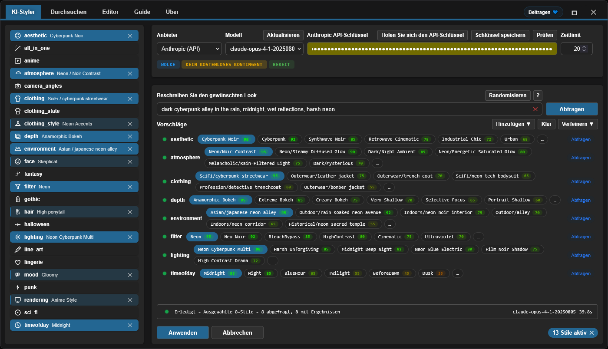

<h4 align="center">
  <a href="./README.md">English</a> | Deutsch | <a href="./README.es.md">Español</a> | <a href="./README.fr.md">Français</a> | <a href="./README.pt.md">Português</a> | <a href="./README.ru.md">Русский</a> | <a href="./README.ja.md">日本語</a> | <a href="./README.ko.md">한국어</a> | <a href="./README.zh.md">中文</a> | <a href="./README.zh-TW.md">繁體中文</a>
</h4>

<p align="center">
  
  
  
</p>
<br />

# ComfyUI Styler Pipeline ✨

> Fokusierte styler-pipeline Nodes für reproduzierbare Workflows in ComfyUI: Style-Anwendung mit deterministischen Styler-Nodes und sicherem Conditioning-Merging.

---

## <a id="table-of-contents"></a>Inhaltsverzeichnis

- ✨ [Funktionen](#features)
- 📦 [Installation](#installation)
- 🔧 [Nodes](#nodes)
- 🤖 [LLM-Einrichtung](#llm-setup)
- ✍️ [KI-Prompts](#ai-prompts)
- 📝 [Erweitertes JSON](#advanced-json)
- 💖 [Unterstützung](#support)
- 🖼️ [Galerie](#gallery)
- 🤝 [Mitwirken](#contributing)
- 📄 [Lizenz](#license)

---

## <a id="features"></a>Funktionen

- Deterministische styler-pipeline Nodes, ausgelegt auf Reproduzierbarkeit über mehrere Runs hinweg.
- AI-gestützte Style-Auswahl: pro Kategorie wird ein LLM abgefragt und eine nach Score gerankte Liste an Style-Kandidaten zurückgegeben.
- Manuelles Browsen und Auswählen von Styles über den Browser-Workflow mit Kategorie-Navigation.
- Dynamic Styler, der Styles sicher auf bestehendes Conditioning anwendet.
- Klassischer `Advanced Styler` Node mit Dropdowns für Kategorie-für-Kategorie Kontrolle im Graph.
- Kompatibel mit ControlNet-Workflows, inklusive OpenPose-getriebener Setups.

---

## <a id="installation"></a>Installation

### Voraussetzungen
- ComfyUI (aktueller Build)
- Python 3.10+

### Schritte

1. Dieses Repo in `ComfyUI/custom_nodes/` klonen.
2. ComfyUI neu starten.
3. Prüfen, dass die Nodes unter `Styler Pipeline/` erscheinen.

---

## <a id="nodes"></a>Nodes

### Styler Pipeline

**Kurzüberblick:**
- Haupt-Node für das tägliche Styling mit dem **Edit** Panel.
- Deterministisch und reproduzierbar, weil die Auswahl im internen JSON gespeichert wird.


**Inputs:**
- `positive` (`CONDITIONING`, required)
- `negative` (`CONDITIONING`, required)
- `clip` (`CLIP`, required to apply styles)
- `strength` (`FLOAT`, default `1.0`)
- `redundancy` (`INT`, default `1`)
- `selected_styles_json` (`STRING`, internal UI state)

**Outputs:**
- `positive` (`CONDITIONING`)
- `negative` (`CONDITIONING`)

**Behavior notes:**
- Nutzt die ausgewählten Styles, um zusätzliches Style-Conditioning zu encoden und mischt es anschließend in das bestehende Conditioning.
- Auf **Edit** klicken, um Kategorie/Style-Auswahlen in einem Panel zu verwalten und in das interne JSON zu schreiben.

#### Strength und Redundancy Guide

`strength` steuert, wie stark die ausgewählten Styles die Generation beeinflussen. Unterschiedliche Checkpoints/Models sind unterschiedlich gut beeinflussbar: manche reagieren stark schon bei wenig `strength`, andere sind resistenter.

Wenn ein Model resistent ist, kann ein höheres `strength` helfen. Ab einem gewissen Punkt verschlechtert es jedoch meist die Qualität; ab ungefähr `~1.3+` wird die Degradation oft sichtbar, weil es effektiv wie ein „Anschreien“ der Instruktion an den `KSampler` wirkt.

`redundancy` wiederholt die ausgewählten Styles wortwörtlich mehrfach, um ihr Gewicht zu erhöhen. Das kann die Style-Adhärenz verbessern, aber zu hohe redundancy kann die Komposition beschädigen.

- Sicherer Startpunkt: `strength = 1.0`, `redundancy = 1`.
- Typisches Vorgehen: zuerst `strength` schrittweise in kleinen Schritten erhöhen.
- In den meisten Fällen `redundancy` bei `2` oder darunter halten.

**AI Styler module:**
Beschreibe den gewünschten Look, und **AI Styler** fragt ein LLM, um automatisch pro Kategorie die am besten passenden Styles vorzuschlagen.
Unterstützt wichtige API-Provider (OpenAI, Anthropic, Groq, Gemini, Hugging Face) und außerdem **Ollama (Local)**, damit du auch offline/ohne Internet arbeiten kannst.
Im Bild unten siehst du den **AI Styler** Tab, geöffnet aus **Edit**, wo Vorschläge auf Basis deines Prompts erzeugt und angewendet werden.



**Browser module:**
Wenn du AI Styler nicht verwenden möchtest, erlaubt dir der **Browse** Tab, Styles manuell auszuwählen und mehr Kontrolle zu behalten.
Im Bild unten siehst du den **Browser** Tab im gleichen Panel, in dem Kategorien und Styles manuell ausgewählt werden.


**Editor module:**
Editor zeigt dir Styles, die pro Kategorie aus den JSON-Dateien geladen werden (`data/*.json`).
Die Editier-Tools sind aktuell in Arbeit und werden bald verfügbar sein (AI-Token-Budget ist derzeit begrenzt).

> [!NOTE]
> Da die ausgewählten Styles im Node-State gespeichert werden, bleibt derselbe Workflow reproduzierbar, selbst wenn du Kategorien und Styles in den JSON-Style-Dateien hinzufügst/entfernst – solange du die ursprünglich ausgewählten Styles beibehältst.

### Styler Pipeline (Single)

Wende jeweils nur einen Style an, indem du `category` und `style` manuell auswählst.


**Inputs:**
- `positive` (`CONDITIONING`, required)
- `negative` (`CONDITIONING`, required)
- `category` (`STRING`/dropdown, required)
- `style` (`STRING`/dropdown, required)
- `clip` (`CLIP`, required to apply styles)
- `strength` (`FLOAT`, default `1.0`)
- `redundancy` (`INT`, default `1`)

**Outputs:**
- `positive` (`CONDITIONING`)
- `negative` (`CONDITIONING`)
- `style` (`STRING`)

### Styler Pipeline (By Index) + Index Iterator

Verwende dieses Paar für deterministische Style-Sweeps, ohne Styles manuell auszuwählen: Ein inkrementeller Index wendet Styles einer ausgewählten Kategorie nacheinander an.
`Styler Pipeline (By Index)` wendet einen Style aus der ausgewählten Kategorie über `style_index` an, und `Index Iterator` liefert bei jedem Run einen inkrementellen Index.


**Inputs:**
- `Styler Pipeline (By Index)`: `positive`, `negative`, `category`, `style_index`, `clip`, `strength`, `redundancy`, `prepend_timestamp`.
- `Index Iterator`: `reset`, `start`.

**Outputs:**
- `Styler Pipeline (By Index)`: `positive`, `negative`, `style`.
- `Index Iterator`: `index` (`INT`).

**Usage:** Verbinde dein `positive` und `negative` Conditioning und verbinde `clip` korrekt. Wähle anschließend eine `category` in `Styler Pipeline (By Index)` und speise `style_index` mit dem `index` Output von `Index Iterator`. Bei jedem Workflow-Run zählt `Index Iterator` ab dem konfigurierten `start` hoch, sodass automatisch der nächste Style dieser Kategorie angewendet wird. Das ist praktisch, um schnell viele Styles zu testen, ohne vor jedem Run manuell umzuschalten, bevor du das resultierende Conditioning an Downstream-Nodes wie `KSampler` weitergibst.

---

### Advanced Styler Pipeline

Klassischer Menü-basierter Styler mit direkten Dropdowns für jede JSON-Kategorie.

**Kurzüberblick:**
- Praktisch, wenn du Kategorie-für-Kategorie Kontrolle mit Dropdowns im Graph willst.
- Fügt explizit Style-Conditioning zu deinen aktuellen positive/negative Pfaden hinzu.
- Schneller zu überblicken als das Panel zu öffnen, wenn du deine Kategorie-Auswahlen bereits kennst.


**Inputs:**
- `positive` (`CONDITIONING`, required)
- `negative` (`CONDITIONING`, required)
- `clip` (`CLIP`, optional input, required to apply style encoding)
- `strength` (`FLOAT`, default `1.0`)
- `redundancy` (`INT`, default `1`)
- Style dropdowns loaded from `data/*.json`

**Outputs:**
- `positive` (`CONDITIONING`)
- `negative` (`CONDITIONING`)

**Usage:** Verbinde das eingehende `positive` und `negative` Conditioning mit diesem Node, verbinde `clip` und wähle die gewünschten Style-Dropdowns pro Kategorie, um den Look schrittweise zu „layern“. Der Node erweitert dein bestehendes Conditioning statt es zu ersetzen – passe also `strength` und `redundancy` nach Bedarf an. Verbinde anschließend die `positive` und `negative` Outputs mit Downstream-Nodes wie `KSampler` für die Generation.

---

## <a id="llm-setup"></a>LLM-Einrichtung

AI Styler verwendet den Provider und das Model, das du in der UI auswählst. Öffne **Edit** und nutze den **AI Styler** Tab, um zuerst einen `Provider` auszuwählen und danach ein `Model` für diesen Provider.

### Cloud API Providers

Cloud API Providers (OpenAI, Anthropic, Google Gemini, Hugging Face, Groq usw.) werden über deren API abgefragt. Wähle den Provider und das Model im AI Styler Tab und füge anschließend deinen API key oder Token in das Token-Feld ein, bevor du Vorschläge generierst.
Bevor du einen Cloud Provider verwendest, klicke auf **Refresh**, um die aktuellste Model-Liste zu laden.

**Provider notes (abhängig von Provider-Policies und kann sich ändern):**
- **Hugging Face** — bietet je nach Model und Provider Modelle mit free-tier Zugang.
- **Groq** — bietet oft einen free tier; prüfe die aktuelle Policy.
- **OpenAI, Google Gemini, Anthropic** — erfordern in der Regel aktiviertes Billing für die API-Nutzung.

> [!WARNING]
> OpenAI API konnte nicht getestet werden, da Billing mit Prepaid-Karten nicht aktiviert werden konnte. Wenn du bei OpenAI einen Fehler siehst, öffne bitte ein GitHub Issue mit detaillierten Fehlerinfos, damit es so schnell wie möglich behoben werden kann.

Der API key oder Token wird nur für den aktuellen Run verwendet und das Plugin **speichert ihn nicht**; du kannst ihn jedoch im Password Manager deines Browsers über den bereitgestellten **Save token** Button speichern.

### Ollama Models (Local + Cloud)

[Ollama](https://ollama.com/download) ist eine kostenlose Desktop-App, mit der du LLMs komplett offline auf deiner eigenen Hardware ausführen kannst. Sobald du dich in einem kostenlosen Ollama Account anmeldest, kannst du außerdem **Ollama Cloud** Models nutzen, ohne sie lokal herunterzuladen.

> [!TIP]
> Ollama benötigt niemals einen API key – weder für lokale Models noch für Cloud Models. Cloud Models erfordern nur, dass du dich in der Ollama App in einen kostenlosen Ollama Account einloggst.

**So erscheinen Ollama Models in der Liste:**

Nach der Installation kann AI Styler zunächst **zero models** anzeigen, bis du in der Ollama App ein Model aktivierst:

1. Öffne die Ollama Desktop-App und lasse sie laufen (minimiert ist ok; nicht schließen).
2. Wähle in der Ollama App das Model aus, das du verwenden willst:
   - **Local model:** wähle ein Model, das auf deine Maschine heruntergeladen wird. `gemma3:4b` ist ein guter Startpunkt – leichter und schneller als die meisten.
   - **Cloud model:** logge dich in deinen kostenlosen Ollama Account in der App ein und wähle dann ein Cloud Model.
3. Sende eine kurze Nachricht in der Ollama App (z. B. „test“), um das ausgewählte Model zu aktivieren.
4. Zurück zu AI Styler und auf **Refresh** klicken; das Model sollte nun im Model-Dropdown erscheinen.

> [!WARNING]
> Es wird dringend empfohlen, **keine lokalen Ollama Models abzufragen, während ein ComfyUI Workflow läuft**. Das kann die gemeinsam genutzten GPU/CPU-Ressourcen stark überlasten und dein System langsam und instabil machen. Wenn möglich, bevorzuge einen **Cloud Provider**, der oft schneller und effizienter ist. Wenn du dennoch Ollama local nutzen willst, starte mit einem kleinen Model wie **gemma3:4b**, bevor du größere Models ausprobierst.

**Troubleshooting (Ollama local):**

- Es erscheinen keine lokalen Models:
  - Sende in der Ollama App eine Nachricht an ein lokales Model, um es zu initialisieren.
  - Stelle sicher, dass Ollama läuft und unter `http://127.0.0.1:11434` erreichbar ist.
- Der Status zeigt „Not connected“:
  - Starte Ollama neu und öffne dann AI Styler erneut.
  - Prüfe, ob Firewall/Security-Software den localhost Port `11434` blockiert.
- Ollama läuft nicht:
  - Starte die App (Windows/macOS) oder führe `ollama serve` aus (Linux).

---

## <a id="ai-prompts"></a>KI-Prompts

Halte Prompts kurz und spezifisch. Beschreibe die visuelle Richtung, nicht eine komplette Geschichte.

### Was du aufnehmen solltest

- Genre/Style: sci-fi, noir, anime, fantasy, etc.
- Mood: tense, cozy, melancholic, energetic.
- Lighting: soft, practical, cinematic rim light, harsh noon sun.
- Time of day: dawn, golden hour, night, overcast afternoon.
- Environment: alley, spaceship interior, forest, classroom, rooftop.

### Was du vermeiden solltest

- Zu lange Prompts mit zu vielen konkurrierenden Ideen.
- Widersprüchliche Vorgaben im selben Satz (z. B. „dark night scene with bright midday sun“).

### So nutzt du die zurückgegebenen Vorschläge

- Starte, indem du 1–2 starke Kategorien beibehältst, die am besten zu deinem Ziel passen.
- Generiere/teste, und verfeinere dann mit wenigen zusätzlichen Kategorien.
- Vermeide es, mehrere konfliktierende Kategorien gleichzeitig zu stacken; füge Änderungen inkrementell hinzu.

---

## <a id="advanced-json"></a>Erweitertes JSON

> Nur für **advanced users**. JSON Editing ist derzeit der einzige Weg, Styles zu verändern; eine visuelle Editor UI ist für eine zukünftige Version geplant. Die enthaltenen Prompts wurden mit AI verfeinert, aber nicht exhaustiv getestet – einige benötigen evtl. kleine manuelle Anpassungen.

Advanced users können Styles frei anpassen:

- **Komplette `data/*.json` Dateien hinzufügen oder entfernen.** Jede JSON-Datei unter `data/` wird automatisch zu einer neuen Style-Kategorie und erscheint in der Kategorie-Liste.
- **Einzelne Style-Einträge hinzufügen, entfernen oder umbenennen** innerhalb einer JSON-Datei und Prompts nach Bedarf anpassen.

**Reproducibility note:** Bestehende Workflows bleiben reproduzierbar, solange die referenzierten Style-Einträge nicht umbenannt oder gelöscht werden. Wenn ein Style, den ein älterer Workflow nutzt, umbenannt oder gelöscht wird, findet dieser Workflow die Definition nicht mehr und kann das gleiche Ergebnis nicht reproduzieren.

Halte die `data/*.json` Style-Dateien konsistent, damit die Styler-Nodes vorhersehbar bleiben.

### JSON shape

```json
[
  {
    "name": "style name",
    "prompt": "style description, {prompt}, token1, token2, token3",
    "negative_prompt": ""
  }
]
```

Required keys per item:
- `name` (string)
- `prompt` (string)
- `negative_prompt` (string, can be empty)

### Praktische Richtlinien

- Bevorzuge konkrete visuelle Sprache statt abstrakter Quality-Tags.
- Halte Prompts kurz und visuell beschreibend.
- Halte Namen user-friendly und leicht zu browsen.
- Halte JSON strikt valide (keine Kommentare, keine trailing commas).
- **Vermeide Wörter, die Models als physische Objekte interpretieren.** Einige Nomen triggern eine wörtliche Darstellung von Objekten, auch wenn eigentlich Farbe oder Hairstyle gemeint ist. Beispiel: **amber-toned** kann dazu führen, dass das Model Amber-Steine zeichnet statt eines warmen Goldtons; **crown braids** kann eine wörtliche Krone erzeugen. Am sichersten ist es, das Trigger-Wort komplett zu entfernen und die Intention mit anderem Vokabular zu beschreiben — z. B. statt „amber-toned“ „warm golden hue“; statt „crown braids“ „intricate braided updo“.

> [!TIP]
> Wenn ein Style-Prompt ein unerwartetes Objekt erzeugt, liegt es meist an einem wörtlich interpretierten Trigger-Wort. Häufige Beispiele: **amber-toned** (rendert Amber-Steine) und **crown braids** (rendert eine wörtliche Krone).

---

## <a id="support"></a>Unterstützung

### Warum deine Unterstützung wichtig ist

Dieses Plugin wird unabhängig entwickelt und gewartet, mit regelmäßiger Nutzung von **paid AI agents**, um Debugging, Testing und Quality-of-Life Verbesserungen zu beschleunigen. Wenn es dir hilft, unterstützt finanzielle Hilfe eine nachhaltige Weiterentwicklung.

Dein Beitrag hilft dabei:

* AI-Tooling für schnellere Fixes und neue Features zu finanzieren
* Laufende Wartung und Kompatibilitätsarbeit über ComfyUI Updates hinweg zu decken
* Zu vermeiden, dass die Entwicklung stoppt, wenn Usage Limits erreicht werden

> [!TIP]
> Du willst nicht spenden? Ein ⭐ auf GitHub hilft trotzdem sehr — es verbessert die Sichtbarkeit und hilft, dass mehr Nutzer es finden

### 💙 Support this project

<table style="width: 100%; table-layout: fixed;">
  <tr>
    <td align="center" style="width: 33.33%; padding: 20px;">
      <div>
        <h4 style="margin: 8px 0;">Ko-fi</h4>
        <a href="https://ko-fi.com/D1D716OLPM" target="_blank" rel="noopener noreferrer">
          
        </a>
        <p style="margin: 8px 0; font-size: 12px;"><a href="https://ko-fi.com/D1D716OLPM" target="_blank" rel="noopener noreferrer">Buy a Coffee</a></p>
      </div>
    </td>
    <td align="center" style="width: 33.33%; padding: 20px;">
      <div>
        <h4 style="margin: 8px 0;">PayPal</h4>
        <a href="https://www.paypal.com/ncp/payment/GEEM324PDD9NC" target="_blank" rel="noopener noreferrer">
          
        </a>
        <p style="margin: 8px 0; font-size: 12px;"><a href="https://www.paypal.com/ncp/payment/GEEM324PDD9NC" target="_blank" rel="noopener noreferrer">Open PayPal</a></p>
      </div>
    </td>
    <td align="center" style="width: 33.33%; padding: 20px;">
      <div>
        <h4 style="margin: 8px 0;">USDC (Arbitrum only ⚠️)</h4>
        <a href="https://arbiscan.io/address/0xe36a336fC6cc9Daae657b4A380dA492AB9601e73" target="_blank" rel="noopener noreferrer">
          
        </a>
        <p style="margin: 8px 0; font-size: 12px;"><a href="#usdc-address">Show address</a></p>
      </div>
    </td>
  </tr>
</table>

<details>
  <summary>Prefer scanning? Show QR codes</summary>
  <br />
  <table style="width: 100%; table-layout: fixed;">
    <tr>
      <td align="center" style="width: 33.33%; padding: 12px;">
        <strong>Ko-fi</strong><br />
        <a href="https://ko-fi.com/D1D716OLPM" target="_blank" rel="noopener noreferrer">
          
        </a>
      </td>
      <td align="center" style="width: 33.33%; padding: 12px;">
        <strong>PayPal</strong><br />
        <a href="https://www.paypal.com/ncp/payment/GEEM324PDD9NC" target="_blank" rel="noopener noreferrer">
          
        </a>
      </td>
      <td align="center" style="width: 33.33%; padding: 12px;">
        <strong>USDC (Arbitrum) ⚠️</strong><br />
        <a href="https://arbiscan.io/address/0xe36a336fC6cc9Daae657b4A380dA492AB9601e73" target="_blank" rel="noopener noreferrer">
          
        </a>
      </td>
    </tr>
  </table>
</details>

<a id="usdc-address"></a>
<details>
  <summary>Show USDC address</summary>

```text
0xe36a336fC6cc9Daae657b4A380dA492AB9601e73
```

> [!WARNING]
> Send USDC over Arbitrum One only. Transfers sent on any other network will not arrive and may be permanently lost.
</details>

## <a id="gallery"></a>Galerie

### Beispiel-Workflow
Klicke auf das Bild unten, um das vollständige Workflow-Beispiel zu öffnen:
Du kannst dieses Workflow-Bild auch per Drag & Drop in ComfyUI ziehen, um es zu öffnen/importieren.
Dieses Beispiel nutzt ControlNet für OpenPose über einen Node aus dem [OpenPose Studio](https://github.com/andreszs/ComfyUI-OpenPose-Studio).

<a href="../workflows/sample_workflow.png" target="_blank" rel="noopener noreferrer">
  
</a>

### Beispielbilder

> [!NOTE]
> Alle Demo-Bilder unten verwenden dasselbe Model, dieselbe LoRA, denselben Base Prompt und denselben Seed. Der einzige Unterschied sind die Styles, die durch den Node **Styler Pipeline** angewendet werden.

| Bild | Styles used |
|---|---|
| <a href="../workflows/sample_bypass.png" target="_blank" rel="noopener noreferrer"></a> | - Baseline: Styler not applied<br>- Generation settings (shared):<br>&nbsp;&nbsp;- Resolution: `1024×1344`<br>&nbsp;&nbsp;- Seed: `717891937617865`<br>&nbsp;&nbsp;- Steps: `25`<br>&nbsp;&nbsp;- CFG: `4`<br>&nbsp;&nbsp;- Sampler: `dpmpp_2m_sde`<br>&nbsp;&nbsp;- Scheduler: `karras`<br>&nbsp;&nbsp;- Denoise: `1.0`<br>&nbsp;&nbsp;- Checkpoint: `yiffInHell_yihXXXTended.safetensors`<br>&nbsp;&nbsp;- LoRA: `inuyasha_ilxl.safetensors`<br>&nbsp;&nbsp;- ControlNet: `illustriousXL_v10.safetensors` |
| <a href="../workflows/sample_4.png" target="_blank" rel="noopener noreferrer"></a> | - aesthetic: `Enchanted Forest`<br>- atmosphere: `Neon/Bioluminescent Glow`<br>- environment: `Nature/bamboo forest`<br>- filter: `BlueHour`<br>- lighting: `Bioluminescent Organic`<br>- mood: `Enchanted`<br>- timeofday: `Twilight`<br>- face: `Raised Eyebrow`<br>- hair: `Color combo silver and cyan`<br>- clothing_style: `Iridescent`<br>- depth: `Soft Focus`<br>- clothing: `Specialty/fantasy outfit` |
| <a href="../workflows/sample_3.png" target="_blank" rel="noopener noreferrer"></a> | - aesthetic: `Rustic`<br>- atmosphere: `Melancholic/Cold Overcast`<br>- environment: `Historical/medieval village`<br>- filter: `BlueHour`<br>- lighting: `Overcast Diffusion`<br>- mood: `Bleak`<br>- timeofday: `Midday`<br>- face: `Serious`<br>- hair: `Silver white hair`<br>- clothing_style: `Denim Fabric`<br>- depth: `Deep Focus`<br>- clothing: `Historical/viking raider` |
| <a href="../workflows/sample_2.png" target="_blank" rel="noopener noreferrer"></a> | - aesthetic: `Dark Fantasy`<br>- atmosphere: `Dark/Night Ambient`<br>- environment: `Outdoor/temple hill overlook`<br>- filter: `Soft`<br>- lighting: `Soft General`<br>- mood: `Meditative`<br>- timeofday: `Midnight`<br>- face: `Worried`<br>- hair: `Long wavy hair`<br>- depth: `Ultra Sharp`<br>- rendering: `Semi-Realistic`<br>- clothing: `Medieval/monk robe` |
| <a href="../workflows/sample_1.png" target="_blank" rel="noopener noreferrer"></a> | - aesthetic: `Cyberpunk`<br>- atmosphere: `Dark/Night Ambient`<br>- environment: `Asian/japanese neon alley`<br>- filter: `Neon`<br>- lighting: `Multi-Source Complex`<br>- mood: `Gloomy`<br>- timeofday: `Midnight`<br>- face: `Skeptical`<br>- hair: `High ponytail`<br>- clothing_style: `Neon Accents`<br>- depth: `Selective Focus`<br>- rendering: `Anime Style`<br>- clothing: `SciFi/cyberpunk streetwear` |

Best practices for reliable results:
- Styler influence varies by Model; some Models are easier to steer than others. If a Model doesn't cooperate with styles, slightly increase `strength` or `redundancy` to raise Styler influence.
- Your positive prompt (`CONDITIONING`) usually carries more weight than the Styler node. Your prompt should not contradict your desired styles, or the Styler effect will be reduced.
- For SDXL, Pony, and Illustrious, ControlNet OpenPose is often a guide rather than a strict rule and can be overridden by the prompt. If the prompt contradicts the pose you're applying, ControlNet may be ignored or produce inconsistent composition. Reinforcing pose in the prompt is usually a good idea.
- Use `camera_angles` carefully so it does not conflict with your prompt or ControlNet. This is the most sensitive category and is often ignored when misused, because it drives composition more than style.

### Styler Iterator workflow

<a href="../workflows/sample_styler_iterator.png" target="_blank" rel="noopener noreferrer">
  
</a>

- **Extensions required:** [comfyui-openpose-studio](https://github.com/andreszs/ComfyUI-OpenPose-Studio)

Du kannst dieses Bild in ComfyUI laden, um den Workflow zu extrahieren/zu öffnen.
Dieser Workflow iteriert bei jedem Run sequentiell durch Styles innerhalb einer Kategorie, sodass du verschiedene Styles testen kannst, ohne Werte manuell zu ändern.
Aufgrund einer technischen Limitation kann das generierte Bild den Namen des iterierten Styles nicht innerhalb seines eigenen Workflows enthalten; nutze den `style` Output des Nodes `Styler Pipeline (By Index)` als Teil des Dateinamens, sonst ist es sehr schwer nachzuvollziehen, welcher Style angewendet wurde.
Der Iterator Workflow kann weder den verwendeten Index noch den Namen des angewendeten Styles zurück in den Workflow persistieren.

### Conditioning Areas workflow (Experimental)

Der Styler Pipeline Node ist nicht nur mit ControlNet Workflows kompatibel, sondern auch **100% kompatibel** mit den `Conditioning Pipeline Area` Nodes aus [comfyui-lora-pipeline](https://github.com/andreszs/comfyui-lora-pipeline).
Dieses Setup ermöglicht Area-Styling, sodass du unterschiedliche Styles auf unterschiedliche Bereiche des Bildes anwenden kannst, indem du Styler-Nodes innerhalb dieser Pipeline verkabelst.
Diese Nodes erlauben außerdem mehrere LoRAs ohne Vermischung ihrer Styles, weil sie die native ComfyUI `Cond Pair Set Props` Logik kapseln, ohne Hooks zu exponieren, und Areas statt Masken verwenden.

<a href="../workflows/sample_conditioning_areas.png" target="_blank" rel="noopener noreferrer">
  
</a>

- **Extensions required:** [comfyui-openpose-studio](https://github.com/andreszs/ComfyUI-OpenPose-Studio), [comfyui-lora-pipeline](https://github.com/andreszs/comfyui-lora-pipeline)
- **Experimental:** Fine-tuning dieses multi-LoRA, multi-area Workflows mit ControlNet ist komplexer und die Ausführung ist deutlich langsamer als bei normalen Workflows.

Area-Styles und konsistente Posen können straightforward sein, aber die finale Bildqualität hängt von vielen Faktoren ab und wird hier nicht vollständig behandelt. Für mehr Details siehe das README von [comfyui-lora-pipeline](https://github.com/andreszs/comfyui-lora-pipeline).

In [diesem Beitrag](https://www.andreszsogon.com/building-a-multi-character-comfyui-workflow-with-area-conditioning-openpose-control-and-style-layering/) findest du ein vollständiges Workflow, das mehrere Conditioning-Bereiche, OpenPose, ControlNet und Styler gleichzeitig kombiniert.

## <a id="contributing"></a>Mitwirken

### Grundprinzipien

- Pull Requests fokussiert und minimal halten.
- Große Refactors vermeiden, sofern nicht vorher besprochen.
- Bestehende Architektur und ihre Begründung beibehalten.

### KI-gestützte Änderungen

Wenn du einen AI-basierten Coding Assistant verwendest, bitte ihn, [AGENTS.md](../AGENTS.md) zu lesen und zu befolgen, bevor Änderungen vorgenommen werden.

### Akzeptanzkriterien

- Ein klares Problem oder eine klare Verbesserung pro PR.
- Lokalisierte, gut reviewbare Diffs.
- Klare Erklärung, warum die Änderung notwendig ist.

---

## <a id="license"></a>Lizenz

MIT License - siehe [LICENSE](../LICENSE) für den vollständigen Text.

---

**Last update:** 2026-02-13  
**Maintained by:** andreszs  
**Status:** Active development
