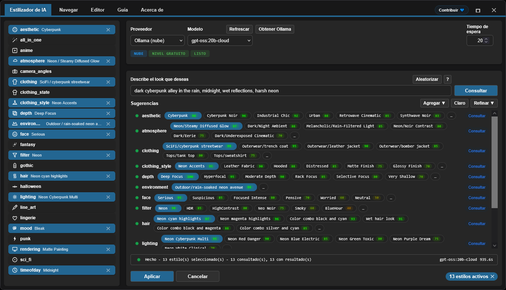

<h4 align="center">
  <a href="./README.md">English</a> | <a href="./README.de.md">Deutsch</a> | Español | <a href="./README.fr.md">Français</a> | <a href="./README.pt.md">Português</a> | <a href="./README.ru.md">Русский</a> | <a href="./README.ja.md">日本語</a> | <a href="./README.ko.md">한국어</a> | <a href="./README.zh.md">中文</a> | <a href="./README.zh-TW.md">繁體中文</a>
</h4>

<p align="center">
  
  
  
</p>
<br />

# ComfyUI Styler Pipeline ✨

> Nodos enfocados de styler-pipeline para workflows reproducibles en ComfyUI: aplicación de estilos con nodos styler deterministas y seguros para el conditioning.

---

## <a id="table-of-contents"></a>Tabla de contenidos

- ✨ [Características](#features)
- 📦 [Instalación](#installation)
- 🔧 [Nodos](#nodes)
- 🤖 [Configuración LLM](#llm-setup)
- ✍️ [Prompts de IA](#ai-prompts)
- 📝 [JSON avanzado](#advanced-json)
- 💖 [Soporte](#support)
- 🖼️ [Galería](#gallery)
- 🤝 [Contribuciones](#contributing)
- 📄 [Licencia](#license)

---

## <a id="features"></a>Características

- Nodos deterministas de styler-pipeline diseñados para mantenerse reproducibles entre ejecuciones.
- Selección de estilos asistida por AI que consulta un LLM por categoría y devuelve candidatos de estilo rankeados con scores.
- Navegación y selección manual de estilos mediante el workflow Browser con navegación por categorías.
- Dynamic Styler que aplica estilos de forma segura al conditioning existente.
- Nodo clásico `Advanced Styler` basado en dropdowns para control categoría por categoría en el grafo.
- Compatible con workflows de ControlNet, incluyendo casos guiados por OpenPose.

---

## <a id="installation"></a>Instalación

### Requisitos
- ComfyUI (build reciente)
- Python 3.10+

### Pasos

1. Cloná este repositorio dentro de `ComfyUI/custom_nodes/`.
2. Reiniciá ComfyUI.
3. Confirmá que los nodos aparezcan bajo `Styler Pipeline/`.

---

## <a id="nodes"></a>Nodos

### Styler Pipeline

**En resumen:**
- Nodo principal para el styling del día a día con el panel **Edit**.
- Determinista y reproducible porque las selecciones se guardan en un JSON interno.


**Entradas:**
- `positive` (`CONDITIONING`, requerido)
- `negative` (`CONDITIONING`, requerido)
- `clip` (`CLIP`, requerido para aplicar estilos)
- `strength` (`FLOAT`, por defecto `1.0`)
- `redundancy` (`INT`, por defecto `1`)
- `selected_styles_json` (`STRING`, estado interno de UI)

**Salidas:**
- `positive` (`CONDITIONING`)
- `negative` (`CONDITIONING`)

**Notas de comportamiento:**
- Usa los estilos seleccionados para codificar conditioning adicional de estilo, y luego lo fusiona dentro del conditioning existente.
- Hacé click en **Edit** para administrar selecciones de categoría/estilo en un solo panel y escribirlas en el JSON interno.

#### Guía de Strength y Redundancy

`strength` controla cuán fuerte los estilos seleccionados guían la generación. Diferentes checkpoints/models no son igual de influenciables: algunos aplican estilos fuertemente con poco `strength`, mientras que otros son más resistentes.

Si un model es resistente, aumentar `strength` puede ayudar. Pero pasado cierto punto, por lo general empeora la calidad; alrededor de `~1.3+` es común que la degradación se vuelva notoria porque, de hecho, es como “gritarle” la instrucción al `KSampler`.

`redundancy` literalmente repite los estilos seleccionados múltiples veces para aumentar su peso. Esto puede mejorar la adherencia al estilo, pero subir redundancy demasiado puede dañar la composición.

- Punto de partida seguro: `strength = 1.0`, `redundancy = 1`.
- Ajuste típico: primero aumentá `strength` gradualmente en pequeños pasos.
- En la mayoría de los casos, mantené `redundancy` en `2` o menos.

**Módulo AI Styler:**
Describí el look que querés, y **AI Styler** le pide a un LLM que sugiera automáticamente los estilos que mejor coinciden por categoría.
Soporta proveedores API importantes (OpenAI, Anthropic, Groq, Gemini, Hugging Face), y también soporta **Ollama (Local)** para que puedas correr en entornos offline/sin internet.
En la imagen de abajo, estás viendo la pestaña **AI Styler** abierta desde **Edit**, donde se generan y aplican sugerencias basadas en prompt.



**Módulo Browser:**
Si preferís no usar AI Styler, el módulo **Browse** te permite elegir estilos manualmente y mantener más control sobre los estilos seleccionados.
En la imagen de abajo, estás viendo la pestaña **Browser** en el mismo panel, donde se seleccionan categorías y estilos de forma manual.


**Módulo Editor:**
Editor te permite ver estilos cargados desde los archivos JSON por categoría (`data/*.json`).
Las herramientas de edición están actualmente en construcción y estarán disponibles pronto (presupuesto de tokens de AI limitado por el momento).

> [!NOTE]
> Como los estilos seleccionados se guardan dentro de los datos del nodo, el mismo workflow sigue siendo reproducible incluso si agregás/removés categorías y estilos definidos en los archivos JSON de estilos, siempre y cuando mantengas los estilos que seleccionaste originalmente.

### Styler Pipeline (Single)

Aplicá un estilo a la vez eligiendo manualmente `category` y `style`.


**Entradas:**
- `positive` (`CONDITIONING`, requerido)
- `negative` (`CONDITIONING`, requerido)
- `category` (`STRING`/dropdown, requerido)
- `style` (`STRING`/dropdown, requerido)
- `clip` (`CLIP`, requerido para aplicar estilos)
- `strength` (`FLOAT`, por defecto `1.0`)
- `redundancy` (`INT`, por defecto `1`)

**Salidas:**
- `positive` (`CONDITIONING`)
- `negative` (`CONDITIONING`)
- `style` (`STRING`)

### Styler Pipeline (By Index) + Index Iterator

Usá este par para barridos deterministas de estilos, evitando seleccionar estilos manualmente mediante un índice incremental para aplicar estilos uno por uno de una categoría seleccionada.
`Styler Pipeline (By Index)` aplica un estilo de una categoría seleccionada usando `style_index`, y `Index Iterator` provee un índice incremental en cada ejecución.


**Entradas:**
- `Styler Pipeline (By Index)`: `positive`, `negative`, `category`, `style_index`, `clip`, `strength`, `redundancy`, `prepend_timestamp`.
- `Index Iterator`: `reset`, `start`.

**Salidas:**
- `Styler Pipeline (By Index)`: `positive`, `negative`, `style`.
- `Index Iterator`: `index` (`INT`).

**Uso:** Conectá tu conditioning `positive` y `negative`, y conectá correctamente `clip`. Luego seleccioná una `category` en `Styler Pipeline (By Index)` y alimentá su `style_index` con la salida `index` de `Index Iterator`. En cada ejecución del workflow, `Index Iterator` incrementa desde el valor `start` configurado, de modo que el siguiente estilo de esa categoría se aplica automáticamente. Esto es útil para probar rápidamente muchos estilos sin cambiar selecciones manualmente cada vez antes de enviar el conditioning resultante a nodos downstream como `KSampler`.

---

### Advanced Styler Pipeline

Styler clásico basado en menús, con dropdowns directos para cada categoría JSON.

**En resumen:**
- Útil cuando querés control categoría por categoría con dropdowns en el grafo.
- Agrega explícitamente conditioning de estilo a tus rutas actuales de positive/negative.
- Más rápido de escanear que abrir el panel cuando ya sabés tus selecciones por categoría.


**Entradas:**
- `positive` (`CONDITIONING`, requerido)
- `negative` (`CONDITIONING`, requerido)
- `clip` (`CLIP`, entrada opcional, requerida para aplicar el encoding de estilos)
- `strength` (`FLOAT`, por defecto `1.0`)
- `redundancy` (`INT`, por defecto `1`)
- Dropdowns de estilo cargados desde `data/*.json`

**Salidas:**
- `positive` (`CONDITIONING`)
- `negative` (`CONDITIONING`)

**Uso:** Conectá el conditioning entrante `positive` y `negative` a este nodo, conectá `clip` y elegí los dropdowns de estilo que quieras de cada categoría para ir “layering” el look. El nodo aumenta tu conditioning existente en lugar de reemplazarlo, así que ajustá `strength` y `redundancy` según sea necesario para balancear. Conectá las salidas `positive` y `negative` a nodos downstream como `KSampler` para la generación.

---

## <a id="llm-setup"></a>Configuración LLM

AI Styler usa el Provider y el Model que elijas en la UI. Abrí **Edit** y usá la pestaña **AI Styler** para seleccionar primero un `Provider`, y luego un `Model` para ese provider.

### Proveedores Cloud API

Los proveedores Cloud API (OpenAI, Anthropic, Google Gemini, Hugging Face, Groq, etc.) se consultan vía su API. Seleccioná el provider y el model que querés usar en la pestaña AI Styler, y luego pegá tu API key o token en el campo de token antes de ejecutar sugerencias.
Antes de usar un proveedor cloud, hacé click en **Refresh** para traer la lista de modelos más reciente.

**Notas sobre providers (sujetas a política del proveedor y pueden cambiar):**
- **Hugging Face** — ofrece modelos con acceso free-tier según el model y el provider.
- **Groq** — a menudo ofrece un free tier; verificá la política actual.
- **OpenAI, Google Gemini, Anthropic** — normalmente requieren billing habilitado para usar la API.

> [!WARNING]
> No se pudo testear OpenAI API porque no se pudo activar billing usando tarjetas prepagas. Si encontrás un error al usar OpenAI, por favor abrí un issue en GitHub con información detallada del error para que se pueda arreglar lo antes posible.

La API key o token se usa solo para la ejecución actual y el plugin **no lo guarda**; pero podés guardarlo en el Password Manager de tu navegador usando el botón **Save token** provisto.

### Modelos de Ollama (Local + Cloud)

[Ollama](https://ollama.com/download) es una app gratuita de escritorio que te permite correr LLMs completamente offline en tu propio hardware. Una vez que inicies sesión en una cuenta gratuita de Ollama, también podés usar modelos de **Ollama Cloud** sin descargarlos localmente.

> [!TIP]
> Ollama nunca requiere una API key — ni para modelos locales ni para modelos cloud. Los modelos cloud solo requieren iniciar sesión en una cuenta gratuita de Ollama dentro de la app de Ollama.

**Cómo hacer que aparezcan los modelos de Ollama:**

Después de instalar Ollama, AI Styler puede listar **cero modelos** hasta que actives uno en la app de Ollama:

1. Abrí la app de escritorio de Ollama y dejala corriendo (minimizar está bien; no la cierres).
2. En la app de Ollama, seleccioná el model que querés usar:
   - **Model local:** elegí un model para descargar a tu máquina. `gemma3:4b` es un buen punto de partida — más liviano y más rápido que la mayoría.
   - **Model cloud:** iniciá sesión en tu cuenta gratuita de Ollama dentro de la app y luego seleccioná un model cloud.
3. Enviá cualquier mensaje corto en la app de Ollama (por ejemplo, "test") para activar el model seleccionado.
4. Volvé a AI Styler y hacé click en **Refresh**; el model debería aparecer ahora en el dropdown de modelos.

> [!WARNING]
> Se recomienda fuertemente **no consultar modelos locales de Ollama mientras se ejecuta un workflow de ComfyUI**. Hacerlo puede sobrecargar severamente los recursos compartidos de GPU/CPU, y volver tu sistema muy lento e inestable. Siempre que sea posible, preferí un **proveedor cloud**, que suele ser más rápido y eficiente. Si igual querés usar Ollama local, arrancá con un model chico como **gemma3:4b** antes de probar modelos más grandes.

**Troubleshooting (Ollama local):**

- No aparecen modelos locales:
  - Enviá cualquier mensaje a un modelo local de Ollama en la app de Ollama para inicializarlo.
  - Confirmá que Ollama esté corriendo y accesible en `http://127.0.0.1:11434`.
- El estado muestra "Not connected":
  - Reiniciá Ollama, y luego reabrí AI Styler.
  - Verificá que el firewall/software de seguridad local no esté bloqueando el puerto localhost `11434`.
- Ollama no está corriendo:
  - Iniciá la app (Windows/macOS) o ejecutá `ollama serve` (Linux).

---

## <a id="ai-prompts"></a>Prompts de IA

Mantené los prompts cortos y específicos. Describí la dirección visual, no una historia completa.

### Qué incluir

- Género/estilo: sci-fi, noir, anime, fantasy, etc.
- Mood: tense, cozy, melancholic, energetic.
- Lighting: soft, practical, cinematic rim light, harsh noon sun.
- Time of day: dawn, golden hour, night, overcast afternoon.
- Environment: alley, spaceship interior, forest, classroom, rooftop.

### Qué evitar

- Prompts demasiado largos con demasiadas ideas compitiendo.
- Direcciones contradictorias en una misma oración (por ejemplo: "dark night scene with bright midday sun").

### Cómo usar las sugerencias devueltas

- Empezá manteniendo 1-2 categorías fuertes que mejor coincidan con tu objetivo.
- Generá/testeá, y luego refiná con un número pequeño de categorías extra.
- Evitá apilar categorías conflictivas a la vez; agregá cambios de manera incremental.

---

## <a id="advanced-json"></a>JSON avanzado

> Solo para **usuarios avanzados**. La edición por JSON es actualmente la única forma de modificar estilos; se planea una UI visual de Editor para una versión futura. Los prompts incluidos fueron refinados con AI pero no se testearon exhaustivamente — algunos pueden requerir pequeños ajustes manuales.

Los usuarios avanzados pueden personalizar estilos libremente:

- **Agregar o remover archivos completos `data/*.json`.** Cualquier archivo JSON colocado bajo `data/` se vuelve automáticamente una nueva categoría de estilo y aparece en la lista de categorías.
- **Agregar, remover o renombrar entradas de estilo individuales** dentro de cualquier archivo JSON, y editar prompts según sea necesario.

**Nota de reproducibilidad:** Los workflows existentes siguen siendo reproducibles siempre y cuando las entradas de estilo que referencian no sean renombradas o eliminadas. Si un estilo usado por un workflow antiguo se renombra o se borra, ese workflow ya no encontrará su definición de estilo y no reproducirá el mismo resultado.

Mantené los archivos de estilos `data/*.json` consistentes para que los nodos styler sigan siendo predecibles.

### Forma del JSON

```json
[
  {
    "name": "style name",
    "prompt": "style description, {prompt}, token1, token2, token3",
    "negative_prompt": ""
  }
]
```

Claves requeridas por item:
- `name` (string)
- `prompt` (string)
- `negative_prompt` (string, puede estar vacío)

### Reglas prácticas

- Preferí lenguaje visual concreto por sobre tags abstractos de calidad.
- Mantené los prompts concisos y visualmente descriptivos.
- Mantené nombres amigables para el usuario y fáciles de explorar.
- Mantené JSON estrictamente válido (sin comentarios, sin comas finales).
- **Evitá palabras que los models suelen interpretar como objetos físicos.** Algunos sustantivos disparan un render literal de objetos incluso cuando la intención es un color o un peinado. Por ejemplo, **amber-toned** puede hacer que el model dibuje piedras de ámbar en lugar de un color dorado cálido; **crown braids** puede hacer que aparezca una corona literal. La solución más segura es remover por completo la palabra disparadora y describir la intención con otro vocabulario — por ejemplo, en lugar de "amber-toned" usar "warm golden hue"; en lugar de "crown braids" usar "intricate braided updo".

> [!TIP]
> Si un prompt de estilo hace que aparezca un objeto inesperado en los outputs, probablemente sea por una trigger word literal. Ejemplos comunes: **amber-toned** (renderiza piedras de ámbar) y **crown braids** (renderiza una corona literal).

---

## <a id="support"></a>Soporte

### Por qué tu apoyo importa

Este plugin se desarrolla y mantiene de forma independiente, con uso regular de **paid AI agents** para acelerar debugging, testing y mejoras de calidad de vida. Si te resulta útil, el apoyo financiero ayuda a que el desarrollo siga avanzando de manera sostenida.

Tu contribución ayuda a:

* Financiar tooling de AI para fixes más rápidos y nuevas features
* Cubrir mantenimiento continuo y trabajo de compatibilidad a través de actualizaciones de ComfyUI
* Evitar que el desarrollo se frene cuando se alcanzan límites de uso

> [!TIP]
> ¿No vas a donar? Una estrella ⭐ en GitHub igual ayuda mucho, mejorando la visibilidad y ayudando a que más usuarios lo encuentren

### 💙 Apoyá este proyecto

<table style="width: 100%; table-layout: fixed;">
  <tr>
    <td align="center" style="width: 33.33%; padding: 20px;">
      <div>
        <h4 style="margin: 8px 0;">Ko-fi</h4>
        <a href="https://ko-fi.com/D1D716OLPM" target="_blank" rel="noopener noreferrer">
          
        </a>
        <p style="margin: 8px 0; font-size: 12px;"><a href="https://ko-fi.com/D1D716OLPM" target="_blank" rel="noopener noreferrer">Buy a Coffee</a></p>
      </div>
    </td>
    <td align="center" style="width: 33.33%; padding: 20px;">
      <div>
        <h4 style="margin: 8px 0;">PayPal</h4>
        <a href="https://www.paypal.com/ncp/payment/GEEM324PDD9NC" target="_blank" rel="noopener noreferrer">
          
        </a>
        <p style="margin: 8px 0; font-size: 12px;"><a href="https://www.paypal.com/ncp/payment/GEEM324PDD9NC" target="_blank" rel="noopener noreferrer">Open PayPal</a></p>
      </div>
    </td>
    <td align="center" style="width: 33.33%; padding: 20px;">
      <div>
        <h4 style="margin: 8px 0;">USDC (Arbitrum only ⚠️)</h4>
        <a href="https://arbiscan.io/address/0xe36a336fC6cc9Daae657b4A380dA492AB9601e73" target="_blank" rel="noopener noreferrer">
          
        </a>
        <p style="margin: 8px 0; font-size: 12px;"><a href="#usdc-address">Show address</a></p>
      </div>
    </td>
  </tr>
</table>

<details>
  <summary>¿Preferís escanear? Mostrar códigos QR</summary>
  <br />
  <table style="width: 100%; table-layout: fixed;">
    <tr>
      <td align="center" style="width: 33.33%; padding: 12px;">
        <strong>Ko-fi</strong><br />
        <a href="https://ko-fi.com/D1D716OLPM" target="_blank" rel="noopener noreferrer">
          
        </a>
      </td>
      <td align="center" style="width: 33.33%; padding: 12px;">
        <strong>PayPal</strong><br />
        <a href="https://www.paypal.com/ncp/payment/GEEM324PDD9NC" target="_blank" rel="noopener noreferrer">
          
        </a>
      </td>
      <td align="center" style="width: 33.33%; padding: 12px;">
        <strong>USDC (Arbitrum) ⚠️</strong><br />
        <a href="https://arbiscan.io/address/0xe36a336fC6cc9Daae657b4A380dA492AB9601e73" target="_blank" rel="noopener noreferrer">
          
        </a>
      </td>
    </tr>
  </table>
</details>

<a id="usdc-address"></a>
<details>
  <summary>Mostrar dirección USDC</summary>

```text
0xe36a336fC6cc9Daae657b4A380dA492AB9601e73
```

> [!WARNING]
> Enviá USDC solo por Arbitrum One. Transferencias enviadas por cualquier otra red no van a llegar y pueden perderse permanentemente.
</details>

## <a id="gallery"></a>Galería

### Workflow de ejemplo
Hacé click en la imagen de abajo para abrir el ejemplo completo del workflow:
También podés arrastrar y soltar esta imagen de workflow en ComfyUI para abrir/importar.
Este workflow de ejemplo usa ControlNet para OpenPose mediante un nodo de [OpenPose Studio](https://github.com/andreszs/ComfyUI-OpenPose-Studio).

<a href="../workflows/sample_workflow.png" target="_blank" rel="noopener noreferrer">
  
</a>

### Imágenes de ejemplo

> [!NOTE]
> Todas las imágenes demo de abajo usan el mismo model, el mismo LoRA, el mismo prompt base y el mismo seed. La única diferencia son los estilos aplicados por el nodo **Styler Pipeline**.

| Imagen | Estilos usados |
|---|---|
| <a href="../workflows/sample_bypass.png" target="_blank" rel="noopener noreferrer"></a> | - Baseline: Styler not applied<br>- Generation settings (shared):<br>&nbsp;&nbsp;- Resolution: `1024×1344`<br>&nbsp;&nbsp;- Seed: `717891937617865`<br>&nbsp;&nbsp;- Steps: `25`<br>&nbsp;&nbsp;- CFG: `4`<br>&nbsp;&nbsp;- Sampler: `dpmpp_2m_sde`<br>&nbsp;&nbsp;- Scheduler: `karras`<br>&nbsp;&nbsp;- Denoise: `1.0`<br>&nbsp;&nbsp;- Checkpoint: `yiffInHell_yihXXXTended.safetensors`<br>&nbsp;&nbsp;- LoRA: `inuyasha_ilxl.safetensors`<br>&nbsp;&nbsp;- ControlNet: `illustriousXL_v10.safetensors` |
| <a href="../workflows/sample_4.png" target="_blank" rel="noopener noreferrer"></a> | - aesthetic: `Enchanted Forest`<br>- atmosphere: `Neon/Bioluminescent Glow`<br>- environment: `Nature/bamboo forest`<br>- filter: `BlueHour`<br>- lighting: `Bioluminescent Organic`<br>- mood: `Enchanted`<br>- timeofday: `Twilight`<br>- face: `Raised Eyebrow`<br>- hair: `Color combo silver and cyan`<br>- clothing_style: `Iridescent`<br>- depth: `Soft Focus`<br>- clothing: `Specialty/fantasy outfit` |
| <a href="../workflows/sample_3.png" target="_blank" rel="noopener noreferrer"></a> | - aesthetic: `Rustic`<br>- atmosphere: `Melancholic/Cold Overcast`<br>- environment: `Historical/medieval village`<br>- filter: `BlueHour`<br>- lighting: `Overcast Diffusion`<br>- mood: `Bleak`<br>- timeofday: `Midday`<br>- face: `Serious`<br>- hair: `Silver white hair`<br>- clothing_style: `Denim Fabric`<br>- depth: `Deep Focus`<br>- clothing: `Historical/viking raider` |
| <a href="../workflows/sample_2.png" target="_blank" rel="noopener noreferrer"></a> | - aesthetic: `Dark Fantasy`<br>- atmosphere: `Dark/Night Ambient`<br>- environment: `Outdoor/temple hill overlook`<br>- filter: `Soft`<br>- lighting: `Soft General`<br>- mood: `Meditative`<br>- timeofday: `Midnight`<br>- face: `Worried`<br>- hair: `Long wavy hair`<br>- depth: `Ultra Sharp`<br>- rendering: `Semi-Realistic`<br>- clothing: `Medieval/monk robe` |
| <a href="../workflows/sample_1.png" target="_blank" rel="noopener noreferrer"></a> | - aesthetic: `Cyberpunk`<br>- atmosphere: `Dark/Night Ambient`<br>- environment: `Asian/japanese neon alley`<br>- filter: `Neon`<br>- lighting: `Multi-Source Complex`<br>- mood: `Gloomy`<br>- timeofday: `Midnight`<br>- face: `Skeptical`<br>- hair: `High ponytail`<br>- clothing_style: `Neon Accents`<br>- depth: `Selective Focus`<br>- rendering: `Anime Style`<br>- clothing: `SciFi/cyberpunk streetwear` |

Buenas prácticas para resultados confiables:
- La influencia del Styler varía según el model; algunos models son más fáciles de guiar que otros. Si un model no coopera con los estilos, aumentá levemente `strength` o `redundancy` para elevar la influencia del Styler.
- El prompt positivo (`CONDITIONING`) suele tener más peso que el nodo Styler. Tu prompt no debería contradecir los estilos deseados, o el efecto del Styler se reducirá.
- Para SDXL, Pony e Illustrious, el OpenPose de ControlNet suele ser una guía más que una regla estricta y puede ser sobreescrito por el prompt. Si el prompt contradice la pose aplicada, ControlNet puede ser ignorado o producir composición inconsistente. Reforzar la pose en el prompt suele ser buena idea.
- Usá `camera_angles` con cuidado para que no entre en conflicto con tu prompt o con ControlNet. Esta es la categoría más sensible y suele ser ignorada cuando se usa mal, porque conduce la composición más que el estilo.

### Workflow de Styler Iterator

<a href="../workflows/sample_styler_iterator.png" target="_blank" rel="noopener noreferrer">
  
</a>

- **Extensions required:** [comfyui-openpose-studio](https://github.com/andreszs/ComfyUI-OpenPose-Studio)

Podés cargar esta imagen en ComfyUI para extraer/abrir el workflow.
Este workflow itera secuencialmente por estilos dentro de una categoría en cada ejecución, así que podés probar diferentes estilos sin cambiar valores manualmente.
Por una limitación técnica, la imagen generada no puede incluir el nombre del estilo iterado dentro de su propio workflow; usá la salida `style` del nodo `Styler Pipeline (By Index)` como parte del filename, de lo contrario es muy difícil identificar qué estilo se aplicó.
El workflow de iterator no puede persistir el índice usado ni el nombre del estilo aplicado de vuelta dentro del workflow.

### Workflow de Conditioning Areas (Experimental)

El nodo Styler Pipeline no solo es compatible con workflows de ControlNet, sino que también es **100% compatible** con los nodos `Conditioning Pipeline Area` de [comfyui-lora-pipeline](https://github.com/andreszs/comfyui-lora-pipeline).
Este setup habilita styling por área, para que puedas aplicar diferentes estilos a distintas áreas de la imagen conectando nodos Styler dentro de ese pipeline.
Esos nodos también permiten múltiples LoRAs sin mezclar sus estilos, porque encapsulan la lógica nativa de ComfyUI `Cond Pair Set Props` sin exponer hooks, y usando áreas en lugar de máscaras.

<a href="../workflows/sample_conditioning_areas.png" target="_blank" rel="noopener noreferrer">
  
</a>

- **Extensions required:** [comfyui-openpose-studio](https://github.com/andreszs/ComfyUI-OpenPose-Studio), [comfyui-lora-pipeline](https://github.com/andreszs/comfyui-lora-pipeline)
- **Experimental:** fine-tunning este workflow multi-LoRA multi-área con ControlNet es más complejo, y ejecutarlo es considerablemente más lento que workflows regulares.

Los estilos por área y poses consistentes pueden ser directos, pero la calidad final de la imagen depende de muchos factores y no se detalla aquí. Para más detalles, leé el README de [comfyui-lora-pipeline](https://github.com/andreszs/comfyui-lora-pipeline).

En [este post](https://www.andreszsogon.com/building-a-multi-character-comfyui-workflow-with-area-conditioning-openpose-control-and-style-layering/) podés ver un workflow completo que combina múltiples áreas de conditioning, OpenPose, ControlNet y Styler, todos usados al mismo tiempo.

## <a id="contributing"></a>Contribuciones

### Principios centrales

- Mantené los pull requests enfocados y mínimos.
- Evitá refactors amplios a menos que se haya discutido primero.
- Preservá la arquitectura existente y su rationale.

### Cambios asistidos por AI

Si usás un asistente de código basado en AI, pedile que lea y siga [AGENTS.md](../AGENTS.md) antes de hacer cambios.

### Criterios de aceptación

- Un problema o mejora clara por PR.
- Diffs localizados y revisables.
- Explicación clara de por qué el cambio es necesario.

---

## <a id="license"></a>Licencia

MIT License - ver [LICENSE](../LICENSE) para el texto completo.

---

**Última actualización:** 2026-02-13  
**Mantenido por:** andreszs  
**Estado:** Desarrollo activo
