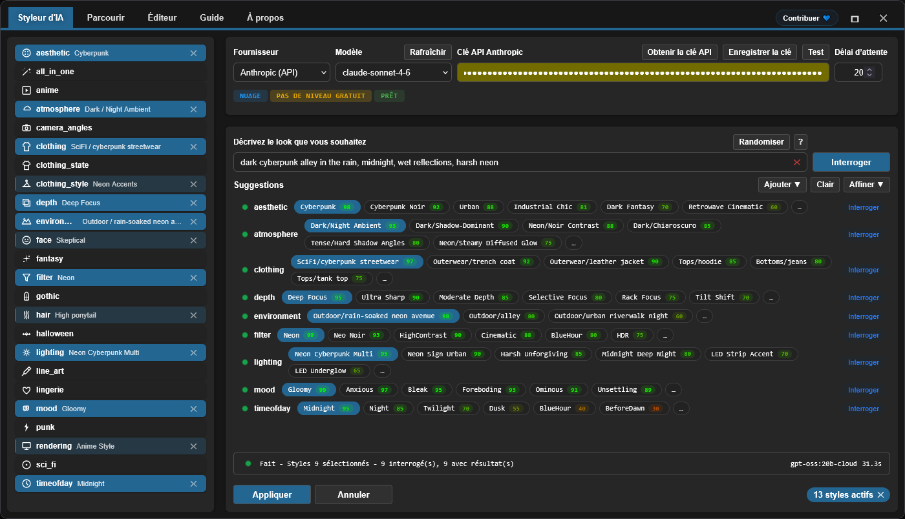

<h4 align="center">
  <a href="./README.md">English</a> | <a href="./README.de.md">Deutsch</a> | <a href="./README.es.md">Español</a> | Français | <a href="./README.pt.md">Português</a> | <a href="./README.ru.md">Русский</a> | <a href="./README.ja.md">日本語</a> | <a href="./README.ko.md">한국어</a> | <a href="./README.zh.md">中文</a> | <a href="./README.zh-TW.md">繁體中文</a>
</h4>

<p align="center">
  
  
  
</p>
<br />

# ComfyUI Styler Pipeline ✨

> Nodes styler-pipeline ciblés pour des workflows ComfyUI reproductibles : application de styles avec des nodes Styler déterministes et sûrs pour le conditioning.

---

## <a id="table-of-contents"></a>Table des matières

- ✨ [Fonctionnalités](#features)
- 📦 [Installation](#installation)
- 🔧 [Nodes](#nodes)
- 🤖 [Configuration LLM](#llm-setup)
- ✍️ [Prompts IA](#ai-prompts)
- 📝 [JSON avancé](#advanced-json)
- 💖 [Support](#support)
- 🖼️ [Galerie](#gallery)
- 🤝 [Contribuer](#contributing)
- 📄 [Licence](#license)

---

## <a id="features"></a>Fonctionnalités

- Nodes styler-pipeline déterministes conçus pour rester reproductibles d’un run à l’autre.
- Sélection de styles assistée par AI : interroge un LLM par catégorie et renvoie des candidats de style classés avec des scores.
- Parcours et sélection manuels de styles via le workflow Browser avec navigation par catégories.
- Dynamic Styler qui applique le style de manière sûre au conditioning existant.
- Node classique `Advanced Styler` basé sur des menus déroulants, pour un contrôle catégorie par catégorie dans le graphe.
- Compatible avec les workflows ControlNet, y compris les setups pilotés par OpenPose.

---

## <a id="installation"></a>Installation

### Prérequis
- ComfyUI (build récent)
- Python 3.10+

### Étapes

1. Clonez ce repo dans `ComfyUI/custom_nodes/`.
2. Redémarrez ComfyUI.
3. Vérifiez que les nodes apparaissent sous `Styler Pipeline/`.

---

## <a id="nodes"></a>Nodes

### Styler Pipeline

**En bref :**
- Node principal pour le styling au quotidien avec le panneau **Edit**.
- Déterministe et reproductible, car les sélections sont stockées dans un JSON interne.


**Inputs :**
- `positive` (`CONDITIONING`, required)
- `negative` (`CONDITIONING`, required)
- `clip` (`CLIP`, required to apply styles)
- `strength` (`FLOAT`, default `1.0`)
- `redundancy` (`INT`, default `1`)
- `selected_styles_json` (`STRING`, internal UI state)

**Outputs :**
- `positive` (`CONDITIONING`)
- `negative` (`CONDITIONING`)

**Notes de comportement :**
- Utilise les styles sélectionnés pour encoder un conditioning de style additionnel, puis le fusionne dans le conditioning existant.
- Cliquez sur **Edit** pour gérer les sélections catégorie/style dans un seul panneau et les écrire dans le JSON interne.

#### Guide Strength et Redundancy

`strength` contrôle à quel point les styles sélectionnés guident la génération. Les différents checkpoints/models ne réagissent pas tous de la même façon : certains appliquent les styles fortement avec peu de `strength`, tandis que d’autres sont plus résistants.

Si un model est résistant, augmenter `strength` peut aider. Mais au-delà d’un certain point, cela dégrade généralement la qualité ; autour de `~1.3+`, la dégradation devient souvent visible, car c’est en pratique comme “crier” l’instruction au `KSampler`.

`redundancy` répète littéralement les styles sélectionnés plusieurs fois pour augmenter leur poids. Cela peut améliorer l’adhérence au style, mais pousser la redundancy trop haut peut nuire à la composition.

- Point de départ sûr : `strength = 1.0`, `redundancy = 1`.
- Ajustement typique : augmentez d’abord `strength` progressivement, par petits pas.
- Dans la plupart des cas, gardez `redundancy` à `2` ou moins.

**AI Styler module :**
Décrivez le rendu que vous voulez, et **AI Styler** demande à un LLM de suggérer automatiquement les styles les plus pertinents par catégorie.
Supporte les principaux providers API (OpenAI, Anthropic, Groq, Gemini, Hugging Face) et supporte aussi **Ollama (Local)** pour fonctionner offline/sans internet.
Sur l’image ci-dessous, vous voyez l’onglet **AI Styler** ouvert depuis **Edit**, où des suggestions basées sur le prompt sont générées et appliquées.



**Browser module :**
Si vous préférez ne pas utiliser AI Styler, l’onglet **Browse** vous permet de choisir les styles manuellement et de garder davantage de contrôle.
Sur l’image ci-dessous, vous voyez l’onglet **Browser** dans le même panneau, où les catégories et styles sont sélectionnés manuellement.


**Editor module :**
Editor vous permet de voir les styles chargés depuis les fichiers JSON par catégorie (`data/*.json`).
Les outils d’édition sont actuellement en construction et seront disponibles bientôt (budget de tokens AI limité pour le moment).

> [!NOTE]
> Comme les styles sélectionnés sont stockés dans les données du node, le même workflow reste reproductible même si vous ajoutez/supprimez des catégories et styles définis dans les fichiers JSON, tant que vous conservez les styles initialement sélectionnés.

### Styler Pipeline (Single)

Appliquez un style à la fois en choisissant manuellement `category` et `style`.


**Inputs :**
- `positive` (`CONDITIONING`, required)
- `negative` (`CONDITIONING`, required)
- `category` (`STRING`/dropdown, required)
- `style` (`STRING`/dropdown, required)
- `clip` (`CLIP`, required to apply styles)
- `strength` (`FLOAT`, default `1.0`)
- `redundancy` (`INT`, default `1`)

**Outputs :**
- `positive` (`CONDITIONING`)
- `negative` (`CONDITIONING`)
- `style` (`STRING`)

### Styler Pipeline (By Index) + Index Iterator

Utilisez ce duo pour des balayages de styles déterministes, sans sélectionner manuellement les styles : un index incrémental applique les styles d’une catégorie sélectionnée, un par un.
`Styler Pipeline (By Index)` applique un style d’une catégorie via `style_index`, et `Index Iterator` fournit un index incrémental à chaque exécution.


**Inputs :**
- `Styler Pipeline (By Index)`: `positive`, `negative`, `category`, `style_index`, `clip`, `strength`, `redundancy`, `prepend_timestamp`.
- `Index Iterator`: `reset`, `start`.

**Outputs :**
- `Styler Pipeline (By Index)`: `positive`, `negative`, `style`.
- `Index Iterator`: `index` (`INT`).

**Usage :** Connectez votre conditioning `positive` et `negative`, et connectez correctement `clip`. Ensuite, sélectionnez une `category` dans `Styler Pipeline (By Index)` et alimentez `style_index` avec la sortie `index` de `Index Iterator`. À chaque exécution du workflow, `Index Iterator` incrémente à partir de la valeur `start` configurée, de sorte que le style suivant de cette catégorie est appliqué automatiquement. C’est utile pour tester rapidement beaucoup de styles sans changer manuellement la sélection avant d’envoyer le conditioning résultant vers des nodes downstream comme `KSampler`.

---

### Advanced Styler Pipeline

Styler classique basé sur des menus, avec des dropdowns directs pour chaque catégorie JSON.

**En bref :**
- Utile si vous voulez un contrôle catégorie par catégorie avec des dropdowns dans le graphe.
- Ajoute explicitement du conditioning de style à vos flux `positive`/`negative` actuels.
- Plus rapide à parcourir que d’ouvrir le panneau lorsque vous connaissez déjà vos choix par catégorie.


**Inputs :**
- `positive` (`CONDITIONING`, required)
- `negative` (`CONDITIONING`, required)
- `clip` (`CLIP`, optional input, required to apply style encoding)
- `strength` (`FLOAT`, default `1.0`)
- `redundancy` (`INT`, default `1`)
- Style dropdowns loaded from `data/*.json`

**Outputs :**
- `positive` (`CONDITIONING`)
- `negative` (`CONDITIONING`)

**Usage :** Connectez le conditioning entrant `positive` et `negative` à ce node, connectez `clip`, puis choisissez les dropdowns de style souhaités pour chaque catégorie afin de “layer” le rendu. Le node augmente votre conditioning existant au lieu de le remplacer : ajustez donc `strength` et `redundancy` selon vos besoins. Enfin, connectez les sorties `positive` et `negative` à des nodes downstream comme `KSampler` pour la génération.

---

## <a id="llm-setup"></a>Configuration LLM

AI Styler utilise le Provider et le Model que vous choisissez dans l’UI. Ouvrez **Edit** et utilisez l’onglet **AI Styler** pour sélectionner d’abord un `Provider`, puis un `Model` pour ce provider.

### Cloud API Providers

Les Cloud API Providers (OpenAI, Anthropic, Google Gemini, Hugging Face, Groq, etc.) sont consultés via leur API. Sélectionnez le provider et le model dans l’onglet AI Styler, puis collez votre API key ou token dans le champ de token avant de lancer des suggestions.
Avant d’utiliser un provider cloud, cliquez sur **Refresh** pour récupérer la liste de models la plus récente.

**Provider notes (sujettes aux politiques des providers et susceptibles de changer) :**
- **Hugging Face** — propose un accès free-tier selon le model et le provider.
- **Groq** — propose souvent un free tier ; vérifiez la politique actuelle.
- **OpenAI, Google Gemini, Anthropic** — requièrent généralement un billing activé pour utiliser l’API.

> [!WARNING]
> OpenAI API n’a pas pu être testée car il n’a pas été possible d’activer le billing avec des cartes prépayées. Si vous rencontrez une erreur avec OpenAI, veuillez ouvrir une issue GitHub avec des informations détaillées afin que cela puisse être corrigé au plus vite.

L’API key ou le token est utilisé uniquement pour l’exécution en cours et le plugin **ne le stocke pas** ; toutefois, vous pouvez l’enregistrer dans le Password Manager de votre navigateur via le bouton **Save token** fourni.

### Ollama Models (Local + Cloud)

[Ollama](https://ollama.com/download) est une application de bureau gratuite qui vous permet d’exécuter des LLMs entièrement offline sur votre propre matériel. Une fois connecté à un compte Ollama gratuit, vous pouvez également utiliser des models **Ollama Cloud** sans les télécharger localement.

> [!TIP]
> Ollama ne nécessite jamais d’API key — ni pour les models locaux ni pour les models cloud. Les models cloud nécessitent seulement de se connecter à un compte Ollama gratuit dans l’application Ollama.

**Comment faire apparaître les models Ollama :**

Après l’installation d’Ollama, AI Styler peut lister **zero models** tant que vous n’en avez pas activé un dans l’application Ollama :

1. Ouvrez l’application de bureau Ollama et laissez-la tourner (minimisée, c’est ok ; ne la fermez pas).
2. Dans l’application Ollama, sélectionnez le model que vous voulez utiliser :
   - **Local model:** choisissez un model à télécharger sur votre machine. `gemma3:4b` est un bon point de départ — plus léger et plus rapide que la plupart.
   - **Cloud model:** connectez-vous à votre compte Ollama gratuit dans l’app, puis sélectionnez un model cloud.
3. Envoyez un message court dans l’app Ollama (par exemple, "test") pour activer le model sélectionné.
4. Revenez à AI Styler et cliquez sur **Refresh** ; le model devrait maintenant apparaître dans le dropdown des models.

> [!WARNING]
> Il est fortement recommandé de **ne pas interroger des models Ollama locaux pendant l’exécution d’un workflow ComfyUI**. Cela peut surcharger sévèrement les ressources GPU/CPU partagées et rendre votre système très lent et instable. Si possible, privilégiez un **provider cloud**, généralement plus rapide et plus efficace. Si vous souhaitez quand même utiliser Ollama local, commencez avec un petit model comme **gemma3:4b** avant d’essayer des models plus gros.

**Troubleshooting (Ollama local) :**

- Aucun model local n’apparaît :
  - Envoyez n’importe quel message à un model local dans l’app Ollama pour l’initialiser.
  - Vérifiez qu’Ollama tourne et est accessible sur `http://127.0.0.1:11434`.
- Le statut affiche "Not connected" :
  - Redémarrez Ollama, puis rouvrez AI Styler.
  - Vérifiez que le firewall/logiciel de sécurité local ne bloque pas le port localhost `11434`.
- Ollama ne tourne pas :
  - Lancez l’app (Windows/macOS) ou exécutez `ollama serve` (Linux).

---

## <a id="ai-prompts"></a>Prompts IA

Gardez les prompts courts et spécifiques. Décrivez la direction visuelle, pas une histoire complète.

### Quoi inclure

- Genre/style : sci-fi, noir, anime, fantasy, etc.
- Mood : tense, cozy, melancholic, energetic.
- Lighting : soft, practical, cinematic rim light, harsh noon sun.
- Time of day : dawn, golden hour, night, overcast afternoon.
- Environment : alley, spaceship interior, forest, classroom, rooftop.

### Quoi éviter

- Des prompts trop longs avec trop d’idées concurrentes.
- Des directives contradictoires dans la même phrase (par exemple : "dark night scene with bright midday sun").

### Comment utiliser les suggestions retournées

- Commencez en gardant 1–2 catégories fortes qui correspondent le mieux à votre objectif.
- Générez/testez, puis affinez avec un petit nombre de catégories supplémentaires.
- Évitez d’empiler des catégories conflictuelles en même temps ; ajoutez les changements de manière incrémentale.

---

## <a id="advanced-json"></a>JSON avancé

> Réservé aux **advanced users**. L’édition JSON est actuellement le seul moyen de modifier les styles ; une UI visuelle d’Editor est prévue pour une future version. Les prompts inclus ont été affinés avec AI mais n’ont pas été testés exhaustivement — certains peuvent nécessiter de petites retouches manuelles.

Les advanced users peuvent personnaliser les styles librement :

- **Ajouter ou supprimer des fichiers complets `data/*.json`.** Tout fichier JSON placé sous `data/` devient automatiquement une nouvelle catégorie de style et apparaît dans la liste des catégories.
- **Ajouter, supprimer ou renommer des entrées de style individuelles** dans n’importe quel fichier JSON, et ajuster les prompts si nécessaire.

**Note de reproductibilité :** Les workflows existants restent reproductibles tant que les entrées de style référencées ne sont pas renommées ou supprimées. Si un style utilisé par un workflow plus ancien est renommé ou supprimé, ce workflow ne retrouvera plus sa définition de style et ne reproduira pas le même résultat.

Gardez les fichiers de styles `data/*.json` cohérents afin que les nodes Styler restent prévisibles.

### JSON shape

```json
[
  {
    "name": "style name",
    "prompt": "style description, {prompt}, token1, token2, token3",
    "negative_prompt": ""
  }
]
```

Required keys per item:
- `name` (string)
- `prompt` (string)
- `negative_prompt` (string, can be empty)

### Conseils pratiques

- Préférez un langage visuel concret plutôt que des tags abstraits de “qualité”.
- Gardez les prompts concis et descriptifs visuellement.
- Gardez des noms user-friendly et faciles à parcourir.
- Gardez le JSON strictement valide (pas de commentaires, pas de virgules finales).
- **Évitez les mots que les models interprètent comme des objets physiques.** Certains noms déclenchent un rendu littéral d’objets même lorsque l’intention est une couleur ou une coiffure. Par exemple, **amber-toned** peut faire dessiner des pierres d’ambre au lieu d’une teinte dorée chaleureuse ; **crown braids** peut faire apparaître une couronne littérale. La solution la plus sûre est de retirer complètement le mot déclencheur et de décrire l’intention avec un autre vocabulaire — par exemple, au lieu de "amber-toned" utiliser "warm golden hue" ; au lieu de "crown braids" utiliser "intricate braided updo".

> [!TIP]
> Si un prompt de style fait apparaître un objet inattendu dans les outputs, c’est probablement à cause d’un trigger word interprété littéralement. Exemples courants : **amber-toned** (rend des pierres d’ambre) et **crown braids** (rend une couronne littérale).

---

## <a id="support"></a>Support

### Pourquoi votre soutien compte

Ce plugin est développé et maintenu de manière indépendante, avec un usage régulier de **paid AI agents** pour accélérer le debugging, le testing et les améliorations de qualité de vie. S’il vous est utile, un soutien financier aide à maintenir un rythme de développement durable.

Votre contribution aide à :

* Financer des outils AI pour des fixes plus rapides et de nouvelles features
* Couvrir la maintenance continue et le travail de compatibilité à travers les mises à jour ComfyUI
* Éviter que le développement ne s’arrête lorsque des limites d’usage sont atteintes

> [!TIP]
> Vous ne souhaitez pas donner ? Une étoile ⭐ sur GitHub aide quand même beaucoup, en améliorant la visibilité et en aidant plus d’utilisateurs à le découvrir

### 💙 Support this project

<table style="width: 100%; table-layout: fixed;">
  <tr>
    <td align="center" style="width: 33.33%; padding: 20px;">
      <div>
        <h4 style="margin: 8px 0;">Ko-fi</h4>
        <a href="https://ko-fi.com/D1D716OLPM" target="_blank" rel="noopener noreferrer">
          
        </a>
        <p style="margin: 8px 0; font-size: 12px;"><a href="https://ko-fi.com/D1D716OLPM" target="_blank" rel="noopener noreferrer">Buy a Coffee</a></p>
      </div>
    </td>
    <td align="center" style="width: 33.33%; padding: 20px;">
      <div>
        <h4 style="margin: 8px 0;">PayPal</h4>
        <a href="https://www.paypal.com/ncp/payment/GEEM324PDD9NC" target="_blank" rel="noopener noreferrer">
          
        </a>
        <p style="margin: 8px 0; font-size: 12px;"><a href="https://www.paypal.com/ncp/payment/GEEM324PDD9NC" target="_blank" rel="noopener noreferrer">Open PayPal</a></p>
      </div>
    </td>
    <td align="center" style="width: 33.33%; padding: 20px;">
      <div>
        <h4 style="margin: 8px 0;">USDC (Arbitrum only ⚠️)</h4>
        <a href="https://arbiscan.io/address/0xe36a336fC6cc9Daae657b4A380dA492AB9601e73" target="_blank" rel="noopener noreferrer">
          
        </a>
        <p style="margin: 8px 0; font-size: 12px;"><a href="#usdc-address">Show address</a></p>
      </div>
    </td>
  </tr>
</table>

<details>
  <summary>Vous préférez scanner ? Afficher les QR codes</summary>
  <br />
  <table style="width: 100%; table-layout: fixed;">
    <tr>
      <td align="center" style="width: 33.33%; padding: 12px;">
        <strong>Ko-fi</strong><br />
        <a href="https://ko-fi.com/D1D716OLPM" target="_blank" rel="noopener noreferrer">
          
        </a>
      </td>
      <td align="center" style="width: 33.33%; padding: 12px;">
        <strong>PayPal</strong><br />
        <a href="https://www.paypal.com/ncp/payment/GEEM324PDD9NC" target="_blank" rel="noopener noreferrer">
          
        </a>
      </td>
      <td align="center" style="width: 33.33%; padding: 12px;">
        <strong>USDC (Arbitrum) ⚠️</strong><br />
        <a href="https://arbiscan.io/address/0xe36a336fC6cc9Daae657b4A380dA492AB9601e73" target="_blank" rel="noopener noreferrer">
          
        </a>
      </td>
    </tr>
  </table>
</details>

<a id="usdc-address"></a>
<details>
  <summary>Afficher l’adresse USDC</summary>

```text
0xe36a336fC6cc9Daae657b4A380dA492AB9601e73
```

> [!WARNING]
> Envoyez USDC uniquement via Arbitrum One. Les transferts envoyés sur n’importe quel autre réseau n’arriveront pas et peuvent être perdus définitivement.
</details>

## <a id="gallery"></a>Galerie

### Example workflow
Cliquez sur l’image ci-dessous pour ouvrir l’exemple complet du workflow :
Vous pouvez aussi glisser-déposer cette image de workflow dans ComfyUI pour l’ouvrir/importer.
Cet exemple utilise ControlNet pour OpenPose via un node de [OpenPose Studio](https://github.com/andreszs/ComfyUI-OpenPose-Studio).

<a href="../workflows/sample_workflow.png" target="_blank" rel="noopener noreferrer">
  
</a>

### Exemples d'images

> [!NOTE]
> Toutes les images de démo ci-dessous utilisent le même model, la même LoRA, le même prompt de base et le même seed. La seule différence est le style appliqué par le node **Styler Pipeline**.

| Image | Styles used |
|---|---|
| <a href="../workflows/sample_bypass.png" target="_blank" rel="noopener noreferrer"></a> | - Baseline: Styler not applied<br>- Generation settings (shared):<br>&nbsp;&nbsp;- Resolution: `1024×1344`<br>&nbsp;&nbsp;- Seed: `717891937617865`<br>&nbsp;&nbsp;- Steps: `25`<br>&nbsp;&nbsp;- CFG: `4`<br>&nbsp;&nbsp;- Sampler: `dpmpp_2m_sde`<br>&nbsp;&nbsp;- Scheduler: `karras`<br>&nbsp;&nbsp;- Denoise: `1.0`<br>&nbsp;&nbsp;- Checkpoint: `yiffInHell_yihXXXTended.safetensors`<br>&nbsp;&nbsp;- LoRA: `inuyasha_ilxl.safetensors`<br>&nbsp;&nbsp;- ControlNet: `illustriousXL_v10.safetensors` |
| <a href="../workflows/sample_4.png" target="_blank" rel="noopener noreferrer"></a> | - aesthetic: `Enchanted Forest`<br>- atmosphere: `Neon/Bioluminescent Glow`<br>- environment: `Nature/bamboo forest`<br>- filter: `BlueHour`<br>- lighting: `Bioluminescent Organic`<br>- mood: `Enchanted`<br>- timeofday: `Twilight`<br>- face: `Raised Eyebrow`<br>- hair: `Color combo silver and cyan`<br>- clothing_style: `Iridescent`<br>- depth: `Soft Focus`<br>- clothing: `Specialty/fantasy outfit` |
| <a href="../workflows/sample_3.png" target="_blank" rel="noopener noreferrer"></a> | - aesthetic: `Rustic`<br>- atmosphere: `Melancholic/Cold Overcast`<br>- environment: `Historical/medieval village`<br>- filter: `BlueHour`<br>- lighting: `Overcast Diffusion`<br>- mood: `Bleak`<br>- timeofday: `Midday`<br>- face: `Serious`<br>- hair: `Silver white hair`<br>- clothing_style: `Denim Fabric`<br>- depth: `Deep Focus`<br>- clothing: `Historical/viking raider` |
| <a href="../workflows/sample_2.png" target="_blank" rel="noopener noreferrer"></a> | - aesthetic: `Dark Fantasy`<br>- atmosphere: `Dark/Night Ambient`<br>- environment: `Outdoor/temple hill overlook`<br>- filter: `Soft`<br>- lighting: `Soft General`<br>- mood: `Meditative`<br>- timeofday: `Midnight`<br>- face: `Worried`<br>- hair: `Long wavy hair`<br>- depth: `Ultra Sharp`<br>- rendering: `Semi-Realistic`<br>- clothing: `Medieval/monk robe` |
| <a href="../workflows/sample_1.png" target="_blank" rel="noopener noreferrer"></a> | - aesthetic: `Cyberpunk`<br>- atmosphere: `Dark/Night Ambient`<br>- environment: `Asian/japanese neon alley`<br>- filter: `Neon`<br>- lighting: `Multi-Source Complex`<br>- mood: `Gloomy`<br>- timeofday: `Midnight`<br>- face: `Skeptical`<br>- hair: `High ponytail`<br>- clothing_style: `Neon Accents`<br>- depth: `Selective Focus`<br>- rendering: `Anime Style`<br>- clothing: `SciFi/cyberpunk streetwear` |

Bonnes pratiques pour des résultats fiables :
- L’influence de Styler varie selon le Model ; certains Models se laissent guider plus facilement que d’autres. Si un Model ne “coopère” pas avec les styles, augmentez légèrement `strength` ou `redundancy` pour augmenter l’influence de Styler.
- Votre prompt positif (`CONDITIONING`) a généralement plus de poids que le node Styler. Votre prompt ne doit pas contredire les styles souhaités, sinon l’effet du Styler sera réduit.
- Pour SDXL, Pony et Illustrious, ControlNet OpenPose est souvent un guide plutôt qu’une règle stricte, et peut être surchargé par le prompt. Si le prompt contredit la pose appliquée, ControlNet peut être ignoré ou produire une composition incohérente. Renforcer la pose dans le prompt est généralement une bonne idée.
- Utilisez `camera_angles` avec précaution pour éviter tout conflit avec votre prompt ou ControlNet. C’est la catégorie la plus sensible et elle est souvent ignorée si elle est mal utilisée, car elle pilote la composition plus que le style.

### Styler Iterator workflow

<a href="../workflows/sample_styler_iterator.png" target="_blank" rel="noopener noreferrer">
  
</a>

- **Extensions required:** [comfyui-openpose-studio](https://github.com/andreszs/ComfyUI-OpenPose-Studio)

Vous pouvez charger cette image dans ComfyUI pour extraire/ouvrir le workflow.
Ce workflow itère séquentiellement à travers les styles d’une catégorie à chaque run, ce qui permet de tester différents styles sans changer les valeurs manuellement.
À cause d’une limitation technique, l’image générée ne peut pas inclure le nom du style itéré au sein de son propre workflow ; utilisez la sortie `style` du node `Styler Pipeline (By Index)` comme partie du nom de fichier, sinon il est très difficile d’identifier quel style a été appliqué.
Le workflow iterator ne peut ni persister l’index utilisé ni le nom du style appliqué dans le workflow.

### Conditioning Areas workflow (Experimental)

Le node Styler Pipeline n’est pas seulement compatible avec les workflows ControlNet : il est aussi **100% compatible** avec les nodes `Conditioning Pipeline Area` de [comfyui-lora-pipeline](https://github.com/andreszs/comfyui-lora-pipeline).
Ce setup active le styling par zone, afin que vous puissiez appliquer des styles différents à des zones différentes de l’image en connectant des nodes Styler dans cette pipeline.
Ces nodes permettent aussi plusieurs LoRAs sans mélanger leurs styles, car ils encapsulent la logique native ComfyUI `Cond Pair Set Props` sans exposer de hooks, et utilisent des zones plutôt que des masques.

<a href="../workflows/sample_conditioning_areas.png" target="_blank" rel="noopener noreferrer">
  
</a>

- **Extensions required:** [comfyui-openpose-studio](https://github.com/andreszs/ComfyUI-OpenPose-Studio), [comfyui-lora-pipeline](https://github.com/andreszs/comfyui-lora-pipeline)
- **Experimental:** le fine-tuning de ce workflow multi-LoRA multi-zone avec ControlNet est plus complexe, et son exécution est considérablement plus lente que celle de workflows standard.

Les styles par zone et les poses cohérentes peuvent être simples, mais la qualité finale dépend de nombreux facteurs et n’est pas détaillée ici. Pour plus de détails, lisez le README de [comfyui-lora-pipeline](https://github.com/andreszs/comfyui-lora-pipeline).

Consultez [cet article](https://www.andreszsogon.com/building-a-multi-character-comfyui-workflow-with-area-conditioning-openpose-control-and-style-layering/) pour un workflow complet combinant plusieurs zones de conditioning, OpenPose, ControlNet et Styler utilisés simultanément.

## <a id="contributing"></a>Contribuer

### Principes de base

- Gardez les pull requests ciblées et minimales.
- Évitez les refactors larges sauf discussion préalable.
- Préservez l’architecture existante et sa justification.

### Changements assistés par AI

Si vous utilisez un assistant de code basé sur AI, demandez-lui de lire et suivre [AGENTS.md](../AGENTS.md) avant d’effectuer des changements.

### Critères d’acceptation

- Un problème ou une amélioration claire par PR.
- Des diffs localisés et faciles à reviewer.
- Une explication claire de pourquoi le changement est nécessaire.

---

## <a id="license"></a>Licence

MIT License - voir [LICENSE](../LICENSE) pour le texte complet.

---

**Last update:** 2026-02-13  
**Maintained by:** andreszs  
**Status:** Active development
