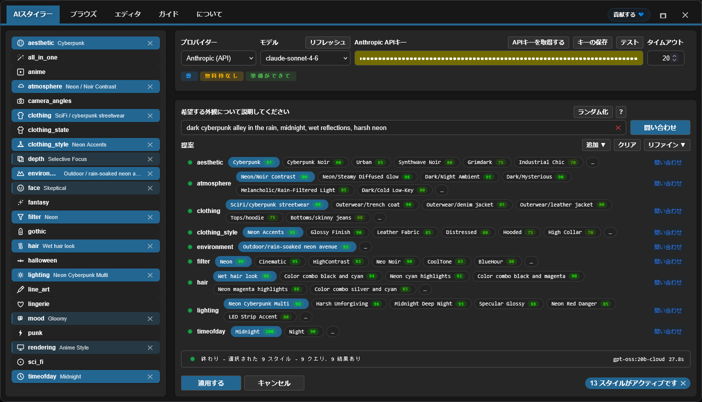

<h4 align="center">
  <a href="./README.md">English</a> | <a href="./README.de.md">Deutsch</a> | <a href="./README.es.md">Español</a> | <a href="./README.fr.md">Français</a> | <a href="./README.pt.md">Português</a> | <a href="./README.ru.md">Русский</a> | 日本語 | <a href="./README.ko.md">한국어</a> | <a href="./README.zh.md">中文</a> | <a href="./README.zh-TW.md">繁體中文</a>
</h4>

<p align="center">
  
  
  
</p>
<br />

# ComfyUI Styler Pipeline ✨

> ComfyUI で再現性のあるワークフローのための、焦点を絞った styler-pipeline ノード群：決定論的な Styler ノードと安全な conditioning マージによるスタイル適用。

---

## <a id="table-of-contents"></a>目次

- ✨ [特徴](#features)
- 📦 [インストール](#installation)
- 🔧 [Nodes](#nodes)
- 🤖 [LLM セットアップ](#llm-setup)
- ✍️ [AI プロンプト](#ai-prompts)
- 📝 [JSON 詳細設定](#advanced-json)
- 💖 [サポート](#support)
- 🖼️ [ギャラリー](#gallery)
- 🤝 [コントリビューション](#contributing)
- 📄 [ライセンス](#license)

---

## <a id="features"></a>特徴

- 実行間で再現性を保つよう設計された、決定論的な styler-pipeline ノード。
- AI によるスタイル選択：カテゴリごとに LLM を問い合わせ、スコア付きでランク付けされたスタイル候補を返します。
- Browser ワークフローによるカテゴリナビゲーション付きの手動スタイル閲覧・選択。
- 既存の conditioning に安全にスタイルを適用する Dynamic Styler。
- グラフ内でカテゴリごとに制御できる、ドロップダウン型のクラシック `Advanced Styler` ノード。
- OpenPose 主導のケースを含む ControlNet ワークフローと互換。

---

## <a id="installation"></a>インストール

### 必要環境
- ComfyUI（最近の build）
- Python 3.10+

### 手順

1. このリポジトリを `ComfyUI/custom_nodes/` に clone します。
2. ComfyUI を再起動します。
3. ノードが `Styler Pipeline/` に表示されることを確認します。

---

## <a id="nodes"></a>Nodes

### Styler Pipeline

**概要：**
- 日常的なスタイリング向けのメインノード（**Edit** パネル）。
- 選択内容が内部 JSON に保存されるため、決定論的かつ再現可能です。


**Inputs:**
- `positive` (`CONDITIONING`, required)
- `negative` (`CONDITIONING`, required)
- `clip` (`CLIP`, required to apply styles)
- `strength` (`FLOAT`, default `1.0`)
- `redundancy` (`INT`, default `1`)
- `selected_styles_json` (`STRING`, internal UI state)

**Outputs:**
- `positive` (`CONDITIONING`)
- `negative` (`CONDITIONING`)

**挙動メモ：**
- 選択されたスタイルを用いて追加のスタイル conditioning をエンコードし、既存の conditioning にマージします。
- **Edit** をクリックして、1つのパネルでカテゴリ/スタイルの選択を管理し、内部 JSON に書き込みます。

#### Strength と Redundancy のガイド

`strength` は、選択したスタイルが生成をどれだけ強く誘導するかを制御します。checkpoint/model によって効き方は異なり、少ない `strength` で強く効くものもあれば、より抵抗するものもあります。

model が抵抗する場合は `strength` を上げると改善することがありますが、ある程度を超えると品質が悪化しがちです。`~1.3+` 付近から劣化が目立つことが多く、実質的に `KSampler` に指示を「叫んでいる」ような状態になります。

`redundancy` は、選択したスタイルを複数回繰り返して重みを増やします。スタイルの追従性が上がる場合がありますが、上げすぎると構図が崩れることがあります。

- 安全な開始点：`strength = 1.0`, `redundancy = 1`
- 一般的な調整：まず `strength` を小刻みに段階的に上げる
- 多くの場合、`redundancy` は `2` 以下に保つ

**AI Styler module:**
欲しい見た目を説明すると、**AI Styler** が LLM に問い合わせて、カテゴリごとに最も一致するスタイルを自動で提案します。
主要な API Provider（OpenAI, Anthropic, Groq, Gemini, Hugging Face）をサポートし、さらにオフライン/インターネットなしで動かせる **Ollama (Local)** もサポートします。
下の画像は、**Edit** から開いた **AI Styler** タブで、prompt に基づく提案を生成して適用しているところです。



**Browser module:**
AI Styler を使いたくない場合、**Browse** タブで手動でスタイルを選択でき、より細かく制御できます。
下の画像は同じパネル内の **Browser** タブで、カテゴリとスタイルを手動選択しているところです。


**Editor module:**
Editor では、カテゴリごとに JSON ファイル（`data/*.json`）からロードされたスタイルを確認できます。
編集ツールは現在開発中で、近いうちに利用可能になります（現時点では AI の token 予算が限られています）。

> [!NOTE]
> 選択したスタイルはノードデータ内に保存されるため、スタイル JSON ファイルでカテゴリやスタイルを追加/削除しても、元々選択していたスタイルを維持している限り、同じワークフローは再現可能です。

### Styler Pipeline (Single)

`category` と `style` を手動で選び、1つのスタイルを適用します。


**Inputs:**
- `positive` (`CONDITIONING`, required)
- `negative` (`CONDITIONING`, required)
- `category` (`STRING`/dropdown, required)
- `style` (`STRING`/dropdown, required)
- `clip` (`CLIP`, required to apply styles)
- `strength` (`FLOAT`, default `1.0`)
- `redundancy` (`INT`, default `1`)

**Outputs:**
- `positive` (`CONDITIONING`)
- `negative` (`CONDITIONING`)
- `style` (`STRING`)

### Styler Pipeline (By Index) + Index Iterator

手動選択なしで決定論的にスタイルをスイープするために、このペアを使います。インクリメンタルな index によって、選択したカテゴリのスタイルを1つずつ適用します。
`Styler Pipeline (By Index)` は `style_index` を使って選択カテゴリのスタイルを適用し、`Index Iterator` は実行ごとにインクリメンタルな index を提供します。


**Inputs:**
- `Styler Pipeline (By Index)`: `positive`, `negative`, `category`, `style_index`, `clip`, `strength`, `redundancy`, `prepend_timestamp`.
- `Index Iterator`: `reset`, `start`.

**Outputs:**
- `Styler Pipeline (By Index)`: `positive`, `negative`, `style`.
- `Index Iterator`: `index` (`INT`).

**Usage:** `positive` と `negative` の conditioning を接続し、`clip` を正しく接続します。その後、`Styler Pipeline (By Index)` で `category` を選び、`style_index` に `Index Iterator` の出力 `index` を接続します。ワークフローを実行するたびに `Index Iterator` は設定した `start` からインクリメントし、そのカテゴリの次のスタイルが自動適用されます。Downstream の `KSampler` などへ送る前に、毎回手動で切り替えずに多くのスタイルを素早く試すのに便利です。

---

### Advanced Styler Pipeline

各 JSON カテゴリに対して直接 dropdown を持つ、クラシックなメニュー型 Styler。

**概要：**
- グラフ内で dropdown によりカテゴリごとに制御したい場合に便利。
- 既存の `positive`/`negative` 経路にスタイル conditioning を明示的に追加します。
- すでにカテゴリごとの選択が決まっている場合、パネルを開くより素早く確認できます。


**Inputs:**
- `positive` (`CONDITIONING`, required)
- `negative` (`CONDITIONING`, required)
- `clip` (`CLIP`, optional input, required to apply style encoding)
- `strength` (`FLOAT`, default `1.0`)
- `redundancy` (`INT`, default `1`)
- Style dropdowns loaded from `data/*.json`

**Outputs:**
- `positive` (`CONDITIONING`)
- `negative` (`CONDITIONING`)

**Usage:** 入力の `positive` と `negative` conditioning をこのノードに接続し、`clip` を接続したら、カテゴリごとに必要なスタイル dropdown を選択して見た目を「重ねて」いきます。このノードは既存の conditioning を置き換えるのではなく拡張するため、必要に応じて `strength` と `redundancy` を調整してバランスを取ってください。最後に `positive` と `negative` の出力を `KSampler` などの downstream ノードに接続して生成します。

---

## <a id="llm-setup"></a>LLM セットアップ

AI Styler は UI で選択した Provider と Model を使用します。**Edit** を開き、**AI Styler** タブでまず `Provider` を選び、次にその provider の `Model` を選択します。

### Cloud API Providers

Cloud API Providers（OpenAI, Anthropic, Google Gemini, Hugging Face, Groq など）は API 経由で呼び出されます。AI Styler タブで provider と model を選び、提案を実行する前に token フィールドへ API key または token を貼り付けてください。
cloud provider を使う前に **Refresh** をクリックし、最新の model リストを取得してください。

**Provider notes（provider のポリシーに依存し、変更される可能性があります）：**
- **Hugging Face** — model と provider により free-tier アクセスを提供します。
- **Groq** — free tier を提供することが多いですが、現行ポリシーを確認してください。
- **OpenAI, Google Gemini, Anthropic** — 通常、API 利用には billing の有効化が必要です。

> [!WARNING]
> OpenAI API は、プリペイドカードでは billing を有効化できずテストできませんでした。OpenAI 利用でエラーが出る場合は、詳細なエラー情報を添えて GitHub issue を作成してください。できるだけ早く修正します。

API key / token は現在の実行にのみ使用され、プラグインは **保存しません**。ただし、用意されている **Save token** ボタンで、ブラウザの Password Manager に保存できます。

### Ollama Models (Local + Cloud)

[Ollama](https://ollama.com/download) は、LLM を自分のハードウェアで完全にオフライン実行できる無料のデスクトップアプリです。無料の Ollama アカウントにサインインすると、ローカルにダウンロードせずに **Ollama Cloud** の model も利用できます。

> [!TIP]
> Ollama は API key を一切必要としません（ローカル/クラウドどちらの model でも）。Cloud model は、Ollama アプリ内で無料アカウントにログインするだけで利用できます。

**Ollama の model を表示させる方法：**

Ollama をインストールしても、Ollama アプリ側で model をアクティブにするまで、AI Styler は **zero models** と表示することがあります。

1. Ollama デスクトップアプリを開いて起動したままにします（最小化でOK。閉じないでください）。
2. Ollama アプリで使用したい model を選択します：
   - **Local model:** マシンにダウンロードする model を選びます。`gemma3:4b` は良い開始点です（多くの model より軽くて速い）。
   - **Cloud model:** アプリ内で無料アカウントにログインし、cloud model を選択します。
3. Ollama アプリで短いメッセージ（例："test"）を送って、選択した model をアクティブにします。
4. AI Styler に戻って **Refresh** をクリックします。model が model dropdown に表示されるはずです。

> [!WARNING]
> **ComfyUI の workflow 実行中にローカルの Ollama model を問い合わせない**ことを強く推奨します。GPU/CPU の共有リソースを大きく圧迫し、システムが非常に遅く不安定になる可能性があります。可能な限り **cloud provider** を優先してください（一般により高速で効率的です）。それでも Ollama local を使う場合は、まず **gemma3:4b** のような小さな model から始めてください。

**Troubleshooting（Ollama local）：**

- ローカル model が表示されない：
  - Ollama アプリでローカル model に対して何でも良いのでメッセージを送って初期化してください。
  - Ollama が起動しており、`http://127.0.0.1:11434` にアクセスできることを確認してください。
- ステータスが "Not connected" と表示される：
  - Ollama を再起動し、その後 AI Styler を開き直してください。
  - firewall/セキュリティソフトが localhost ポート `11434` をブロックしていないか確認してください。
- Ollama が起動していない：
  - アプリを起動（Windows/macOS）するか、`ollama serve` を実行してください（Linux）。

---

## <a id="ai-prompts"></a>AI プロンプト

prompt は短く具体的に。物語を長々と書くのではなく、視覚的な方向性を説明してください。

### 含めると良いもの

- Genre/style: sci-fi, noir, anime, fantasy, etc.
- Mood: tense, cozy, melancholic, energetic.
- Lighting: soft, practical, cinematic rim light, harsh noon sun.
- Time of day: dawn, golden hour, night, overcast afternoon.
- Environment: alley, spaceship interior, forest, classroom, rooftop.

### 避けるべきこと

- 長すぎる prompt（アイデアが多すぎて競合する）。
- 同じ文中で矛盾する指示（例："dark night scene with bright midday sun"）。

### 返ってきた提案の使い方

- まずは目標に最も合う強いカテゴリを1〜2個だけ残してスタート。
- 生成/テストしてから、追加カテゴリを少数だけ加えて refine。
- 競合しやすいカテゴリを同時に積み重ねない。変更は段階的に追加する。

---

## <a id="advanced-json"></a>JSON 詳細設定

> **advanced users** 向け。現在、JSON 編集がスタイルを変更する唯一の方法です。将来のバージョンで Editor のビジュアル UI を予定しています。含まれる prompt は AI で調整されていますが、網羅的にテストされていません — いくつかは小さな手動調整が必要になる可能性があります。

advanced users はスタイルを自由にカスタマイズできます：

- **`data/*.json` のファイルを丸ごと追加/削除。** `data/` 配下に置いた JSON ファイルは自動で新しいスタイルカテゴリとなり、カテゴリ一覧に表示されます。
- **任意の JSON ファイル内で、個々のスタイル項目を追加/削除/リネーム**し、必要に応じて prompt を編集します。

**再現性について：** 参照しているスタイル項目がリネーム/削除されない限り、既存のワークフローは再現可能です。古いワークフローが使っているスタイルがリネーム/削除されると、そのワークフローは定義を見つけられず、同じ結果を再現できなくなります。

styler ノードの予測可能性を保つため、`data/*.json` のスタイルファイルは整合性を維持してください。

### JSON shape

```json
[
  {
    "name": "style name",
    "prompt": "style description, {prompt}, token1, token2, token3",
    "negative_prompt": ""
  }
]
```

Required keys per item:
- `name` (string)
- `prompt` (string)
- `negative_prompt` (string, can be empty)

### 実用的なガイドライン

- 抽象的な quality タグより、具体的な視覚表現を優先する。
- prompt は簡潔に、視覚的に説明的に保つ。
- 名前は user-friendly で browse しやすくする。
- JSON は厳密に有効な形式を保つ（コメント禁止、末尾カンマ禁止）。
- **model が物理オブジェクトとして解釈しがちな単語を避ける。** 意図が色や髪型でも、一部の名詞は literal なオブジェクト描写を引き起こします。例：**amber-toned** は暖かい金色の意図でも琥珀の石を描くことがあり、**crown braids** は文字通りの王冠を生成することがあります。最も安全なのはトリガー単語を完全に削除し、別の語彙で意図を説明することです — 例えば "amber-toned" の代わりに "warm golden hue"、"crown braids" の代わりに "intricate braided updo"。

> [!TIP]
> スタイル prompt により予期せぬオブジェクトが出る場合、多くは literal に解釈される trigger word が原因です。一般的な例：**amber-toned**（琥珀の石をレンダリング）や **crown braids**（文字通りの王冠をレンダリング）。

---

## <a id="support"></a>サポート

### あなたのサポートが大切な理由

このプラグインは独立して開発・保守されており、デバッグ、テスト、QoL 改善を加速するために **paid AI agents** を定期的に活用しています。有用だと感じた場合、金銭的サポートは継続的な開発を支えます。

あなたの支援は以下に役立ちます：

* より速い修正と新機能のための AI ツール費用
* ComfyUI アップデートに伴う継続保守と互換対応
* 使用制限により開発が止まることを防ぐ

> [!TIP]
> 寄付しない場合でも、GitHub の ⭐ は大きな助けになります（可視性が上がり、より多くのユーザーに届きます）

### 💙 Support this project

<table style="width: 100%; table-layout: fixed;">
  <tr>
    <td align="center" style="width: 33.33%; padding: 20px;">
      <div>
        <h4 style="margin: 8px 0;">Ko-fi</h4>
        <a href="https://ko-fi.com/D1D716OLPM" target="_blank" rel="noopener noreferrer">
          
        </a>
        <p style="margin: 8px 0; font-size: 12px;"><a href="https://ko-fi.com/D1D716OLPM" target="_blank" rel="noopener noreferrer">Buy a Coffee</a></p>
      </div>
    </td>
    <td align="center" style="width: 33.33%; padding: 20px;">
      <div>
        <h4 style="margin: 8px 0;">PayPal</h4>
        <a href="https://www.paypal.com/ncp/payment/GEEM324PDD9NC" target="_blank" rel="noopener noreferrer">
          
        </a>
        <p style="margin: 8px 0; font-size: 12px;"><a href="https://www.paypal.com/ncp/payment/GEEM324PDD9NC" target="_blank" rel="noopener noreferrer">Open PayPal</a></p>
      </div>
    </td>
    <td align="center" style="width: 33.33%; padding: 20px;">
      <div>
        <h4 style="margin: 8px 0;">USDC (Arbitrum only ⚠️)</h4>
        <a href="https://arbiscan.io/address/0xe36a336fC6cc9Daae657b4A380dA492AB9601e73" target="_blank" rel="noopener noreferrer">
          
        </a>
        <p style="margin: 8px 0; font-size: 12px;"><a href="#usdc-address">Show address</a></p>
      </div>
    </td>
  </tr>
</table>

<details>
  <summary>スキャンしたい？ QR コードを表示</summary>
  <br />
  <table style="width: 100%; table-layout: fixed;">
    <tr>
      <td align="center" style="width: 33.33%; padding: 12px;">
        <strong>Ko-fi</strong><br />
        <a href="https://ko-fi.com/D1D716OLPM" target="_blank" rel="noopener noreferrer">
          
        </a>
      </td>
      <td align="center" style="width: 33.33%; padding: 12px;">
        <strong>PayPal</strong><br />
        <a href="https://www.paypal.com/ncp/payment/GEEM324PDD9NC" target="_blank" rel="noopener noreferrer">
          
        </a>
      </td>
      <td align="center" style="width: 33.33%; padding: 12px;">
        <strong>USDC (Arbitrum) ⚠️</strong><br />
        <a href="https://arbiscan.io/address/0xe36a336fC6cc9Daae657b4A380dA492AB9601e73" target="_blank" rel="noopener noreferrer">
          
        </a>
      </td>
    </tr>
  </table>
</details>

<a id="usdc-address"></a>
<details>
  <summary>USDC アドレスを表示</summary>

```text
0xe36a336fC6cc9Daae657b4A380dA492AB9601e73
```

> [!WARNING]
> USDC は Arbitrum One のみで送金してください。他のネットワークで送られた送金は到達せず、永久に失われる可能性があります。
</details>

## <a id="gallery"></a>ギャラリー

### サンプル Workflow
下の画像をクリックして、完全な workflow の例を開きます：
この workflow 画像は ComfyUI にドラッグ＆ドロップして開く/インポートすることもできます。
この例の workflow は、[OpenPose Studio](https://github.com/andreszs/ComfyUI-OpenPose-Studio) のノードを使って ControlNet で OpenPose を利用します。

<a href="../workflows/sample_workflow.png" target="_blank" rel="noopener noreferrer">
  
</a>

### サンプル画像

> [!NOTE]
> 下のデモ画像はすべて同じ model、同じ LoRA、同じベース prompt、同じ seed を使用しています。違いは **Styler Pipeline** ノードが適用するスタイルだけです。

| 画像 | Styles used |
|---|---|
| <a href="../workflows/sample_bypass.png" target="_blank" rel="noopener noreferrer"></a> | - Baseline: Styler not applied<br>- Generation settings (shared):<br>&nbsp;&nbsp;- Resolution: `1024×1344`<br>&nbsp;&nbsp;- Seed: `717891937617865`<br>&nbsp;&nbsp;- Steps: `25`<br>&nbsp;&nbsp;- CFG: `4`<br>&nbsp;&nbsp;- Sampler: `dpmpp_2m_sde`<br>&nbsp;&nbsp;- Scheduler: `karras`<br>&nbsp;&nbsp;- Denoise: `1.0`<br>&nbsp;&nbsp;- Checkpoint: `yiffInHell_yihXXXTended.safetensors`<br>&nbsp;&nbsp;- LoRA: `inuyasha_ilxl.safetensors`<br>&nbsp;&nbsp;- ControlNet: `illustriousXL_v10.safetensors` |
| <a href="../workflows/sample_4.png" target="_blank" rel="noopener noreferrer"></a> | - aesthetic: `Enchanted Forest`<br>- atmosphere: `Neon/Bioluminescent Glow`<br>- environment: `Nature/bamboo forest`<br>- filter: `BlueHour`<br>- lighting: `Bioluminescent Organic`<br>- mood: `Enchanted`<br>- timeofday: `Twilight`<br>- face: `Raised Eyebrow`<br>- hair: `Color combo silver and cyan`<br>- clothing_style: `Iridescent`<br>- depth: `Soft Focus`<br>- clothing: `Specialty/fantasy outfit` |
| <a href="../workflows/sample_3.png" target="_blank" rel="noopener noreferrer"></a> | - aesthetic: `Rustic`<br>- atmosphere: `Melancholic/Cold Overcast`<br>- environment: `Historical/medieval village`<br>- filter: `BlueHour`<br>- lighting: `Overcast Diffusion`<br>- mood: `Bleak`<br>- timeofday: `Midday`<br>- face: `Serious`<br>- hair: `Silver white hair`<br>- clothing_style: `Denim Fabric`<br>- depth: `Deep Focus`<br>- clothing: `Historical/viking raider` |
| <a href="../workflows/sample_2.png" target="_blank" rel="noopener noreferrer"></a> | - aesthetic: `Dark Fantasy`<br>- atmosphere: `Dark/Night Ambient`<br>- environment: `Outdoor/temple hill overlook`<br>- filter: `Soft`<br>- lighting: `Soft General`<br>- mood: `Meditative`<br>- timeofday: `Midnight`<br>- face: `Worried`<br>- hair: `Long wavy hair`<br>- depth: `Ultra Sharp`<br>- rendering: `Semi-Realistic`<br>- clothing: `Medieval/monk robe` |
| <a href="../workflows/sample_1.png" target="_blank" rel="noopener noreferrer"></a> | - aesthetic: `Cyberpunk`<br>- atmosphere: `Dark/Night Ambient`<br>- environment: `Asian/japanese neon alley`<br>- filter: `Neon`<br>- lighting: `Multi-Source Complex`<br>- mood: `Gloomy`<br>- timeofday: `Midnight`<br>- face: `Skeptical`<br>- hair: `High ponytail`<br>- clothing_style: `Neon Accents`<br>- depth: `Selective Focus`<br>- rendering: `Anime Style`<br>- clothing: `SciFi/cyberpunk streetwear` |

信頼できる結果のためのベストプラクティス：
- Styler の影響は model によって変わります。スタイルが効きにくい場合は `strength` または `redundancy` を少し上げて影響を強めてください。
- 多くの場合、正の prompt（`CONDITIONING`）のほうが Styler ノードより影響が大きいです。prompt が望むスタイルと矛盾すると、Styler の効果は弱まります。
- SDXL / Pony / Illustrious では、ControlNet OpenPose は厳密なルールではなくガイドであることが多く、prompt により上書きされる場合があります。prompt が適用した pose と矛盾すると、ControlNet が無視されたり構図が不安定になったりします。pose を prompt で補強するのは一般的に有効です。
- `camera_angles` は prompt や ControlNet と競合しないよう注意して使ってください。これは最もセンシティブなカテゴリで、誤用するとしばしば無視されます。スタイルよりも構図を強く駆動するためです。

### Styler Iterator workflow

<a href="../workflows/sample_styler_iterator.png" target="_blank" rel="noopener noreferrer">
  
</a>

- **Extensions required:** [comfyui-openpose-studio](https://github.com/andreszs/ComfyUI-OpenPose-Studio)

この画像を ComfyUI に読み込むと、workflow を抽出/開くことができます。
この workflow は実行ごとにカテゴリ内のスタイルを順番にイテレートするため、値を手動で変えずに異なるスタイルを試せます。
技術的制約により、生成画像は workflow 内部でイテレートしているスタイル名を含められません。`Styler Pipeline (By Index)` ノードの `style` 出力をファイル名の一部に使用してください。そうしないと、どのスタイルが適用されたか判別が非常に難しくなります。
この iterator workflow は、使用した index や適用されたスタイル名を workflow に戻して永続化できません。

### Conditioning Areas workflow (Experimental)

Styler Pipeline ノードは ControlNet workflow と互換なだけでなく、[comfyui-lora-pipeline](https://github.com/andreszs/comfyui-lora-pipeline) の `Conditioning Pipeline Area` ノードとも **100% 互換**です。
この setup によりエリア別スタイリングが可能になり、pipeline 内で Styler ノードを接続して、画像の異なる領域に異なるスタイルを適用できます。
これらのノードは複数 LoRA をスタイル混在させずに扱えます。ComfyUI ネイティブの `Cond Pair Set Props` ロジックをフックなしでカプセル化し、マスクではなくエリアを使うためです。

<a href="../workflows/sample_conditioning_areas.png" target="_blank" rel="noopener noreferrer">
  
</a>

- **Extensions required:** [comfyui-openpose-studio](https://github.com/andreszs/ComfyUI-OpenPose-Studio), [comfyui-lora-pipeline](https://github.com/andreszs/comfyui-lora-pipeline)
- **Experimental:** ControlNet を使った multi-LoRA / multi-area workflow の fine-tuning はより複雑で、通常の workflow より実行がかなり遅くなります。

エリア別スタイルや一貫した pose は比較的 straightforward ですが、最終的な画質は多くの要因に依存し、ここでは詳細に扱いません。詳細は [comfyui-lora-pipeline](https://github.com/andreszs/comfyui-lora-pipeline) の README を参照してください。

複数の conditioning area、OpenPose、ControlNet、Styler をすべて同時に使用したワークフローは、[こちらの記事](https://www.andreszsogon.com/building-a-multi-character-comfyui-workflow-with-area-conditioning-openpose-control-and-style-layering/)でご覧いただけます。

## <a id="contributing"></a>コントリビューション

### 基本方针

- Pull Request は焦点を絞って最小限に。
- 事前に議論されていない大規模な refactor は避ける。
- 既存のアーキテクチャとその理由を維持する。

### AI を使った変更

AI ベースのコーディングアシスタントを使う場合は、変更前に [AGENTS.md](../AGENTS.md) を読んで従うよう依頼してください。

### 受け入れ基準

- PR ごとに明確な問題/改善が1つ。
- 局所的でレビューしやすい diff。
- なぜ必要なのかの明確な説明。

---

## <a id="license"></a>ライセンス

MIT License - 全文は [LICENSE](../LICENSE) を参照してください。

---

**Last update:** 2026-02-13  
**Maintained by:** andreszs  
**Status:** Active development
