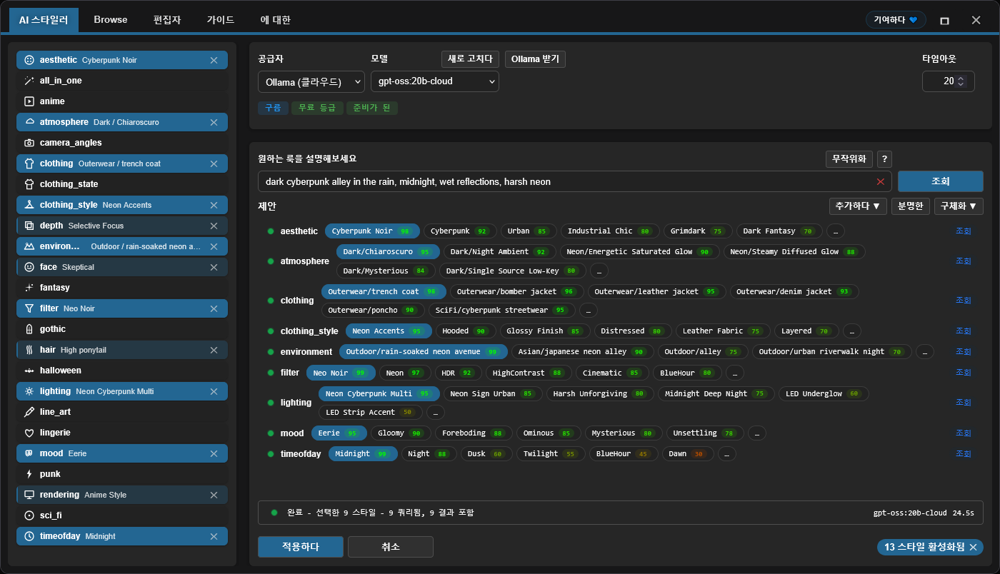

<h4 align="center">
  <a href="./README.md">English</a> | <a href="./README.de.md">Deutsch</a> | <a href="./README.es.md">Español</a> | <a href="./README.fr.md">Français</a> | <a href="./README.pt.md">Português</a> | <a href="./README.ru.md">Русский</a> | <a href="./README.ja.md">日本語</a> | 한국어 | <a href="./README.zh.md">中文</a> | <a href="./README.zh-TW.md">繁體中文</a>
</h4>

<p align="center">
  
  
  
</p>
<br />

# ComfyUI Styler Pipeline ✨

> ComfyUI에서 재현 가능한 워크플로를 위한 집중형 styler-pipeline 노드: 결정론적 Styler 노드와 안전한 conditioning 병합으로 스타일을 적용합니다.

---

## <a id="table-of-contents"></a>목차

- ✨ [특징](#features)
- 📦 [설치](#installation)
- 🔧 [Nodes](#nodes)
- 🤖 [LLM 설정](#llm-setup)
- ✍️ [AI 프롬프트](#ai-prompts)
- 📝 [JSON 고급 설정](#advanced-json)
- 💖 [지원](#support)
- 🖼️ [갤러리](#gallery)
- 🤝 [기여](#contributing)
- 📄 [라이선스](#license)

---

## <a id="features"></a>특징

- 실행 간 재현성을 유지하도록 설계된 결정론적 styler-pipeline 노드.
- AI 기반 스타일 선택: 카테고리별로 LLM을 호출해 점수(score)와 함께 랭킹된 스타일 후보를 반환합니다.
- 카테고리 내비게이션이 있는 Browser 워크플로를 통한 수동 스타일 탐색 및 선택.
- 기존 conditioning에 안전하게 스타일을 적용하는 Dynamic Styler.
- 그래프에서 카테고리별로 제어할 수 있는 드롭다운 기반의 클래식 `Advanced Styler` 노드.
- OpenPose 기반 케이스를 포함해 ControlNet 워크플로와 호환.

---

## <a id="installation"></a>설치

### 요구 사항
- ComfyUI (최신 build)
- Python 3.10+

### 설치 단계

1. 이 repo를 `ComfyUI/custom_nodes/` 안에 clone 합니다.
2. ComfyUI를 재시작합니다.
3. 노드가 `Styler Pipeline/` 아래에 표시되는지 확인합니다.

---

## <a id="nodes"></a>Nodes

### Styler Pipeline

**요약:**
- 일상적인 스타일링을 위한 메인 노드( **Edit** 패널).
- 선택 항목이 내부 JSON에 저장되므로 결정론적이며 재현 가능합니다.


**Inputs:**
- `positive` (`CONDITIONING`, required)
- `negative` (`CONDITIONING`, required)
- `clip` (`CLIP`, required to apply styles)
- `strength` (`FLOAT`, default `1.0`)
- `redundancy` (`INT`, default `1`)
- `selected_styles_json` (`STRING`, internal UI state)

**Outputs:**
- `positive` (`CONDITIONING`)
- `negative` (`CONDITIONING`)

**동작 메모:**
- 선택된 스타일을 사용해 추가 스타일 conditioning을 인코딩한 다음 기존 conditioning에 병합합니다.
- **Edit**를 클릭해 하나의 패널에서 카테고리/스타일 선택을 관리하고 내부 JSON에 기록합니다.

#### Strength 및 Redundancy 가이드

`strength`는 선택된 스타일이 생성에 얼마나 강하게 영향을 주는지 제어합니다. checkpoint/model마다 반응이 다르며, 어떤 것은 낮은 `strength`에서도 강하게 적용되는 반면 어떤 것은 더 저항적입니다.

model이 저항적이라면 `strength`를 올리는 것이 도움이 될 수 있습니다. 다만 일정 수준을 넘기면 보통 품질이 나빠지며, `~1.3+` 근처부터는 저하가 눈에 띄는 경우가 많습니다. 이는 사실상 `KSampler`에 지시를 “소리쳐” 전달하는 것과 비슷합니다.

`redundancy`는 선택된 스타일을 여러 번 반복해 가중치를 키웁니다. 스타일 일치도를 높일 수 있지만, redundancy를 너무 높이면 구도가 망가질 수 있습니다.

- 안전한 시작점: `strength = 1.0`, `redundancy = 1`
- 일반적인 조정: 먼저 `strength`를 작은 단계로 점진적으로 올리기
- 대부분의 경우 `redundancy`는 `2` 이하로 유지

**AI Styler module:**
원하는 룩을 설명하면 **AI Styler**가 LLM에 요청해 카테고리별로 가장 잘 맞는 스타일을 자동으로 추천합니다.
주요 API Provider(OpenAI, Anthropic, Groq, Gemini, Hugging Face)를 지원하며, 오프라인/인터넷 없이도 사용할 수 있도록 **Ollama (Local)**도 지원합니다.
아래 이미지는 **Edit**에서 열린 **AI Styler** 탭으로, prompt 기반 추천을 생성하고 적용하는 모습을 보여줍니다.



**Browser module:**
AI Styler를 사용하지 않으려면 **Browse** 탭에서 스타일을 수동으로 선택해 더 많은 제어를 할 수 있습니다.
아래 이미지는 같은 패널의 **Browser** 탭으로, 카테고리와 스타일을 수동으로 선택하는 화면입니다.


**Editor module:**
Editor에서는 카테고리별 JSON 파일(`data/*.json`)에서 로드된 스타일을 확인할 수 있습니다.
편집 도구는 현재 개발 중이며 곧 제공될 예정입니다(현재 AI token 예산이 제한적입니다).

> [!NOTE]
> 선택된 스타일은 노드 데이터 내부에 저장되므로, 스타일 JSON 파일에 정의된 카테고리/스타일을 추가/삭제하더라도, 원래 선택했던 스타일을 유지하는 한 동일한 워크플로는 재현 가능합니다.

### Styler Pipeline (Single)

`category`와 `style`을 수동으로 선택해 한 번에 하나의 스타일을 적용합니다.


**Inputs:**
- `positive` (`CONDITIONING`, required)
- `negative` (`CONDITIONING`, required)
- `category` (`STRING`/dropdown, required)
- `style` (`STRING`/dropdown, required)
- `clip` (`CLIP`, required to apply styles)
- `strength` (`FLOAT`, default `1.0`)
- `redundancy` (`INT`, default `1`)

**Outputs:**
- `positive` (`CONDITIONING`)
- `negative` (`CONDITIONING`)
- `style` (`STRING`)

### Styler Pipeline (By Index) + Index Iterator

수동으로 스타일을 선택하지 않고도 결정론적으로 스타일을 스윕하려면 이 페어를 사용하세요. 증가하는 index로 선택한 카테고리의 스타일을 하나씩 적용합니다.
`Styler Pipeline (By Index)`는 `style_index`로 선택된 카테고리의 스타일을 적용하고, `Index Iterator`는 실행마다 증가하는 index를 제공합니다.


**Inputs:**
- `Styler Pipeline (By Index)`: `positive`, `negative`, `category`, `style_index`, `clip`, `strength`, `redundancy`, `prepend_timestamp`.
- `Index Iterator`: `reset`, `start`.

**Outputs:**
- `Styler Pipeline (By Index)`: `positive`, `negative`, `style`.
- `Index Iterator`: `index` (`INT`).

**Usage:** `positive`와 `negative` conditioning을 연결하고 `clip`을 올바르게 연결하세요. 그 다음 `Styler Pipeline (By Index)`에서 `category`를 선택하고, `style_index`에 `Index Iterator`의 출력 `index`를 연결합니다. 워크플로를 실행할 때마다 `Index Iterator`는 설정된 `start` 값에서 증가하며, 해당 카테고리의 다음 스타일이 자동으로 적용됩니다. 결과 conditioning을 `KSampler` 같은 downstream 노드로 보내기 전에 매번 수동으로 바꾸지 않고도 많은 스타일을 빠르게 테스트하는 데 유용합니다.

---

### Advanced Styler Pipeline

각 JSON 카테고리에 대한 직접 dropdown을 제공하는 클래식 메뉴 기반 Styler.

**요약:**
- 그래프에서 dropdown으로 카테고리별 제어가 필요할 때 유용합니다.
- 현재 `positive`/`negative` 경로에 스타일 conditioning을 명시적으로 추가합니다.
- 이미 카테고리별 선택을 알고 있다면 패널을 여는 것보다 빠르게 훑어볼 수 있습니다.


**Inputs:**
- `positive` (`CONDITIONING`, required)
- `negative` (`CONDITIONING`, required)
- `clip` (`CLIP`, optional input, required to apply style encoding)
- `strength` (`FLOAT`, default `1.0`)
- `redundancy` (`INT`, default `1`)
- Style dropdowns loaded from `data/*.json`

**Outputs:**
- `positive` (`CONDITIONING`)
- `negative` (`CONDITIONING`)

**Usage:** 입력 `positive`와 `negative` conditioning을 이 노드에 연결하고 `clip`을 연결한 뒤, 카테고리별로 원하는 스타일 dropdown을 선택해 룩을 “레이어링”하세요. 이 노드는 기존 conditioning을 교체하지 않고 확장하므로, 필요에 따라 `strength`와 `redundancy`를 조정해 균형을 맞추세요. 마지막으로 `positive`와 `negative` 출력을 `KSampler` 같은 downstream 노드에 연결해 생성합니다.

---

## <a id="llm-setup"></a>LLM 설정

AI Styler는 UI에서 선택한 Provider와 Model을 사용합니다. **Edit**를 열고 **AI Styler** 탭에서 먼저 `Provider`를 선택한 다음, 해당 provider의 `Model`을 선택하세요.

### Cloud API Providers

Cloud API Providers(OpenAI, Anthropic, Google Gemini, Hugging Face, Groq 등)는 API로 조회합니다. AI Styler 탭에서 provider와 model을 선택한 다음, 추천 실행 전에 token 필드에 API key 또는 token을 붙여넣으세요.
cloud provider를 사용하기 전에 **Refresh**를 클릭해 최신 model 목록을 가져오세요.

**Provider notes(Provider 정책에 따라 달라질 수 있으며 변경될 수 있음):**
- **Hugging Face** — model 및 provider에 따라 free-tier 접근을 제공합니다.
- **Groq** — 종종 free tier를 제공합니다. 현재 정책을 확인하세요.
- **OpenAI, Google Gemini, Anthropic** — 일반적으로 API 사용을 위해 billing 활성화가 필요합니다.

> [!WARNING]
> OpenAI API는 프리페이드 카드로 billing을 활성화할 수 없어 테스트하지 못했습니다. OpenAI 사용 중 오류가 발생하면, 가능한 한 빨리 수정할 수 있도록 자세한 오류 정보와 함께 GitHub issue를 열어 주세요.

API key 또는 token은 현재 실행에만 사용되며 플러그인은 **저장하지 않습니다**. 다만 제공된 **Save token** 버튼을 사용해 브라우저 Password Manager에 저장할 수 있습니다.

### Ollama Models (Local + Cloud)

[Ollama](https://ollama.com/download)는 LLM을 본인 하드웨어에서 완전히 오프라인으로 실행할 수 있는 무료 데스크톱 앱입니다. 무료 Ollama 계정에 로그인하면 로컬로 다운로드하지 않고도 **Ollama Cloud** model을 사용할 수 있습니다.

> [!TIP]
> Ollama는 로컬/클라우드 model 모두에서 API key가 전혀 필요하지 않습니다. Cloud model은 Ollama 앱에서 무료 Ollama 계정에 로그인하기만 하면 됩니다.

**Ollama model이 보이게 하는 방법:**

Ollama를 설치한 뒤에도, Ollama 앱에서 model을 활성화하기 전까지 AI Styler가 **zero models**를 표시할 수 있습니다.

1. Ollama 데스크톱 앱을 열고 실행 상태로 둡니다(최소화는 가능하지만 종료하지 마세요).
2. Ollama 앱에서 사용할 model을 선택합니다:
   - **Local model:** 로컬로 다운로드할 model을 선택합니다. `gemma3:4b`는 대부분의 model보다 가볍고 빠르며 좋은 시작점입니다.
   - **Cloud model:** 앱에서 무료 Ollama 계정에 로그인한 뒤 cloud model을 선택합니다.
3. Ollama 앱에서 짧은 메시지(예: "test")를 보내 선택한 model을 활성화합니다.
4. AI Styler로 돌아와 **Refresh**를 클릭하면, 이제 model이 model dropdown에 표시될 것입니다.

> [!WARNING]
> **ComfyUI workflow가 실행 중일 때 로컬 Ollama model을 호출하지 않는 것**을 강력히 권장합니다. 공유 GPU/CPU 리소스를 심하게 과부하시켜 시스템이 매우 느리고 불안정해질 수 있습니다. 가능하면 더 빠르고 효율적인 **cloud provider**를 우선하세요. 그래도 Ollama local을 사용하려면, 더 큰 model을 시도하기 전에 **gemma3:4b** 같은 작은 model로 시작하세요.

**Troubleshooting (Ollama local):**

- 로컬 model이 보이지 않음:
  - Ollama 앱에서 로컬 model에 아무 메시지나 보내 초기화하세요.
  - Ollama가 실행 중이며 `http://127.0.0.1:11434`에서 접근 가능한지 확인하세요.
- 상태가 "Not connected"로 표시됨:
  - Ollama를 재시작한 후 AI Styler를 다시 여세요.
  - 방화벽/보안 소프트웨어가 localhost 포트 `11434`를 차단하지 않는지 확인하세요.
- Ollama가 실행 중이 아님:
  - 앱을 실행(Windows/macOS)하거나 `ollama serve`를 실행하세요(Linux).

---

## <a id="ai-prompts"></a>AI 프롬프트

prompt는 짧고 구체적으로 유지하세요. 완전한 이야기가 아니라 시각적 방향을 설명하세요.

### 포함할 것

- Genre/style: sci-fi, noir, anime, fantasy, etc.
- Mood: tense, cozy, melancholic, energetic.
- Lighting: soft, practical, cinematic rim light, harsh noon sun.
- Time of day: dawn, golden hour, night, overcast afternoon.
- Environment: alley, spaceship interior, forest, classroom, rooftop.

### 피할 것

- 너무 많은 아이디어가 경쟁하는 지나치게 긴 prompt.
- 한 문장 안에서의 모순된 지시(예: "dark night scene with bright midday sun").

### 반환된 추천을 사용하는 방법

- 목표에 가장 잘 맞는 강한 카테고리 1~2개만 남기고 시작하세요.
- 생성/테스트 후 소수의 추가 카테고리로 refine 하세요.
- 충돌하는 카테고리를 동시에 쌓지 말고, 변경은 점진적으로 추가하세요.

---

## <a id="advanced-json"></a>JSON 고급 설정

> **advanced users** 전용. 현재 스타일 수정은 JSON 편집이 유일한 방법이며, 향후 버전에서 Editor의 시각적 UI를 계획하고 있습니다. 포함된 prompt는 AI로 다듬었지만 충분히 테스트되지 않았습니다 — 일부는 작은 수동 조정이 필요할 수 있습니다.

advanced users는 스타일을 자유롭게 커스터마이즈할 수 있습니다:

- **`data/*.json` 파일 전체를 추가하거나 제거.** `data/` 아래에 둔 모든 JSON 파일은 자동으로 새 스타일 카테고리가 되며 카테고리 목록에 나타납니다.
- **어떤 JSON 파일이든 개별 스타일 항목을 추가/제거/이름 변경**하고 필요에 따라 prompt를 편집합니다.

**재현성 노트:** 참조되는 스타일 항목이 이름 변경되거나 삭제되지 않는 한 기존 워크플로는 재현 가능합니다. 과거 워크플로가 사용하는 스타일이 이름 변경되거나 삭제되면, 해당 워크플로는 스타일 정의를 찾지 못해 동일한 결과를 재현하지 못합니다.

styler 노드가 예측 가능하도록 `data/*.json` 스타일 파일의 일관성을 유지하세요.

### JSON shape

```json
[
  {
    "name": "style name",
    "prompt": "style description, {prompt}, token1, token2, token3",
    "negative_prompt": ""
  }
]
```

Required keys per item:
- `name` (string)
- `prompt` (string)
- `negative_prompt` (string, can be empty)

### 실용적인 지침

- 추상적인 품질 태그보다 구체적인 시각 언어를 선호하세요.
- prompt를 간결하고 시각적으로 설명적으로 유지하세요.
- 이름은 user-friendly하고 탐색하기 쉽게 유지하세요.
- JSON을 엄격히 유효하게 유지하세요(주석 금지, trailing comma 금지).
- **model이 물리적 객체로 해석하기 쉬운 단어를 피하세요.** 일부 명사는 의도가 색상이나 헤어스타일이더라도 문자 그대로의 객체를 렌더링하도록 트리거합니다. 예: **amber-toned**는 따뜻한 금색 의도 대신 호박(amber) 돌을 그릴 수 있고, **crown braids**는 문자 그대로의 왕관을 생성할 수 있습니다. 가장 안전한 방법은 트리거 단어를 완전히 제거하고 다른 어휘로 의도를 설명하는 것입니다 — 예를 들어 "amber-toned" 대신 "warm golden hue", "crown braids" 대신 "intricate braided updo"를 사용하세요.

> [!TIP]
> 스타일 prompt가 예상치 못한 객체를 출력한다면, 보통 literal trigger word 때문입니다. 흔한 예: **amber-toned**(호박 돌을 렌더링) 및 **crown braids**(문자 그대로의 왕관을 렌더링).

---

## <a id="support"></a>지원

### 당신의 지원이 중요한 이유

이 플러그인은 독립적으로 개발 및 유지되며, 디버깅, 테스트, QoL 개선을 가속하기 위해 **paid AI agents**를 정기적으로 사용합니다. 유용하다면, 금전적 지원은 지속 가능한 개발 속도를 유지하는 데 도움이 됩니다.

기여는 다음을 돕습니다:

* 더 빠른 수정과 새 기능을 위한 AI 툴링 비용
* ComfyUI 업데이트 전반에 걸친 지속 유지보수 및 호환 작업
* 사용량 제한에 도달했을 때 개발이 멈추지 않도록 지원

> [!TIP]
> 기부하지 않더라도 GitHub에서 ⭐를 주는 것만으로도 큰 도움이 됩니다 — 가시성이 올라가 더 많은 사용자가 찾을 수 있게 됩니다

### 💙 Support this project

<table style="width: 100%; table-layout: fixed;">
  <tr>
    <td align="center" style="width: 33.33%; padding: 20px;">
      <div>
        <h4 style="margin: 8px 0;">Ko-fi</h4>
        <a href="https://ko-fi.com/D1D716OLPM" target="_blank" rel="noopener noreferrer">
          
        </a>
        <p style="margin: 8px 0; font-size: 12px;"><a href="https://ko-fi.com/D1D716OLPM" target="_blank" rel="noopener noreferrer">Buy a Coffee</a></p>
      </div>
    </td>
    <td align="center" style="width: 33.33%; padding: 20px;">
      <div>
        <h4 style="margin: 8px 0;">PayPal</h4>
        <a href="https://www.paypal.com/ncp/payment/GEEM324PDD9NC" target="_blank" rel="noopener noreferrer">
          
        </a>
        <p style="margin: 8px 0; font-size: 12px;"><a href="https://www.paypal.com/ncp/payment/GEEM324PDD9NC" target="_blank" rel="noopener noreferrer">Open PayPal</a></p>
      </div>
    </td>
    <td align="center" style="width: 33.33%; padding: 20px;">
      <div>
        <h4 style="margin: 8px 0;">USDC (Arbitrum only ⚠️)</h4>
        <a href="https://arbiscan.io/address/0xe36a336fC6cc9Daae657b4A380dA492AB9601e73" target="_blank" rel="noopener noreferrer">
          
        </a>
        <p style="margin: 8px 0; font-size: 12px;"><a href="#usdc-address">Show address</a></p>
      </div>
    </td>
  </tr>
</table>

<details>
  <summary>스캔하시나요? QR 코드를 표시</summary>
  <br />
  <table style="width: 100%; table-layout: fixed;">
    <tr>
      <td align="center" style="width: 33.33%; padding: 12px;">
        <strong>Ko-fi</strong><br />
        <a href="https://ko-fi.com/D1D716OLPM" target="_blank" rel="noopener noreferrer">
          
        </a>
      </td>
      <td align="center" style="width: 33.33%; padding: 12px;">
        <strong>PayPal</strong><br />
        <a href="https://www.paypal.com/ncp/payment/GEEM324PDD9NC" target="_blank" rel="noopener noreferrer">
          
        </a>
      </td>
      <td align="center" style="width: 33.33%; padding: 12px;">
        <strong>USDC (Arbitrum) ⚠️</strong><br />
        <a href="https://arbiscan.io/address/0xe36a336fC6cc9Daae657b4A380dA492AB9601e73" target="_blank" rel="noopener noreferrer">
          
        </a>
      </td>
    </tr>
  </table>
</details>

<a id="usdc-address"></a>
<details>
  <summary>USDC 주소 표시</summary>

```text
0xe36a336fC6cc9Daae657b4A380dA492AB9601e73
```

> [!WARNING]
> USDC는 Arbitrum One으로만 전송하세요. 다른 네트워크로 보낸 전송은 도착하지 않으며 영구적으로 손실될 수 있습니다.
</details>

## <a id="gallery"></a>갤러리

### 예제 Workflow
아래 이미지를 클릭해 전체 workflow 예제를 여세요:
이 workflow 이미지는 ComfyUI로 드래그 앤 드롭해 열기/가져오기도 할 수 있습니다.
이 예제 workflow는 [OpenPose Studio](https://github.com/andreszs/ComfyUI-OpenPose-Studio)의 노드를 통해 ControlNet으로 OpenPose를 사용합니다.

<a href="../workflows/sample_workflow.png" target="_blank" rel="noopener noreferrer">
  
</a>

### 예제 이미지

> [!NOTE]
> 아래의 모든 데모 이미지는 동일한 model, 동일한 LoRA, 동일한 기본 prompt, 동일한 seed를 사용합니다. 유일한 차이는 **Styler Pipeline** 노드가 적용하는 스타일입니다.

| 이미지 | Styles used |
|---|---|
| <a href="../workflows/sample_bypass.png" target="_blank" rel="noopener noreferrer"></a> | - Baseline: Styler not applied<br>- Generation settings (shared):<br>&nbsp;&nbsp;- Resolution: `1024×1344`<br>&nbsp;&nbsp;- Seed: `717891937617865`<br>&nbsp;&nbsp;- Steps: `25`<br>&nbsp;&nbsp;- CFG: `4`<br>&nbsp;&nbsp;- Sampler: `dpmpp_2m_sde`<br>&nbsp;&nbsp;- Scheduler: `karras`<br>&nbsp;&nbsp;- Denoise: `1.0`<br>&nbsp;&nbsp;- Checkpoint: `yiffInHell_yihXXXTended.safetensors`<br>&nbsp;&nbsp;- LoRA: `inuyasha_ilxl.safetensors`<br>&nbsp;&nbsp;- ControlNet: `illustriousXL_v10.safetensors` |
| <a href="../workflows/sample_4.png" target="_blank" rel="noopener noreferrer"></a> | - aesthetic: `Enchanted Forest`<br>- atmosphere: `Neon/Bioluminescent Glow`<br>- environment: `Nature/bamboo forest`<br>- filter: `BlueHour`<br>- lighting: `Bioluminescent Organic`<br>- mood: `Enchanted`<br>- timeofday: `Twilight`<br>- face: `Raised Eyebrow`<br>- hair: `Color combo silver and cyan`<br>- clothing_style: `Iridescent`<br>- depth: `Soft Focus`<br>- clothing: `Specialty/fantasy outfit` |
| <a href="../workflows/sample_3.png" target="_blank" rel="noopener noreferrer"></a> | - aesthetic: `Rustic`<br>- atmosphere: `Melancholic/Cold Overcast`<br>- environment: `Historical/medieval village`<br>- filter: `BlueHour`<br>- lighting: `Overcast Diffusion`<br>- mood: `Bleak`<br>- timeofday: `Midday`<br>- face: `Serious`<br>- hair: `Silver white hair`<br>- clothing_style: `Denim Fabric`<br>- depth: `Deep Focus`<br>- clothing: `Historical/viking raider` |
| <a href="../workflows/sample_2.png" target="_blank" rel="noopener noreferrer"></a> | - aesthetic: `Dark Fantasy`<br>- atmosphere: `Dark/Night Ambient`<br>- environment: `Outdoor/temple hill overlook`<br>- filter: `Soft`<br>- lighting: `Soft General`<br>- mood: `Meditative`<br>- timeofday: `Midnight`<br>- face: `Worried`<br>- hair: `Long wavy hair`<br>- depth: `Ultra Sharp`<br>- rendering: `Semi-Realistic`<br>- clothing: `Medieval/monk robe` |
| <a href="../workflows/sample_1.png" target="_blank" rel="noopener noreferrer"></a> | - aesthetic: `Cyberpunk`<br>- atmosphere: `Dark/Night Ambient`<br>- environment: `Asian/japanese neon alley`<br>- filter: `Neon`<br>- lighting: `Multi-Source Complex`<br>- mood: `Gloomy`<br>- timeofday: `Midnight`<br>- face: `Skeptical`<br>- hair: `High ponytail`<br>- clothing_style: `Neon Accents`<br>- depth: `Selective Focus`<br>- rendering: `Anime Style`<br>- clothing: `SciFi/cyberpunk streetwear` |

신뢰할 수 있는 결과를 위한 모범 사례:
- Styler 영향은 model마다 다릅니다. 어떤 model은 더 쉽게 유도되고, 어떤 model은 더 어렵습니다. 스타일이 잘 적용되지 않으면 `strength`나 `redundancy`를 약간 올려 Styler 영향력을 높이세요.
- `positive` prompt(`CONDITIONING`)는 보통 Styler 노드보다 더 큰 가중치를 갖습니다. prompt가 원하는 스타일과 모순되면 Styler 효과가 줄어듭니다.
- SDXL, Pony, Illustrious에서는 ControlNet OpenPose가 엄격한 규칙이라기보다 가이드인 경우가 많고, prompt에 의해 덮어써질 수 있습니다. prompt가 적용한 pose와 모순되면 ControlNet이 무시되거나 구성이 불안정해질 수 있습니다. prompt에서 pose를 강화하는 것이 보통 도움이 됩니다.
- `camera_angles`는 prompt나 ControlNet과 충돌하지 않도록 주의해서 사용하세요. 이 카테고리는 가장 민감하며, 잘못 사용하면 종종 무시됩니다. 스타일보다 구성을 더 강하게 구동하기 때문입니다.

### Styler Iterator workflow

<a href="../workflows/sample_styler_iterator.png" target="_blank" rel="noopener noreferrer">
  
</a>

- **Extensions required:** [comfyui-openpose-studio](https://github.com/andreszs/ComfyUI-OpenPose-Studio)

이 이미지를 ComfyUI에 로드해 workflow를 추출/열 수 있습니다.
이 workflow는 실행마다 카테고리 내 스타일을 순차적으로 반복하므로, 값을 수동으로 바꾸지 않고도 다양한 스타일을 테스트할 수 있습니다.
기술적 제한으로 인해 생성된 이미지는 자체 workflow 안에 반복된 스타일 이름을 포함할 수 없습니다. 적용된 스타일을 식별하기 어렵기 때문에 `Styler Pipeline (By Index)` 노드의 `style` 출력을 파일명 일부로 사용하세요.
iterator workflow는 사용된 index나 적용된 스타일 이름을 workflow로 다시 저장(persist)할 수 없습니다.

### Conditioning Areas workflow (Experimental)

Styler Pipeline 노드는 ControlNet workflow와 호환될 뿐만 아니라, [comfyui-lora-pipeline](https://github.com/andreszs/comfyui-lora-pipeline)의 `Conditioning Pipeline Area` 노드와도 **100% 호환**됩니다.
이 setup은 영역별 스타일링을 가능하게 하여, pipeline 안에서 Styler 노드를 연결해 이미지의 서로 다른 영역에 서로 다른 스타일을 적용할 수 있습니다.
이 노드들은 또한 여러 LoRA를 스타일이 섞이지 않도록 처리할 수 있는데, ComfyUI 네이티브 `Cond Pair Set Props` 로직을 훅 없이 캡슐화하고 마스크 대신 영역을 사용하기 때문입니다.

<a href="../workflows/sample_conditioning_areas.png" target="_blank" rel="noopener noreferrer">
  
</a>

- **Extensions required:** [comfyui-openpose-studio](https://github.com/andreszs/ComfyUI-OpenPose-Studio), [comfyui-lora-pipeline](https://github.com/andreszs/comfyui-lora-pipeline)
- **Experimental:** ControlNet을 사용한 multi-LoRA multi-area workflow fine-tuning은 더 복잡하며, 일반 workflow보다 실행 속도가 상당히 느립니다.

영역 스타일과 일관된 pose는 비교적 straightforward할 수 있지만, 최종 이미지 품질은 많은 요인에 좌우되며 여기서는 모두 다루지 않습니다. 자세한 내용은 [comfyui-lora-pipeline](https://github.com/andreszs/comfyui-lora-pipeline) README를 참고하세요.

여러 conditioning area, OpenPose, ControlNet, Styler를 모두 동시에 사용하는 workflow는 [이 포스트](https://www.andreszsogon.com/building-a-multi-character-comfyui-workflow-with-area-conditioning-openpose-control-and-style-layering/)에서 확인할 수 있습니다.

## <a id="contributing"></a>기여

### 핵심 원칙

- Pull request는 집중적이고 최소한으로 유지하세요.
- 사전에 논의되지 않은 광범위한 리팩터링은 피하세요.
- 기존 아키텍처와 그 rationale을 유지하세요.

### AI 보조 변경 사항

AI 기반 코딩 어시스턴트를 사용한다면, 변경 전에 [AGENTS.md](../AGENTS.md)를 읽고 따르도록 요청하세요.

### 수낙 기준

- PR당 하나의 명확한 문제 또는 개선.
- 국소적이고 리뷰 가능한 diff.
- 변경이 필요한 이유에 대한 명확한 설명.

---

## <a id="license"></a>라이선스

MIT License - 전체 텍스트는 [LICENSE](../LICENSE)를 참고하세요.

---

**Last update:** 2026-02-13  
**Maintained by:** andreszs  
**Status:** Active development
