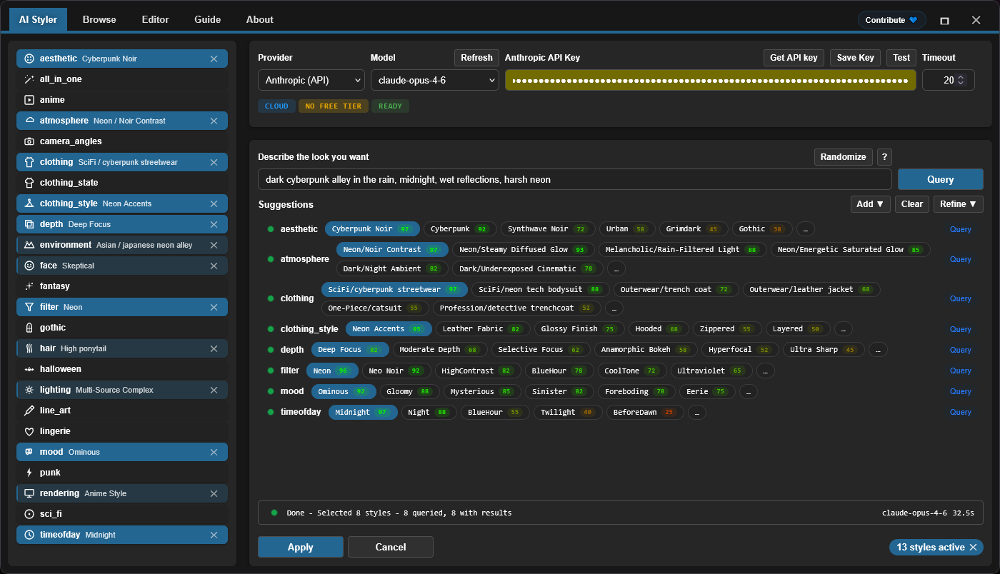

<h4 align="center">
  English | <a href="./README.de.md">Deutsch</a> | <a href="./README.es.md">Español</a> | <a href="./README.fr.md">Français</a> | <a href="./README.pt.md">Português</a> | <a href="./README.ru.md">Русский</a> | <a href="./README.ja.md">日本語</a> | <a href="./README.ko.md">한국어</a> | <a href="./README.zh.md">中文</a> | <a href="./README.zh-TW.md">繁體中文</a>
</h4>

<p align="center">
  
  
  
</p>
<br />

# ComfyUI Styler Pipeline ✨

> Focused styler-pipeline nodes for reproducible ComfyUI workflows: style application with deterministic, conditioning-safe styler nodes.

---

## Table of Contents

- ✨ [Features](#features)
- 📦 [Installation](#installation)
- 🔧 [Nodes](#nodes)
- 🤖 [LLM Setup](#llm-setup)
- ✍️ [AI Prompts](#ai-prompts)
- 📝 [Advanced JSON](#advanced-json)
- 💖 [Support](#support)
- 🖼️ [Gallery](#gallery)
- 🤝 [Contributing](#contributing)
- 📄 [License](#license)

---

## Features

- Deterministic styler-pipeline nodes designed to stay reproducible across runs.
- AI-assisted style selection that queries an LLM by category and returns ranked style candidates with scores.
- Manual style browsing and selection through the Browser workflow with category navigation.
- Dynamic Styler that applies style safely to existing conditioning.
- Classic dropdown-based `Advanced Styler` node for category-by-category control in the graph.
- Compatible with ControlNet workflows, including OpenPose-guided use cases.

---

## Installation

### Requirements
- ComfyUI (recent build)
- Python 3.10+

### Steps

1. Clone this repository into `ComfyUI/custom_nodes/`.
2. Restart ComfyUI.
3. Confirm nodes appear under `Styler Pipeline/`.

---

## Nodes

### Styler Pipeline

**At a glance:**
- Main node for everyday styling with the **Edit** panel.
- Deterministic and reproducible because selections are stored in internal JSON.


**Inputs:**
- `positive` (`CONDITIONING`, required)
- `negative` (`CONDITIONING`, required)
- `clip` (`CLIP`, required to apply styles)
- `strength` (`FLOAT`, default `1.0`)
- `redundancy` (`INT`, default `1`)
- `selected_styles_json` (`STRING`, internal UI state)

**Outputs:**
- `positive` (`CONDITIONING`)
- `negative` (`CONDITIONING`)

**Behavior notes:**
- Uses selected styles to encode additional style conditioning, then merges it into existing conditioning.
- Click **Edit** to manage category/style picks in one panel and write them into internal JSON.

#### Strength and Redundancy Guidelines

`strength` controls how strongly the selected styles steer the generation. Different checkpoints/models are not equally influenceable: some apply styles strongly at low `strength`, while others are more resistant.

If a model is resistant, increasing `strength` can help. But beyond a point, it usually hurts output quality; around `~1.3+` is commonly where degradation becomes noticeable because it is effectively "shouting" the instruction at `KSampler`.

`redundancy` literally repeats the selected styles multiple times to increase their weight. This can improve style adherence, but increasing redundancy too much can harm composition.

- Safe starting point: `strength = 1.0`, `redundancy = 1`.
- Typical tuning: increase `strength` gradually in small steps first.
- In most cases, keep `redundancy` at `2` or below.

**AI Styler module:**
Describe the look you want, and **AI Styler** asks an LLM to automatically suggest the best matching styles by category.
It supports major API providers (OpenAI, Anthropic, Groq, Gemini, Hugging Face), and it also supports **Ollama (Local)** so you can run in offline/no-internet environments.
In the image below, you are looking at the **AI Styler tab** opened from **Edit**, where prompt-driven suggestions are generated and applied.



**Browser module:**
If you prefer not to use AI Styler, the **Browse** module lets you choose styles manually and keep more control over selected styles.
In the image below, you are looking at the **Browser tab** in the same panel, where categories and styles are selected manually.


**Editor module:**
Editor lets you view styles loaded from the category JSON files (`data/*.json`).
Editing tools are currently under construction and will be available soon (limited AI token budget at the moment).

> [!NOTE]
> Because selected styles are saved inside node data, the same workflow stays reproducible even if you add/remove categories and styles defined in the JSON style files, as long as you keep the styles you originally selected.

### Styler Pipeline (Single)

Apply one style at a time by manually choosing `category` and `style`.


**Inputs:**
- `positive` (`CONDITIONING`, required)
- `negative` (`CONDITIONING`, required)
- `category` (`STRING`/dropdown, required)
- `style` (`STRING`/dropdown, required)
- `clip` (`CLIP`, required to apply styles)
- `strength` (`FLOAT`, default `1.0`)
- `redundancy` (`INT`, default `1`)

**Outputs:**
- `positive` (`CONDITIONING`)
- `negative` (`CONDITIONING`)
- `style` (`STRING`)

### Styler Pipeline (By Index) + Index Iterator

Use this pair for deterministic style sweeps, avoiding manual selection of styles by using an incrementing index to apply styles one by one from a selected category.
`Styler Pipeline (By Index)` applies one style from a selected category using `style_index`, and `Index Iterator` provides an incrementing index each run.


**Inputs:**
- `Styler Pipeline (By Index)`: `positive`, `negative`, `category`, `style_index`, `clip`, `strength`, `redundancy`, `prepend_timestamp`.
- `Index Iterator`: `reset`, `start`.

**Outputs:**
- `Styler Pipeline (By Index)`: `positive`, `negative`, `style`.
- `Index Iterator`: `index` (`INT`).

**Usage:** Connect your `positive` and `negative` conditioning and connect `clip` correctly, then select a `category` in `Styler Pipeline (By Index)` and feed its `style_index` from `Index Iterator`'s `index` output. On each workflow run, `Index Iterator` increments from the configured `start` value so the next style in that category is applied automatically. This is useful for quickly testing many styles without manually changing selections each time before sending the resulting conditioning to downstream nodes such as `KSampler`.

---

### Advanced Styler Pipeline

Classic menu-based styler with direct dropdowns for each JSON category.

**At a glance:**
- Good when you want category-by-category dropdown control in the graph.
- Explicitly appends style conditioning to your current positive/negative paths.
- Faster to scan than opening the panel when you already know your category picks.


**Inputs:**
- `positive` (`CONDITIONING`, required)
- `negative` (`CONDITIONING`, required)
- `clip` (`CLIP`, optional input, required to apply style encoding)
- `strength` (`FLOAT`, default `1.0`)
- `redundancy` (`INT`, default `1`)
- Style dropdowns loaded from `data/*.json`

**Outputs:**
- `positive` (`CONDITIONING`)
- `negative` (`CONDITIONING`)

**Usage:** Connect incoming `positive` and `negative` conditioning to this node, connect `clip`, and choose the style dropdowns you want from each category to layer your look. The node augments your existing conditioning rather than replacing it, so adjust `strength` and `redundancy` as needed for balance. Connect the output `positive` and `negative` conditioning to downstream nodes such as `KSampler` for generation.

---

## LLM Setup

AI Styler uses the Provider and Model you choose in the UI. Open **Edit** and use the **AI Styler** tab to select a `Provider` first, then select a `Model` for that provider.

### Cloud API providers

Cloud API providers (OpenAI, Anthropic, Google Gemini, Hugging Face, Groq, etc.) are queried via their API. Select the provider and model you want to use in the AI Styler tab, then paste your API key or token in the token field before running suggestions.
Before using a cloud provider, click **Refresh** to fetch the latest model list.

**Provider notes (subject to provider policy and may change):**
- **Hugging Face** — offers models with free-tier access depending on the model and provider.
- **Groq** — often offers a free tier; check current policy.
- **OpenAI, Google Gemini, Anthropic** — typically require billing enabled for API usage.

> [!WARNING]
> OpenAI API could not be tested because billing could not be activated using prepaid cards. If you encounter an error while using OpenAI, please open a GitHub issue with detailed error information so it can be fixed as soon as possible.

The API key or token is used for the current run only and is **not saved** by the plugin; but you can save in your browser's Password Manager by using the **Save token** button provided.

### Ollama models (Local + Cloud)

[Ollama](https://ollama.com/download) is a free desktop app that lets you run LLMs completely offline on your own hardware. Once signed in to a free Ollama account, you can also use **Ollama Cloud** models without downloading them locally.

> [!TIP]
> Ollama never requires an API key — not for local models and not for cloud models. Cloud models only require a free Ollama account sign-in inside the Ollama app.

**Getting Ollama models to show up:**

After installing Ollama, the AI Styler may list **no models** until you activate one in the Ollama app:

1. Open the Ollama desktop app and keep it running (minimize is fine; do not close it).
2. In the Ollama app, select the model you want to use:
   - **Local model:** choose a model to download to your machine. `gemma3:4b` is a good starter — lighter and faster than most.
   - **Cloud model:** sign in to your free Ollama account inside the app, then select a cloud model.
3. Send any short message in the Ollama app (e.g., "test") to activate the selected model.
4. Return to AI Styler and click **Refresh**; the model should now appear in the model dropdown.

> [!WARNING]
> It's strongly recommended **not querying local Ollama models while a ComfyUI workflow is running**. Doing so can severely overload shared GPU/CPU resources, make your system very slow and unstable. Whenever possible, prefer a **cloud provider**, which is typically faster and more efficient. If you still want local Ollama, start with a small model like **gemma3:4b** before trying larger ones.

**Troubleshooting (Ollama local):**

- No local models listed:
  - Send any message to an Ollama local model in the Ollama app to initialize it.
  - Confirm Ollama is running and reachable at `http://127.0.0.1:11434`.
- Status shows "Not connected":
  - Restart Ollama, then reopen AI Styler.
  - Check that local firewall/security software is not blocking localhost port `11434`.
- Ollama not running:
  - Start the app (Windows/macOS) or run `ollama serve` (Linux).

---

## AI Prompts

Keep prompts short and specific. Describe the visual direction, not a full story.

### What to include

- Genre/style: sci-fi, noir, anime, fantasy, etc.
- Mood: tense, cozy, melancholic, energetic.
- Lighting: soft, practical, cinematic rim light, harsh noon sun.
- Time of day: dawn, golden hour, night, overcast afternoon.
- Environment: alley, spaceship interior, forest, classroom, rooftop.

### What to avoid

- Over-long prompts with too many competing ideas.
- Contradictory directions in one sentence (for example: "dark night scene with bright midday sun").

### Using the returned suggestions

- Start by keeping 1-2 strong categories that best match your goal.
- Generate/test, then refine with a small number of extra categories.
- Avoid stacking conflicting categories at once; add changes incrementally.

---

## Advanced JSON

> For **advanced users** only. JSON editing is currently the only way to modify styles; a visual Editor UI is planned for a future version. Built-in prompts were AI-refined but not exhaustively tested — some may need small manual tweaks.

Advanced users can customize styles freely:

- **Add or remove entire `data/*.json` files.** Any JSON file placed under `data/` automatically becomes a new style category and appears in the category list.
- **Add, remove, or rename individual style entries** inside any JSON file, and edit prompts as needed.

**Reproducibility note:** Existing workflows stay reproducible as long as the style entries they reference are not renamed or removed. If a style used by an older workflow is renamed or deleted, that workflow will no longer find its style definition and will not reproduce the same result.

Keep `data/*.json` style files consistent so styler nodes stay predictable.

### JSON shape

```json
[
  {
    "name": "style name",
    "prompt": "style description, {prompt}, token1, token2, token3",
    "negative_prompt": ""
  }
]
```

Required keys per item:
- `name` (string)
- `prompt` (string)
- `negative_prompt` (string, can be empty)

### Practical rules

- Prefer concrete visual language over abstract quality tags.
- Keep prompts concise and visually descriptive.
- Keep naming user-friendly and easy to browse.
- Maintain strict valid JSON (no comments, no trailing commas).
- **Avoid words that models commonly interpret as physical objects.** Some nouns trigger literal object rendering even when the intent is a color or hairstyle. For example, **amber-toned** can cause the model to draw amber stones instead of a warm golden color; **crown braids** can cause a literal crown to appear. The safest fix is to remove the triggering word entirely and describe the intent with different vocabulary — e.g., instead of "amber-toned" use "warm golden hue"; instead of "crown braids" use "intricate braided updo".

> [!TIP]
> If a style prompt causes an unexpected object to appear in outputs, a literal trigger word is likely the cause. Common examples: **amber-toned** (renders amber stones) and **crown braids** (renders a literal crown).

---

## Support

### Why Your Support Matters

This plugin is developed and maintained independently, with regular use of **paid AI agents** to speed up debugging, testing, and quality-of-life improvements. If you find it useful, financial support helps keep development moving steadily.

Your contribution helps:

* Fund AI tooling for faster fixes and new features
* Cover ongoing maintenance and compatibility work across ComfyUI updates
* Prevent development slowdowns when usage limits are reached

> [!TIP]
> Not donating? A GitHub star ⭐ still helps a lot by improving visibility and helping more users

### 💙 Support This Project

<table style="width: 100%; table-layout: fixed;">
  <tr>
    <td align="center" style="width: 33.33%; padding: 20px;">
      <div>
        <h4 style="margin: 8px 0;">Ko-fi</h4>
        <a href="https://ko-fi.com/D1D716OLPM" target="_blank" rel="noopener noreferrer">
          
        </a>
        <p style="margin: 8px 0; font-size: 12px;"><a href="https://ko-fi.com/D1D716OLPM" target="_blank" rel="noopener noreferrer">Buy a Coffee</a></p>
      </div>
    </td>
    <td align="center" style="width: 33.33%; padding: 20px;">
      <div>
        <h4 style="margin: 8px 0;">PayPal</h4>
        <a href="https://www.paypal.com/ncp/payment/GEEM324PDD9NC" target="_blank" rel="noopener noreferrer">
          
        </a>
        <p style="margin: 8px 0; font-size: 12px;"><a href="https://www.paypal.com/ncp/payment/GEEM324PDD9NC" target="_blank" rel="noopener noreferrer">Open PayPal</a></p>
      </div>
    </td>
    <td align="center" style="width: 33.33%; padding: 20px;">
      <div>
        <h4 style="margin: 8px 0;">USDC (Arbitrum only ⚠️)</h4>
        <a href="https://arbiscan.io/address/0xe36a336fC6cc9Daae657b4A380dA492AB9601e73" target="_blank" rel="noopener noreferrer">
          
        </a>
        <p style="margin: 8px 0; font-size: 12px;"><a href="#usdc-address">Show address</a></p>
      </div>
    </td>
  </tr>
</table>

<details>
  <summary>Prefer scanning? Show QR codes</summary>
  <br />
  <table style="width: 100%; table-layout: fixed;">
    <tr>
      <td align="center" style="width: 33.33%; padding: 12px;">
        <strong>Ko-fi</strong><br />
        <a href="https://ko-fi.com/D1D716OLPM" target="_blank" rel="noopener noreferrer">
          
        </a>
      </td>
      <td align="center" style="width: 33.33%; padding: 12px;">
        <strong>PayPal</strong><br />
        <a href="https://www.paypal.com/ncp/payment/GEEM324PDD9NC" target="_blank" rel="noopener noreferrer">
          
        </a>
      </td>
      <td align="center" style="width: 33.33%; padding: 12px;">
        <strong>USDC (Arbitrum) ⚠️</strong><br />
        <a href="https://arbiscan.io/address/0xe36a336fC6cc9Daae657b4A380dA492AB9601e73" target="_blank" rel="noopener noreferrer">
          
        </a>
      </td>
    </tr>
  </table>
</details>

<a id="usdc-address"></a>
<details>
  <summary>Show USDC address</summary>

```text
0xe36a336fC6cc9Daae657b4A380dA492AB9601e73
```

> [!WARNING]
> Send USDC on Arbitrum One only. Transfers sent on any other network will not arrive and may be permanently lost.
</details>

## Gallery

### Sample Workflow
Click the image below to open the full workflow example:
You can also drag and drop this workflow image into ComfyUI to open/import it.
This example workflow uses ControlNet for OpenPose via an [OpenPose Studio](https://github.com/andreszs/ComfyUI-OpenPose-Studio) node.

<a href="../workflows/sample_workflow.png" target="_blank" rel="noopener noreferrer">
  
</a>

### Sample Images

> [!NOTE]
> All demo images below use the same model, the same LoRA, the same base prompt, and the same seed. The only difference is the styles applied by the **Styler Pipeline** node.

| Image | Styles used |
|---|---|
| <a href="../workflows/sample_bypass.png" target="_blank" rel="noopener noreferrer"></a> | - Baseline: Styler not applied<br>- Generation settings (shared):<br>&nbsp;&nbsp;- Resolution: `1024×1344`<br>&nbsp;&nbsp;- Seed: `717891937617865`<br>&nbsp;&nbsp;- Steps: `25`<br>&nbsp;&nbsp;- CFG: `4`<br>&nbsp;&nbsp;- Sampler: `dpmpp_2m_sde`<br>&nbsp;&nbsp;- Scheduler: `karras`<br>&nbsp;&nbsp;- Denoise: `1.0`<br>&nbsp;&nbsp;- Checkpoint: `yiffInHell_yihXXXTended.safetensors`<br>&nbsp;&nbsp;- LoRA: `inuyasha_ilxl.safetensors`<br>&nbsp;&nbsp;- ControlNet: `illustriousXL_v10.safetensors` |
| <a href="../workflows/sample_4.png" target="_blank" rel="noopener noreferrer"></a> | - aesthetic: `Enchanted Forest`<br>- atmosphere: `Neon/Bioluminescent Glow`<br>- environment: `Nature/bamboo forest`<br>- filter: `BlueHour`<br>- lighting: `Bioluminescent Organic`<br>- mood: `Enchanted`<br>- timeofday: `Twilight`<br>- face: `Raised Eyebrow`<br>- hair: `Color combo silver and cyan`<br>- clothing_style: `Iridescent`<br>- depth: `Soft Focus`<br>- clothing: `Specialty/fantasy outfit` |
| <a href="../workflows/sample_3.png" target="_blank" rel="noopener noreferrer"></a> | - aesthetic: `Rustic`<br>- atmosphere: `Melancholic/Cold Overcast`<br>- environment: `Historical/medieval village`<br>- filter: `BlueHour`<br>- lighting: `Overcast Diffusion`<br>- mood: `Bleak`<br>- timeofday: `Midday`<br>- face: `Serious`<br>- hair: `Silver white hair`<br>- clothing_style: `Denim Fabric`<br>- depth: `Deep Focus`<br>- clothing: `Historical/viking raider` |
| <a href="../workflows/sample_2.png" target="_blank" rel="noopener noreferrer"></a> | - aesthetic: `Dark Fantasy`<br>- atmosphere: `Dark/Night Ambient`<br>- environment: `Outdoor/temple hill overlook`<br>- filter: `Soft`<br>- lighting: `Soft General`<br>- mood: `Meditative`<br>- timeofday: `Midnight`<br>- face: `Worried`<br>- hair: `Long wavy hair`<br>- depth: `Ultra Sharp`<br>- rendering: `Semi-Realistic`<br>- clothing: `Medieval/monk robe` |
| <a href="../workflows/sample_1.png" target="_blank" rel="noopener noreferrer"></a> | - aesthetic: `Cyberpunk`<br>- atmosphere: `Dark/Night Ambient`<br>- environment: `Asian/japanese neon alley`<br>- filter: `Neon`<br>- lighting: `Multi-Source Complex`<br>- mood: `Gloomy`<br>- timeofday: `Midnight`<br>- face: `Skeptical`<br>- hair: `High ponytail`<br>- clothing_style: `Neon Accents`<br>- depth: `Selective Focus`<br>- rendering: `Anime Style`<br>- clothing: `SciFi/cyberpunk streetwear` |

Best practices for reliable results:
- Styler influence varies by model; some models are easier to steer than others. If a model does not cooperate with styles, slightly increase `strength` or `redundancy` to raise Styler influence.
- The positive prompt (`CONDITIONING`) usually has more weight than the Styler node. Your prompt should not contradict the desired styles, or the Styler effect will be reduced.
- For SDXL, Pony, and Illustrious, ControlNet's OpenPose is typically a guideline rather than a strict rule and can be overridden by the prompt. If the prompt contradicts your applied pose, ControlNet may be ignored or produce inconsistent composition. Reinforcing the pose in the prompt is generally a good idea.
- Use `camera_angles` carefully so it does not conflict with your prompt or ControlNet. This is the most sensitive category and is often ignored when used incorrectly because it drives composition more than style.

### Styler Iterator Workflow

<a href="../workflows/sample_styler_iterator.png" target="_blank" rel="noopener noreferrer">
  
</a>

- **Extensions required:** [comfyui-openpose-studio](https://github.com/andreszs/ComfyUI-OpenPose-Studio)

You can load this image into ComfyUI to extract/open the workflow.
This workflow iterates sequentially through styles in a category on each run, so you can test different styles without changing values manually.
Due to a technical limitation, the generated image cannot include the iterated style name in its own workflow; use the `style` output from the `Styler Pipeline (By Index)` node as part of the filename, otherwise it is very difficult to identify which style was applied.
The iterator workflow cannot persist the used index or the applied style name back into the workflow.

### Conditioning Areas Workflow (Experimental)

The Styler Pipeline node is not only compatible with ControlNet workflows, but is also **100% compatible** with the `Conditioning Pipeline Area` nodes from [comfyui-lora-pipeline](https://github.com/andreszs/comfyui-lora-pipeline).
This setup enables per-area styling, so you can apply different styles to different areas of the image by connecting Styler nodes into that pipeline.
Those nodes also allow multiple LoRAs without blending their styles, because they encapsulate ComfyUI native `Cond Pair Set Props` logic while not exposing hooks, and using areas rather than masks.

<a href="../workflows/sample_conditioning_areas.png" target="_blank" rel="noopener noreferrer">
  
</a>

- **Extensions required:** [comfyui-openpose-studio](https://github.com/andreszs/ComfyUI-OpenPose-Studio), [comfyui-lora-pipeline](https://github.com/andreszs/comfyui-lora-pipeline)
- **Experimental:** fine-tunning this multi-LoRA multi-area with ControlNet workflow is more complex, and running it is considerably slower than regular workflows.

Per-area styles and consistent poses can be straightforward, but final image quality depends on many factors and is not detailed here. For more details, read the [comfyui-lora-pipeline README](https://github.com/andreszs/comfyui-lora-pipeline).

See [this post](https://www.andreszsogon.com/building-a-multi-character-comfyui-workflow-with-area-conditioning-openpose-control-and-style-layering/) for a complete workflow combining multiple conditioning areas, OpenPose, ControlNet and Styler all used together.

## Contributing

### Core principles

- Keep pull requests focused and minimal.
- Avoid broad refactors unless discussed first.
- Preserve existing architecture and rationale.

### AI-assisted changes

If using an AI coding assistant, require it to read and follow [AGENTS.md](../AGENTS.md) before making changes.

### Acceptance criteria

- One clear problem or improvement per PR.
- Localized, reviewable diffs.
- Clear explanation of why the change is needed.

---

## License

MIT License - see [LICENSE](../LICENSE) for full text.

---

**Last Updated:** 2026-02-13
**Maintained by:** andreszs
**Status:** Active Development


