<h4 align="center">
  <a href="./README.md">English</a> | <a href="./README.de.md">Deutsch</a> | <a href="./README.es.md">Español</a> | <a href="./README.fr.md">Français</a> | Português | <a href="./README.ru.md">Русский</a> | <a href="./README.ja.md">日本語</a> | <a href="./README.ko.md">한국어</a> | <a href="./README.zh.md">中文</a> | <a href="./README.zh-TW.md">繁體中文</a>
</h4>

<p align="center">
  
  
  
</p>
<br />

# ComfyUI Styler Pipeline ✨

> Nodes focados do styler-pipeline para workflows reproduzíveis no ComfyUI: aplicação de estilos com nodes Styler determinísticos e seguros para o conditioning.

---

## <a id="table-of-contents"></a>Sumário

- ✨ [Recursos](#features)
- 📦 [Instalação](#installation)
- 🔧 [Nodes](#nodes)
- 🤖 [Configuração LLM](#llm-setup)
- ✍️ [Prompts de IA](#ai-prompts)
- 📝 [JSON avançado](#advanced-json)
- 💖 [Suporte](#support)
- 🖼️ [Galeria](#gallery)
- 🤝 [Contribuições](#contributing)
- 📄 [Licença](#license)

---

## <a id="features"></a>Recursos

- Nodes determinísticos do styler-pipeline projetados para permanecer reproduzíveis entre execuções.
- Seleção de estilos assistida por AI: consulta um LLM por categoria e retorna candidatos de estilo ranqueados com scores.
- Navegação e seleção manual de estilos via workflow Browser com navegação por categorias.
- Dynamic Styler que aplica estilos de forma segura ao conditioning existente.
- Node clássico `Advanced Styler` baseado em dropdowns para controle categoria por categoria no grafo.
- Compatível com workflows de ControlNet, incluindo casos guiados por OpenPose.

---

## <a id="installation"></a>Instalação

### Requisitos
- ComfyUI (build recente)
- Python 3.10+

### Passos

1. Faça clone deste repo dentro de `ComfyUI/custom_nodes/`.
2. Reinicie o ComfyUI.
3. Confirme que os nodes aparecem em `Styler Pipeline/`.

---

## <a id="nodes"></a>Nodes

### Styler Pipeline

**Em resumo:**
- Node principal para o styling do dia a dia com o painel **Edit**.
- Determinístico e reproduzível porque as seleções são salvas em um JSON interno.

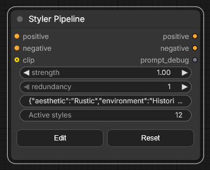

**Inputs:**
- `positive` (`CONDITIONING`, required)
- `negative` (`CONDITIONING`, required)
- `clip` (`CLIP`, required to apply styles)
- `strength` (`FLOAT`, default `1.0`)
- `redundancy` (`INT`, default `1`)
- `selected_styles_json` (`STRING`, internal UI state)

**Outputs:**
- `positive` (`CONDITIONING`)
- `negative` (`CONDITIONING`)

**Notas de comportamento:**
- Usa os estilos selecionados para codificar conditioning adicional de estilo e, em seguida, mescla no conditioning existente.
- Clique em **Edit** para gerenciar seleções de categoria/estilo em um único painel e gravar no JSON interno.

#### Guia de Strength e Redundancy

`strength` controla o quão forte os estilos selecionados guiam a geração. Diferentes checkpoints/models não são influenciáveis da mesma forma: alguns aplicam estilos fortemente com pouco `strength`, enquanto outros são mais resistentes.

Se um model for resistente, aumentar `strength` pode ajudar. Mas acima de certo ponto, geralmente piora a qualidade; em torno de `~1.3+` é comum que a degradação fique perceptível porque, na prática, é como “gritar” a instrução para o `KSampler`.

`redundancy` literalmente repete os estilos selecionados múltiplas vezes para aumentar o peso. Isso pode melhorar a aderência ao estilo, mas aumentar demais a redundancy pode prejudicar a composição.

- Ponto de partida seguro: `strength = 1.0`, `redundancy = 1`.
- Ajuste típico: primeiro aumente `strength` gradualmente, em pequenos passos.
- Na maioria dos casos, mantenha `redundancy` em `2` ou menos.

**AI Styler module:**
Descreva o visual que você quer e o **AI Styler** pede para um LLM sugerir automaticamente os estilos que melhor combinam por categoria.
Suporta os principais API providers (OpenAI, Anthropic, Groq, Gemini, Hugging Face) e também suporta **Ollama (Local)** para você rodar em ambientes offline/sem internet.
Na imagem abaixo, você vê a aba **AI Styler** aberta a partir de **Edit**, onde as sugestões baseadas no prompt são geradas e aplicadas.

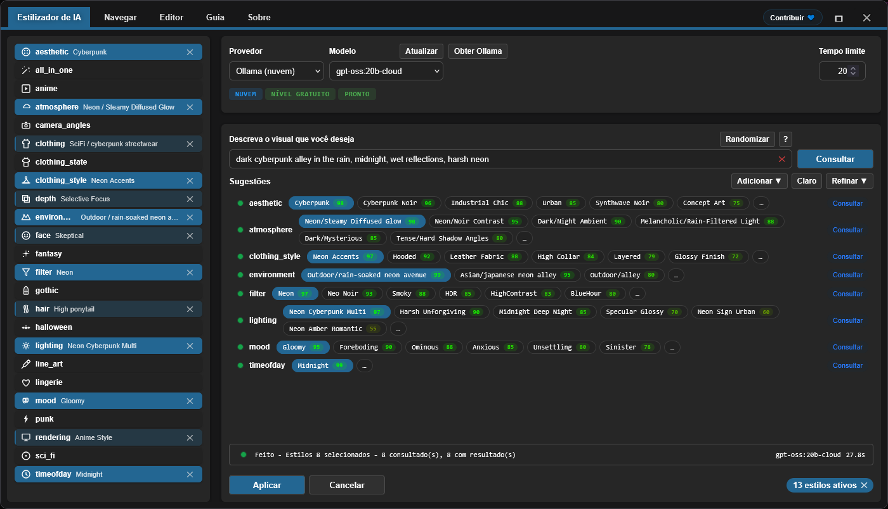

**Browser module:**
Se você preferir não usar AI Styler, o módulo **Browse** permite escolher estilos manualmente e manter mais controle.
Na imagem abaixo, você vê a aba **Browser** no mesmo painel, onde categorias e estilos são selecionados manualmente.

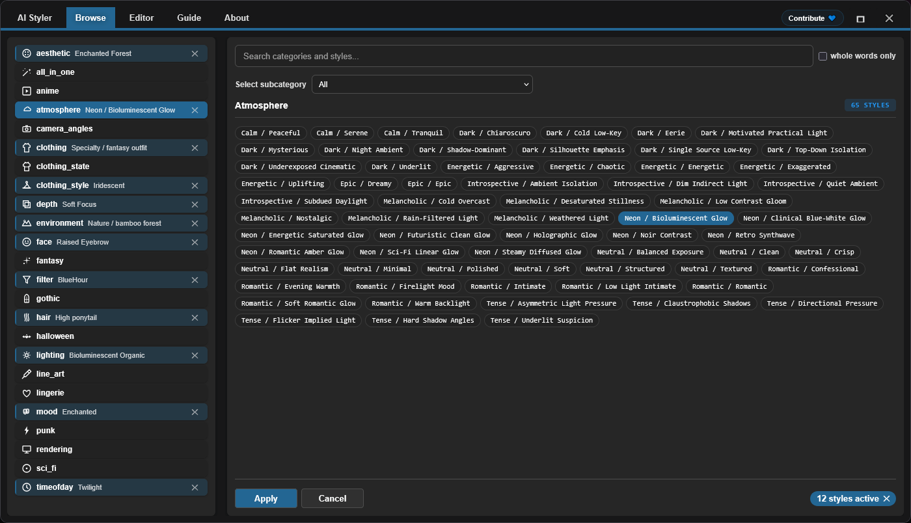

**Editor module:**
O Editor permite ver estilos carregados dos arquivos JSON por categoria (`data/*.json`).
As ferramentas de edição estão atualmente em construção e estarão disponíveis em breve (o orçamento de tokens de AI está limitado no momento).

> [!NOTE]
> Como os estilos selecionados são armazenados dentro dos dados do node, o mesmo workflow permanece reproduzível mesmo se você adicionar/remover categorias e estilos definidos nos arquivos JSON de estilos, desde que mantenha os estilos que selecionou originalmente.

### Styler Pipeline (Single)

Aplique um estilo por vez escolhendo manualmente `category` e `style`.

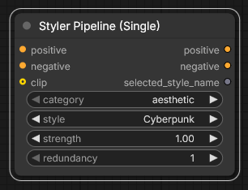

**Inputs:**
- `positive` (`CONDITIONING`, required)
- `negative` (`CONDITIONING`, required)
- `category` (`STRING`/dropdown, required)
- `style` (`STRING`/dropdown, required)
- `clip` (`CLIP`, required to apply styles)
- `strength` (`FLOAT`, default `1.0`)
- `redundancy` (`INT`, default `1`)

**Outputs:**
- `positive` (`CONDITIONING`)
- `negative` (`CONDITIONING`)
- `style` (`STRING`)

### Styler Pipeline (By Index) + Index Iterator

Use este par para varreduras determinísticas de estilos, evitando selecionar estilos manualmente: um índice incremental aplica os estilos de uma categoria selecionada um por um.
`Styler Pipeline (By Index)` aplica um estilo de uma categoria selecionada usando `style_index`, e o `Index Iterator` fornece um índice incremental em cada execução.

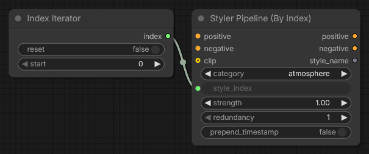

**Inputs:**
- `Styler Pipeline (By Index)`: `positive`, `negative`, `category`, `style_index`, `clip`, `strength`, `redundancy`, `prepend_timestamp`.
- `Index Iterator`: `reset`, `start`.

**Outputs:**
- `Styler Pipeline (By Index)`: `positive`, `negative`, `style`.
- `Index Iterator`: `index` (`INT`).

**Usage:** Conecte seu conditioning `positive` e `negative`, e conecte corretamente `clip`. Em seguida, selecione uma `category` no `Styler Pipeline (By Index)` e alimente o `style_index` com a saída `index` do `Index Iterator`. A cada execução do workflow, o `Index Iterator` incrementa a partir do valor `start` configurado, de modo que o próximo estilo dessa categoria seja aplicado automaticamente. Isso é útil para testar rapidamente muitos estilos sem alterar seleções manualmente antes de enviar o conditioning resultante para nodes downstream como `KSampler`.

---

### Advanced Styler Pipeline

Styler clássico baseado em menus, com dropdowns diretos para cada categoria JSON.

**Em resumo:**
- Útil quando você quer controle categoria por categoria com dropdowns no grafo.
- Adiciona explicitamente conditioning de estilo às suas rotas atuais de `positive`/`negative`.
- Mais rápido de escanear do que abrir o painel quando você já sabe suas seleções por categoria.

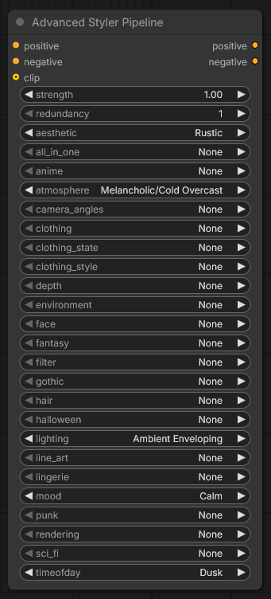

**Inputs:**
- `positive` (`CONDITIONING`, required)
- `negative` (`CONDITIONING`, required)
- `clip` (`CLIP`, optional input, required to apply style encoding)
- `strength` (`FLOAT`, default `1.0`)
- `redundancy` (`INT`, default `1`)
- Style dropdowns loaded from `data/*.json`

**Outputs:**
- `positive` (`CONDITIONING`)
- `negative` (`CONDITIONING`)

**Usage:** Conecte o conditioning de entrada `positive` e `negative` a este node, conecte `clip` e escolha os dropdowns de estilo desejados de cada categoria para ir “layering” o visual. O node aumenta seu conditioning existente em vez de substituí-lo, então ajuste `strength` e `redundancy` conforme necessário para balancear. Conecte as saídas `positive` e `negative` a nodes downstream como `KSampler` para geração.

---

## <a id="llm-setup"></a>Configuração LLM

O AI Styler usa o Provider e o Model que você escolher na UI. Abra **Edit** e use a aba **AI Styler** para selecionar primeiro um `Provider` e depois um `Model` para esse provider.

### Cloud API Providers

Cloud API providers (OpenAI, Anthropic, Google Gemini, Hugging Face, Groq, etc.) são consultados via API. Selecione o provider e o model na aba AI Styler e cole sua API key ou token no campo de token antes de executar sugestões.
Antes de usar um provider cloud, clique em **Refresh** para obter a lista de models mais recente.

**Provider notes (sujeitas às políticas do provider e podem mudar):**
- **Hugging Face** — oferece acesso free-tier dependendo do model e do provider.
- **Groq** — frequentemente oferece um free tier; verifique a política atual.
- **OpenAI, Google Gemini, Anthropic** — normalmente exigem billing habilitado para usar a API.

> [!WARNING]
> Não foi possível testar a OpenAI API porque não foi possível ativar o billing usando cartões pré-pagos. Se você encontrar um erro ao usar OpenAI, abra um issue no GitHub com informações detalhadas do erro para que possa ser corrigido o quanto antes.

A API key ou token é usada apenas para a execução atual e o plugin **não a armazena**; mas você pode salvá-la no Password Manager do seu navegador usando o botão **Save token** fornecido.

### Ollama Models (Local + Cloud)

[Ollama](https://ollama.com/download) é um app de desktop gratuito que permite rodar LLMs totalmente offline no seu próprio hardware. Depois de fazer login em uma conta gratuita do Ollama, você também pode usar models do **Ollama Cloud** sem baixá-los localmente.

> [!TIP]
> O Ollama nunca exige uma API key — nem para models locais nem para models cloud. Models cloud exigem apenas que você faça login em uma conta gratuita do Ollama dentro do app do Ollama.

**Como fazer os models do Ollama aparecerem:**

Depois de instalar o Ollama, o AI Styler pode listar **zero models** até você ativar um no app do Ollama:

1. Abra o app de desktop do Ollama e deixe-o rodando (minimizar é ok; não feche).
2. No app do Ollama, selecione o model que deseja usar:
   - **Local model:** escolha um model para baixar na sua máquina. `gemma3:4b` é um bom ponto de partida — mais leve e mais rápido do que a maioria.
   - **Cloud model:** faça login na sua conta gratuita do Ollama no app e então selecione um model cloud.
3. Envie qualquer mensagem curta no app do Ollama (por exemplo, "test") para ativar o model selecionado.
4. Volte ao AI Styler e clique em **Refresh**; o model deve aparecer agora no dropdown de models.

> [!WARNING]
> Recomenda-se fortemente **não consultar models locais do Ollama enquanto um workflow do ComfyUI estiver em execução**. Isso pode sobrecarregar severamente os recursos compartilhados de GPU/CPU e tornar seu sistema muito lento e instável. Sempre que possível, prefira um **provider cloud**, que geralmente é mais rápido e eficiente. Se você ainda quiser usar o Ollama local, comece com um model pequeno como **gemma3:4b** antes de testar models maiores.

**Troubleshooting (Ollama local):**

- Models locais não aparecem:
  - Envie qualquer mensagem para um model local do Ollama no app do Ollama para inicializá-lo.
  - Confirme que o Ollama está rodando e acessível em `http://127.0.0.1:11434`.
- O status mostra "Not connected":
  - Reinicie o Ollama e depois reabra o AI Styler.
  - Verifique se o firewall/software de segurança local não está bloqueando a porta localhost `11434`.
- O Ollama não está rodando:
  - Inicie o app (Windows/macOS) ou execute `ollama serve` (Linux).

---

## <a id="ai-prompts"></a>Prompts de IA

Mantenha prompts curtos e específicos. Descreva a direção visual, não uma história completa.

### O que incluir

- Genre/style: sci-fi, noir, anime, fantasy, etc.
- Mood: tense, cozy, melancholic, energetic.
- Lighting: soft, practical, cinematic rim light, harsh noon sun.
- Time of day: dawn, golden hour, night, overcast afternoon.
- Environment: alley, spaceship interior, forest, classroom, rooftop.

### O que evitar

- Prompts muito longos com ideias demais competindo.
- Direções contraditórias na mesma frase (por exemplo: "dark night scene with bright midday sun").

### Como usar as sugestões retornadas

- Comece mantendo 1–2 categorias fortes que melhor correspondam ao seu objetivo.
- Gere/teste e depois refine com poucas categorias extras.
- Evite empilhar categorias conflitantes ao mesmo tempo; adicione mudanças de forma incremental.

---

## <a id="advanced-json"></a>JSON avançado

> Apenas para **advanced users**. A edição por JSON é atualmente a única forma de modificar estilos; uma UI visual do Editor está planejada para uma versão futura. Os prompts incluídos foram refinados com AI mas não foram testados exaustivamente — alguns podem exigir pequenos ajustes manuais.

Advanced users podem personalizar estilos livremente:

- **Adicionar ou remover arquivos completos `data/*.json`.** Qualquer arquivo JSON colocado em `data/` se torna automaticamente uma nova categoria de estilo e aparece na lista de categorias.
- **Adicionar, remover ou renomear entradas de estilo individuais** dentro de qualquer arquivo JSON e editar prompts conforme necessário.

**Nota de reprodutibilidade:** Workflows existentes permanecem reproduzíveis desde que as entradas de estilo referenciadas não sejam renomeadas ou removidas. Se um estilo usado por um workflow antigo for renomeado ou removido, esse workflow não encontrará a definição do estilo e não reproduzirá o mesmo resultado.

Mantenha os arquivos de estilo `data/*.json` consistentes para que os nodes styler permaneçam previsíveis.

### JSON shape

```json
[
  {
    "name": "style name",
    "prompt": "style description, {prompt}, token1, token2, token3",
    "negative_prompt": ""
  }
]
```

Required keys per item:
- `name` (string)
- `prompt` (string)
- `negative_prompt` (string, can be empty)

### Diretrizes práticas

- Prefira linguagem visual concreta a tags abstratas de qualidade.
- Mantenha os prompts concisos e visualmente descritivos.
- Mantenha nomes user-friendly e fáceis de navegar.
- Mantenha o JSON estritamente válido (sem comentários, sem vírgulas finais).
- **Evite palavras que models tendem a interpretar como objetos físicos.** Alguns substantivos disparam um render literal de objetos mesmo quando a intenção é uma cor ou um penteado. Por exemplo, **amber-toned** pode fazer o model desenhar pedras de âmbar em vez de um tom dourado quente; **crown braids** pode fazer aparecer uma coroa literal. A solução mais segura é remover completamente a palavra gatilho e descrever a intenção com outro vocabulário — por exemplo, em vez de "amber-toned" use "warm golden hue"; em vez de "crown braids" use "intricate braided updo".

> [!TIP]
> Se um prompt de estilo fizer aparecer um objeto inesperado nos outputs, provavelmente é por causa de uma trigger word literal. Exemplos comuns: **amber-toned** (renderiza pedras de âmbar) e **crown braids** (renderiza uma coroa literal).

---

## <a id="support"></a>Suporte

### Por que seu apoio importa

Este plugin é desenvolvido e mantido de forma independente, com uso regular de **paid AI agents** para acelerar debugging, testing e melhorias de qualidade de vida. Se ele for útil para você, o apoio financeiro ajuda o desenvolvimento a avançar de forma sustentável.

Sua contribuição ajuda a:

* Financiar tooling de AI para fixes mais rápidos e novas features
* Cobrir manutenção contínua e trabalho de compatibilidade em atualizações do ComfyUI
* Evitar que o desenvolvimento pare quando limites de uso forem atingidos

> [!TIP]
> Não vai doar? Uma estrela ⭐ no GitHub também ajuda muito, melhorando a visibilidade e ajudando mais usuários a encontrarem o projeto

### 💙 Support this project

<table style="width: 100%; table-layout: fixed;">
  <tr>
    <td align="center" style="width: 33.33%; padding: 20px;">
      <div>
        <h4 style="margin: 8px 0;">Ko-fi</h4>
        <a href="https://ko-fi.com/D1D716OLPM" target="_blank" rel="noopener noreferrer">
          
        </a>
        <p style="margin: 8px 0; font-size: 12px;"><a href="https://ko-fi.com/D1D716OLPM" target="_blank" rel="noopener noreferrer">Buy a Coffee</a></p>
      </div>
    </td>
    <td align="center" style="width: 33.33%; padding: 20px;">
      <div>
        <h4 style="margin: 8px 0;">PayPal</h4>
        <a href="https://www.paypal.com/ncp/payment/GEEM324PDD9NC" target="_blank" rel="noopener noreferrer">
          
        </a>
        <p style="margin: 8px 0; font-size: 12px;"><a href="https://www.paypal.com/ncp/payment/GEEM324PDD9NC" target="_blank" rel="noopener noreferrer">Open PayPal</a></p>
      </div>
    </td>
    <td align="center" style="width: 33.33%; padding: 20px;">
      <div>
        <h4 style="margin: 8px 0;">USDC (Arbitrum only ⚠️)</h4>
        <a href="https://arbiscan.io/address/0xe36a336fC6cc9Daae657b4A380dA492AB9601e73" target="_blank" rel="noopener noreferrer">
          
        </a>
        <p style="margin: 8px 0; font-size: 12px;"><a href="#usdc-address">Show address</a></p>
      </div>
    </td>
  </tr>
</table>

<details>
  <summary>Prefere escanear? Mostrar QR codes</summary>
  <br />
  <table style="width: 100%; table-layout: fixed;">
    <tr>
      <td align="center" style="width: 33.33%; padding: 12px;">
        <strong>Ko-fi</strong><br />
        <a href="https://ko-fi.com/D1D716OLPM" target="_blank" rel="noopener noreferrer">
          
        </a>
      </td>
      <td align="center" style="width: 33.33%; padding: 12px;">
        <strong>PayPal</strong><br />
        <a href="https://www.paypal.com/ncp/payment/GEEM324PDD9NC" target="_blank" rel="noopener noreferrer">
          
        </a>
      </td>
      <td align="center" style="width: 33.33%; padding: 12px;">
        <strong>USDC (Arbitrum) ⚠️</strong><br />
        <a href="https://arbiscan.io/address/0xe36a336fC6cc9Daae657b4A380dA492AB9601e73" target="_blank" rel="noopener noreferrer">
          
        </a>
      </td>
    </tr>
  </table>
</details>

<a id="usdc-address"></a>
<details>
  <summary>Mostrar endereço USDC</summary>

```text
0xe36a336fC6cc9Daae657b4A380dA492AB9601e73
```

> [!WARNING]
> Envie USDC somente pela Arbitrum One. Transferências enviadas por qualquer outra rede não chegarão e podem ser perdidas permanentemente.
</details>

## <a id="gallery"></a>Galeria

### Workflow de exemplo
Clique na imagem abaixo para abrir o exemplo completo do workflow:
Você também pode arrastar e soltar esta imagem de workflow no ComfyUI para abrir/importar.
Este workflow de exemplo usa ControlNet para OpenPose por meio de um node do [OpenPose Studio](https://github.com/andreszs/ComfyUI-OpenPose-Studio).

<a href="../workflows/sample_workflow.png" target="_blank" rel="noopener noreferrer">
  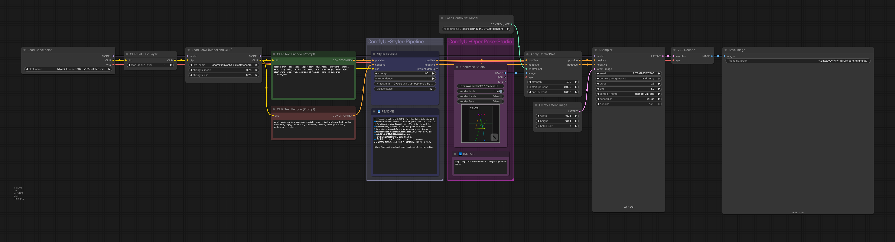
</a>

### Imagens de exemplo

> [!NOTE]
> Todas as imagens demo abaixo usam o mesmo model, a mesma LoRA, o mesmo prompt base e o mesmo seed. A única diferença são os estilos aplicados pelo node **Styler Pipeline**.

| Imagem | Styles used |
|---|---|
| <a href="../workflows/sample_bypass.png" target="_blank" rel="noopener noreferrer"></a> | - Baseline: Styler not applied<br>- Generation settings (shared):<br>&nbsp;&nbsp;- Resolution: `1024×1344`<br>&nbsp;&nbsp;- Seed: `717891937617865`<br>&nbsp;&nbsp;- Steps: `25`<br>&nbsp;&nbsp;- CFG: `4`<br>&nbsp;&nbsp;- Sampler: `dpmpp_2m_sde`<br>&nbsp;&nbsp;- Scheduler: `karras`<br>&nbsp;&nbsp;- Denoise: `1.0`<br>&nbsp;&nbsp;- Checkpoint: `yiffInHell_yihXXXTended.safetensors`<br>&nbsp;&nbsp;- LoRA: `inuyasha_ilxl.safetensors`<br>&nbsp;&nbsp;- ControlNet: `illustriousXL_v10.safetensors` |
| <a href="../workflows/sample_4.png" target="_blank" rel="noopener noreferrer">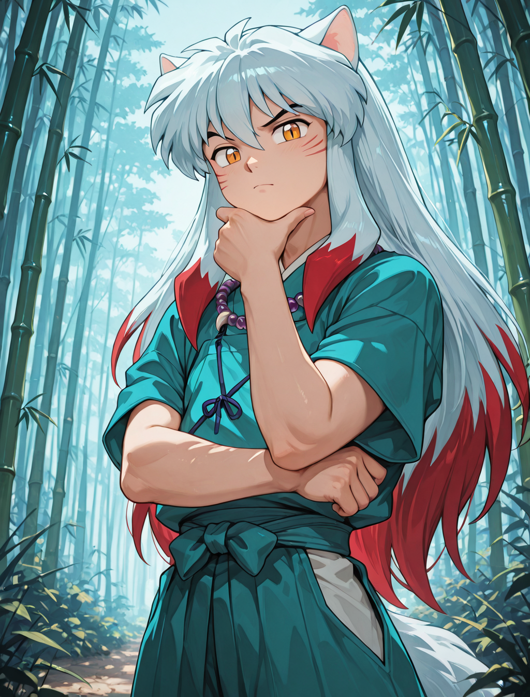</a> | - aesthetic: `Enchanted Forest`<br>- atmosphere: `Neon/Bioluminescent Glow`<br>- environment: `Nature/bamboo forest`<br>- filter: `BlueHour`<br>- lighting: `Bioluminescent Organic`<br>- mood: `Enchanted`<br>- timeofday: `Twilight`<br>- face: `Raised Eyebrow`<br>- hair: `Color combo silver and cyan`<br>- clothing_style: `Iridescent`<br>- depth: `Soft Focus`<br>- clothing: `Specialty/fantasy outfit` |
| <a href="../workflows/sample_3.png" target="_blank" rel="noopener noreferrer">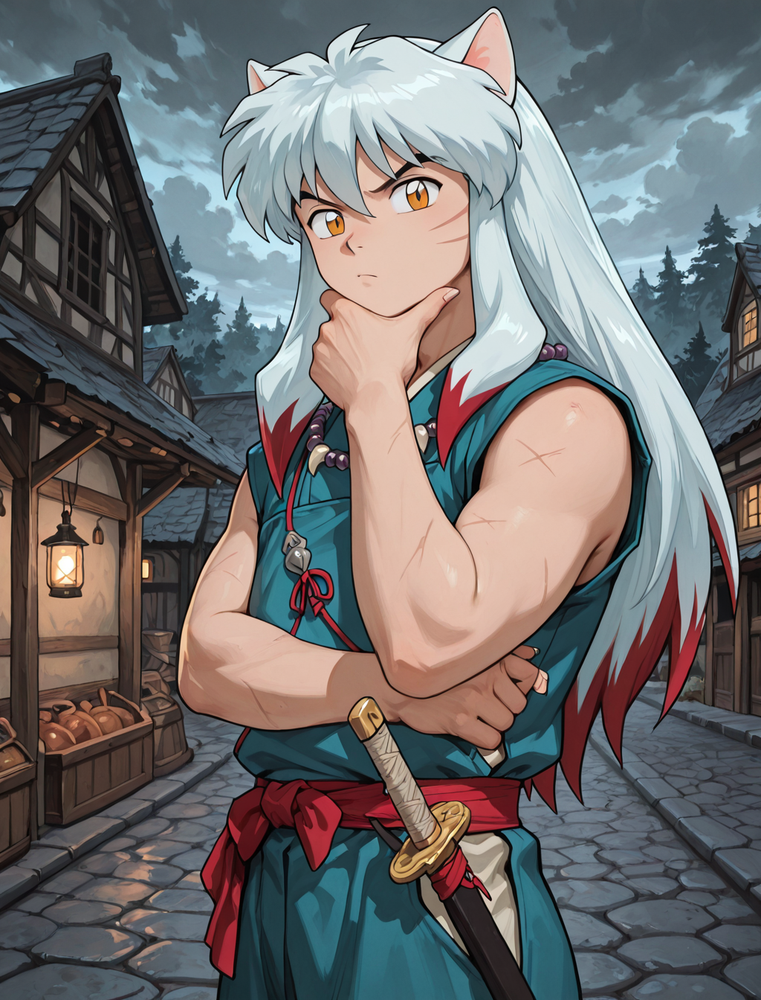</a> | - aesthetic: `Rustic`<br>- atmosphere: `Melancholic/Cold Overcast`<br>- environment: `Historical/medieval village`<br>- filter: `BlueHour`<br>- lighting: `Overcast Diffusion`<br>- mood: `Bleak`<br>- timeofday: `Midday`<br>- face: `Serious`<br>- hair: `Silver white hair`<br>- clothing_style: `Denim Fabric`<br>- depth: `Deep Focus`<br>- clothing: `Historical/viking raider` |
| <a href="../workflows/sample_2.png" target="_blank" rel="noopener noreferrer"></a> | - aesthetic: `Dark Fantasy`<br>- atmosphere: `Dark/Night Ambient`<br>- environment: `Outdoor/temple hill overlook`<br>- filter: `Soft`<br>- lighting: `Soft General`<br>- mood: `Meditative`<br>- timeofday: `Midnight`<br>- face: `Worried`<br>- hair: `Long wavy hair`<br>- depth: `Ultra Sharp`<br>- rendering: `Semi-Realistic`<br>- clothing: `Medieval/monk robe` |
| <a href="../workflows/sample_1.png" target="_blank" rel="noopener noreferrer">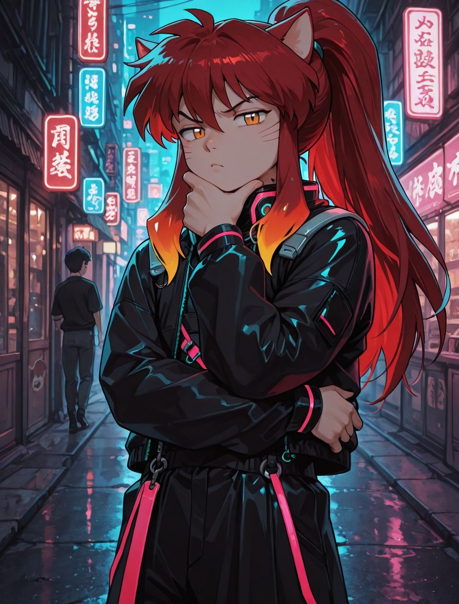</a> | - aesthetic: `Cyberpunk`<br>- atmosphere: `Dark/Night Ambient`<br>- environment: `Asian/japanese neon alley`<br>- filter: `Neon`<br>- lighting: `Multi-Source Complex`<br>- mood: `Gloomy`<br>- timeofday: `Midnight`<br>- face: `Skeptical`<br>- hair: `High ponytail`<br>- clothing_style: `Neon Accents`<br>- depth: `Selective Focus`<br>- rendering: `Anime Style`<br>- clothing: `SciFi/cyberpunk streetwear` |

Boas práticas para resultados confiáveis:
- A influência do Styler varia conforme o Model; alguns Models são mais fáceis de conduzir do que outros. Se um Model não cooperar com estilos, aumente levemente `strength` ou `redundancy` para elevar a influência do Styler.
- Seu prompt positivo (`CONDITIONING`) geralmente tem mais peso do que o node Styler. Seu prompt não deve contradizer os estilos desejados, ou o efeito do Styler será reduzido.
- Para SDXL, Pony e Illustrious, o OpenPose do ControlNet costuma ser uma orientação, não uma regra rígida, e pode ser sobrescrito pelo prompt. Se o prompt contradizer a pose aplicada, o ControlNet pode ser ignorado ou produzir uma composição inconsistente. Reforçar a pose no prompt geralmente é uma boa ideia.
- Use `camera_angles` com cuidado para não entrar em conflito com seu prompt ou ControlNet. Esta é a categoria mais sensível e costuma ser ignorada quando usada incorretamente, porque conduz a composição mais do que o estilo.

### Styler Iterator workflow

<a href="../workflows/sample_styler_iterator.png" target="_blank" rel="noopener noreferrer">
  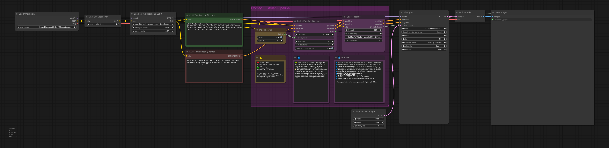
</a>

- **Extensions required:** [comfyui-openpose-studio](https://github.com/andreszs/ComfyUI-OpenPose-Studio)

Você pode carregar esta imagem no ComfyUI para extrair/abrir o workflow.
Este workflow itera sequencialmente pelos estilos dentro de uma categoria a cada execução, então você pode testar estilos diferentes sem mudar valores manualmente.
Por uma limitação técnica, a imagem gerada não pode incluir o nome do estilo iterado dentro do próprio workflow; use a saída `style` do node `Styler Pipeline (By Index)` como parte do filename, caso contrário fica muito difícil identificar qual estilo foi aplicado.
O workflow de iterator não consegue persistir o índice usado nem o nome do estilo aplicado de volta no workflow.

### Conditioning Areas workflow (Experimental)

O node Styler Pipeline não é apenas compatível com workflows de ControlNet, mas também é **100% compatível** com os nodes `Conditioning Pipeline Area` do [comfyui-lora-pipeline](https://github.com/andreszs/comfyui-lora-pipeline).
Este setup permite styling por área, para você aplicar estilos diferentes em áreas diferentes da imagem conectando nodes Styler dentro desse pipeline.
Esses nodes também permitem múltiplas LoRAs sem misturar seus estilos, porque encapsulam a lógica nativa do ComfyUI `Cond Pair Set Props` sem expor hooks, e usam áreas em vez de máscaras.

<a href="../workflows/sample_conditioning_areas.png" target="_blank" rel="noopener noreferrer">
  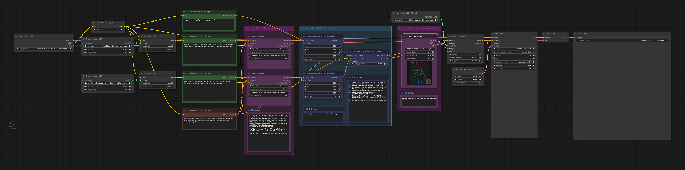
</a>

- **Extensions required:** [comfyui-openpose-studio](https://github.com/andreszs/ComfyUI-OpenPose-Studio), [comfyui-lora-pipeline](https://github.com/andreszs/comfyui-lora-pipeline)
- **Experimental:** o fine-tuning deste workflow multi-LoRA multi-área com ControlNet é mais complexo e a execução é consideravelmente mais lenta do que workflows regulares.

Estilos por área e poses consistentes podem ser diretos, mas a qualidade final da imagem depende de muitos fatores e não é detalhada aqui. Para mais detalhes, leia o README do [comfyui-lora-pipeline](https://github.com/andreszs/comfyui-lora-pipeline).

Veja [este post](https://www.andreszsogon.com/building-a-multi-character-comfyui-workflow-with-area-conditioning-openpose-control-and-style-layering/) para um workflow completo combinando múltiplas áreas de conditioning, OpenPose, ControlNet e Styler usados ao mesmo tempo.

## <a id="contributing"></a>Contribuições

### Princípios centrais

- Mantenha pull requests focados e mínimos.
- Evite refactors amplos a menos que tenham sido discutidos primeiro.
- Preserve a arquitetura existente e seu rationale.

### Mudanças assistidas por AI

Se você usar um assistente de código baseado em AI, peça para ele ler e seguir [AGENTS.md](../AGENTS.md) antes de fazer mudanças.

### Critérios de aceitação

- Um problema ou melhoria clara por PR.
- Diffs localizados e revisáveis.
- Explicação clara de por que a mudança é necessária.

---

## <a id="license"></a>Licença

MIT License - veja [LICENSE](../LICENSE) para o texto completo.

---

**Last update:** 2026-02-13  
**Maintained by:** andreszs  
**Status:** Active development
