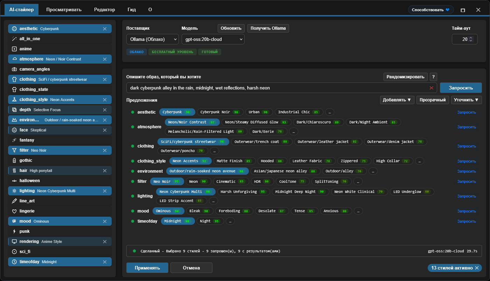

<h4 align="center">
  <a href="./README.md">English</a> | <a href="./README.de.md">Deutsch</a> | <a href="./README.es.md">Español</a> | <a href="./README.fr.md">Français</a> | <a href="./README.pt.md">Português</a> | Русский | <a href="./README.ja.md">日本語</a> | <a href="./README.ko.md">한국어</a> | <a href="./README.zh.md">中文</a> | <a href="./README.zh-TW.md">繁體中文</a>
</h4>

<p align="center">
  
  
  
</p>
<br />

# ComfyUI Styler Pipeline ✨

> Фокусированные nodes styler-pipeline для воспроизводимых workflows в ComfyUI: применение стилей с детерминированными Styler nodes и безопасным merging conditioning.

---

## <a id="table-of-contents"></a>Содержание

- ✨ [Особенности](#features)
- 📦 [Установка](#installation)
- 🔧 [Nodes](#nodes)
- 🤖 [Настройка LLM](#llm-setup)
- ✍️ [Промпты для ИИ](#ai-prompts)
- 📝 [Расширенный JSON](#advanced-json)
- 💖 [Поддержка](#support)
- 🖼️ [Галерея](#gallery)
- 🤝 [Участие](#contributing)
- 📄 [Лицензия](#license)

---

## <a id="features"></a>Особенности

- Детерминированные nodes styler-pipeline, рассчитанные на воспроизводимость между запусками.
- Выбор стилей с помощью AI: опрашивает LLM по категориям и возвращает кандидатов стилей, отсортированных по score.
- Ручной просмотр и выбор стилей через workflow Browser с навигацией по категориям.
- Dynamic Styler, безопасно применяющий стили к существующему conditioning.
- Классический node `Advanced Styler` на основе dropdowns для контроля категория за категорией в графе.
- Совместим с workflows ControlNet, включая сценарии на базе OpenPose.

---

## <a id="installation"></a>Установка

### Требования
- ComfyUI (свежий build)
- Python 3.10+

### Шаги

1. Клонируйте этот репозиторий в `ComfyUI/custom_nodes/`.
2. Перезапустите ComfyUI.
3. Убедитесь, что nodes отображаются в `Styler Pipeline/`.

---

## <a id="nodes"></a>Nodes

### Styler Pipeline

**Коротко:**
- Основной node для повседневного styling с панелью **Edit**.
- Детерминированный и воспроизводимый, потому что выбор сохраняется во внутренний JSON.


**Inputs:**
- `positive` (`CONDITIONING`, required)
- `negative` (`CONDITIONING`, required)
- `clip` (`CLIP`, required to apply styles)
- `strength` (`FLOAT`, default `1.0`)
- `redundancy` (`INT`, default `1`)
- `selected_styles_json` (`STRING`, internal UI state)

**Outputs:**
- `positive` (`CONDITIONING`)
- `negative` (`CONDITIONING`)

**Behavior notes:**
- Использует выбранные стили, чтобы закодировать дополнительный style conditioning, затем смешивает его с существующим conditioning.
- Нажмите **Edit**, чтобы управлять выбором category/style в одной панели и записать его во внутренний JSON.

#### Руководство по Strength и Redundancy

`strength` контролирует, насколько сильно выбранные стили направляют генерацию. Разные checkpoints/models по-разному поддаются влиянию: одни применяют стиль сильно при малом `strength`, другие более устойчивы.

Если model устойчив, увеличение `strength` может помочь. Но после определённого порога качество обычно ухудшается; примерно на `~1.3+` деградация часто становится заметной, потому что по сути это похоже на то, как “крикнуть” инструкцию в `KSampler`.

`redundancy` буквально повторяет выбранные стили несколько раз, увеличивая их вес. Это может улучшить следование стилю, но слишком высокая redundancy может испортить композицию.

- Безопасная стартовая точка: `strength = 1.0`, `redundancy = 1`.
- Типичная настройка: сначала увеличивайте `strength` постепенно, маленькими шагами.
- В большинстве случаев держите `redundancy` на уровне `2` или ниже.

**AI Styler module:**
Опишите желаемый look, и **AI Styler** попросит LLM автоматически предложить наиболее подходящие стили по категориям.
Поддерживает ключевые API providers (OpenAI, Anthropic, Groq, Gemini, Hugging Face), а также **Ollama (Local)**, чтобы вы могли работать offline/без интернета.
На изображении ниже вы видите вкладку **AI Styler**, открытую из **Edit**, где генерируются и применяются предложения на основе prompt.



**Browser module:**
Если вы предпочитаете не использовать AI Styler, вкладка **Browse** позволяет выбирать стили вручную и сохранять больше контроля.
На изображении ниже вы видите вкладку **Browser** в том же панели, где категории и стили выбираются вручную.


**Editor module:**
Editor позволяет просматривать стили, загруженные из JSON-файлов по категориям (`data/*.json`).
Инструменты редактирования сейчас в разработке и будут доступны скоро (в данный момент ограничен budget токенов AI).

> [!NOTE]
> Поскольку выбранные стили сохраняются внутри данных node, тот же workflow остаётся воспроизводимым даже если вы добавляете/удаляете категории и стили в JSON-файлах, при условии, что вы сохраняете исходно выбранные стили.

### Styler Pipeline (Single)

Применяйте один стиль за раз, вручную выбирая `category` и `style`.


**Inputs:**
- `positive` (`CONDITIONING`, required)
- `negative` (`CONDITIONING`, required)
- `category` (`STRING`/dropdown, required)
- `style` (`STRING`/dropdown, required)
- `clip` (`CLIP`, required to apply styles)
- `strength` (`FLOAT`, default `1.0`)
- `redundancy` (`INT`, default `1`)

**Outputs:**
- `positive` (`CONDITIONING`)
- `negative` (`CONDITIONING`)
- `style` (`STRING`)

### Styler Pipeline (By Index) + Index Iterator

Используйте эту пару для детерминированных переборов стилей, избегая ручного выбора: инкрементальный индекс применяет стили выбранной категории один за другим.
`Styler Pipeline (By Index)` применяет стиль из выбранной категории через `style_index`, а `Index Iterator` выдаёт инкрементальный индекс при каждом запуске.


**Inputs:**
- `Styler Pipeline (By Index)`: `positive`, `negative`, `category`, `style_index`, `clip`, `strength`, `redundancy`, `prepend_timestamp`.
- `Index Iterator`: `reset`, `start`.

**Outputs:**
- `Styler Pipeline (By Index)`: `positive`, `negative`, `style`.
- `Index Iterator`: `index` (`INT`).

**Usage:** Подключите `positive` и `negative` conditioning и корректно подключите `clip`. Затем выберите `category` в `Styler Pipeline (By Index)` и подайте в `style_index` выход `index` из `Index Iterator`. При каждом запуске workflow `Index Iterator` увеличивает значение начиная с настроенного `start`, так что следующий стиль этой категории применяется автоматически. Это удобно для быстрого тестирования множества стилей без ручного переключения перед отправкой результата в downstream nodes вроде `KSampler`.

---

### Advanced Styler Pipeline

Классический menu-based Styler с прямыми dropdowns для каждой JSON-категории.

**Коротко:**
- Удобно, когда нужен контроль категория за категорией через dropdowns в графе.
- Явно добавляет style conditioning к вашим текущим путям `positive`/`negative`.
- Быстрее просматривать, чем открывать панель, когда вы уже знаете свои выборы по категориям.


**Inputs:**
- `positive` (`CONDITIONING`, required)
- `negative` (`CONDITIONING`, required)
- `clip` (`CLIP`, optional input, required to apply style encoding)
- `strength` (`FLOAT`, default `1.0`)
- `redundancy` (`INT`, default `1`)
- Style dropdowns loaded from `data/*.json`

**Outputs:**
- `positive` (`CONDITIONING`)
- `negative` (`CONDITIONING`)

**Usage:** Подключите входной `positive` и `negative` conditioning к этому node, подключите `clip` и выберите нужные dropdowns стилей в каждой категории, чтобы “наслаивать” look. Node увеличивает существующий conditioning вместо замены, поэтому настраивайте `strength` и `redundancy` по необходимости. Подключите выходы `positive` и `negative` к downstream nodes вроде `KSampler` для генерации.

---

## <a id="llm-setup"></a>Настройка LLM

AI Styler использует Provider и Model, которые вы выберете в UI. Откройте **Edit** и на вкладке **AI Styler** сначала выберите `Provider`, затем `Model` для этого provider.

### Cloud API Providers

Cloud API providers (OpenAI, Anthropic, Google Gemini, Hugging Face, Groq и т. д.) вызываются через их API. Выберите provider и model во вкладке AI Styler, затем вставьте вашу API key или token в поле token перед запуском suggestions.
Перед использованием cloud provider нажмите **Refresh**, чтобы получить самый свежий список models.

**Provider notes (зависят от политики provider и могут меняться):**
- **Hugging Face** — предоставляет free-tier доступ в зависимости от model и provider.
- **Groq** — часто предоставляет free tier; проверьте текущую политику.
- **OpenAI, Google Gemini, Anthropic** — обычно требуют включённый billing для использования API.

> [!WARNING]
> OpenAI API не удалось протестировать, потому что не получилось включить billing с предоплаченными картами. Если при использовании OpenAI вы встретите ошибку, пожалуйста, откройте GitHub issue с подробной информацией об ошибке, чтобы это можно было исправить как можно скорее.

API key или token используется только для текущего запуска, и плагин **не сохраняет его**; но вы можете сохранить его в Password Manager вашего браузера через предоставленную кнопку **Save token**.

### Ollama Models (Local + Cloud)

[Ollama](https://ollama.com/download) — бесплатное desktop-приложение, которое позволяет запускать LLMs полностью offline на вашем оборудовании. После входа в бесплатный Ollama account вы также можете использовать models **Ollama Cloud** без локальной загрузки.

> [!TIP]
> Ollama никогда не требует API key — ни для локальных models, ни для cloud models. Cloud models требуют лишь входа в бесплатный Ollama account в приложении Ollama.

**Как сделать так, чтобы models Ollama появились:**

После установки Ollama AI Styler может показывать **zero models**, пока вы не активируете хотя бы один в приложении Ollama:

1. Откройте desktop-приложение Ollama и оставьте его запущенным (можно свернуть; не закрывайте).
2. В приложении Ollama выберите model, который хотите использовать:
   - **Local model:** выберите model для загрузки на вашу машину. `gemma3:4b` — хороший старт: легче и быстрее большинства.
   - **Cloud model:** войдите в бесплатный Ollama account в приложении и затем выберите cloud model.
3. Отправьте любое короткое сообщение в приложении Ollama (например, "test"), чтобы активировать выбранный model.
4. Вернитесь в AI Styler и нажмите **Refresh**; теперь model должен появиться в dropdown списка моделей.

> [!WARNING]
> Настоятельно рекомендуется **не опрашивать локальные models Ollama во время выполнения workflow ComfyUI**. Это может сильно перегрузить общие ресурсы GPU/CPU и сделать систему очень медленной и нестабильной. По возможности используйте **cloud provider**, который обычно быстрее и эффективнее. Если вы всё же хотите использовать Ollama local, начните с небольшого model вроде **gemma3:4b** перед тем, как пробовать более крупные models.

**Troubleshooting (Ollama local):**

- Локальные models не появляются:
  - Отправьте любое сообщение локальному model в приложении Ollama, чтобы инициализировать его.
  - Убедитесь, что Ollama запущен и доступен по адресу `http://127.0.0.1:11434`.
- Статус показывает "Not connected":
  - Перезапустите Ollama и затем снова откройте AI Styler.
  - Проверьте, не блокирует ли firewall/локальное security ПО localhost порт `11434`.
- Ollama не запущен:
  - Запустите приложение (Windows/macOS) или выполните `ollama serve` (Linux).

---

## <a id="ai-prompts"></a>Промпты для ИИ

Делайте prompts короткими и конкретными. Описывайте визуальное направление, а не полную историю.

### Что включать

- Genre/style: sci-fi, noir, anime, fantasy, etc.
- Mood: tense, cozy, melancholic, energetic.
- Lighting: soft, practical, cinematic rim light, harsh noon sun.
- Time of day: dawn, golden hour, night, overcast afternoon.
- Environment: alley, spaceship interior, forest, classroom, rooftop.

### Чего избегать

- Слишком длинных prompts с избыточным количеством конкурирующих идей.
- Противоречивых указаний в одном предложении (например: "dark night scene with bright midday sun").

### Как использовать возвращённые suggestions

- Начните с 1–2 сильных категорий, которые лучше всего соответствуют цели.
- Сгенерируйте/протестируйте, затем refine с небольшим количеством дополнительных категорий.
- Не “стекайте” конфликтующие категории одновременно; добавляйте изменения постепенно.

---

## <a id="advanced-json"></a>Расширенный JSON

> Только для **advanced users**. Сейчас редактирование JSON — единственный способ менять стили; визуальный Editor UI планируется в будущей версии. Включённые prompts были улучшены с помощью AI, но не тестировались исчерпывающе — некоторые могут потребовать небольших ручных правок.

Advanced users могут свободно кастомизировать стили:

- **Добавлять или удалять целые файлы `data/*.json`.** Любой JSON-файл в `data/` автоматически становится новой категорией стиля и появляется в списке категорий.
- **Добавлять, удалять или переименовывать отдельные style entries** внутри любого JSON-файла и редактировать prompts по необходимости.

**Примечание о воспроизводимости:** Существующие workflows остаются воспроизводимыми, пока referenced style entries не переименованы и не удалены. Если стиль, используемый старым workflow, переименовать или удалить, workflow больше не найдёт его definition и не воспроизведёт тот же результат.

Держите файлы стилей `data/*.json` согласованными, чтобы styler nodes оставались предсказуемыми.

### JSON shape

```json
[
  {
    "name": "style name",
    "prompt": "style description, {prompt}, token1, token2, token3",
    "negative_prompt": ""
  }
]
```

Required keys per item:
- `name` (string)
- `prompt` (string)
- `negative_prompt` (string, can be empty)

### Практические рекомендации

- Предпочитайте конкретный визуальный язык абстрактным “quality tags”.
- Держите prompts короткими и визуально описательными.
- Держите имена user-friendly и удобными для browsing.
- Поддерживайте строго валидный JSON (без комментариев, без trailing commas).
- **Избегайте слов, которые models часто интерпретируют как физические объекты.** Некоторые существительные вызывают literal rendering объектов даже когда intention — цвет или прическа. Например, **amber-toned** может заставить model рисовать янтарные камни вместо тёплого золотистого оттенка; **crown braids** может добавить буквальную корону. Самое безопасное — полностью удалить trigger word и описать intention другим словарём — например, вместо "amber-toned" использовать "warm golden hue"; вместо "crown braids" — "intricate braided updo".

> [!TIP]
> Если style prompt вызывает неожиданный объект в outputs, вероятно, это из-за literal trigger word. Частые примеры: **amber-toned** (рендерит янтарные камни) и **crown braids** (рендерит буквальную корону).

---

## <a id="support"></a>Поддержка

### Почему ваша поддержка важна

Этот плагин разрабатывается и поддерживается независимо, с регулярным использованием **paid AI agents** для ускорения debugging, testing и улучшений качества жизни. Если он полезен, финансовая поддержка помогает устойчивому развитию.

Ваш вклад помогает:

* Финансировать AI tooling для более быстрых fixes и новых features
* Покрывать непрерывное обслуживание и работу по совместимости при обновлениях ComfyUI
* Не допустить остановки разработки при достижении usage limits

> [!TIP]
> Не хотите донатить? Звезда ⭐ на GitHub тоже очень помогает — повышает видимость и помогает большему числу пользователей найти проект

### 💙 Support this project

<table style="width: 100%; table-layout: fixed;">
  <tr>
    <td align="center" style="width: 33.33%; padding: 20px;">
      <div>
        <h4 style="margin: 8px 0;">Ko-fi</h4>
        <a href="https://ko-fi.com/D1D716OLPM" target="_blank" rel="noopener noreferrer">
          
        </a>
        <p style="margin: 8px 0; font-size: 12px;"><a href="https://ko-fi.com/D1D716OLPM" target="_blank" rel="noopener noreferrer">Buy a Coffee</a></p>
      </div>
    </td>
    <td align="center" style="width: 33.33%; padding: 20px;">
      <div>
        <h4 style="margin: 8px 0;">PayPal</h4>
        <a href="https://www.paypal.com/ncp/payment/GEEM324PDD9NC" target="_blank" rel="noopener noreferrer">
          
        </a>
        <p style="margin: 8px 0; font-size: 12px;"><a href="https://www.paypal.com/ncp/payment/GEEM324PDD9NC" target="_blank" rel="noopener noreferrer">Open PayPal</a></p>
      </div>
    </td>
    <td align="center" style="width: 33.33%; padding: 20px;">
      <div>
        <h4 style="margin: 8px 0;">USDC (Arbitrum only ⚠️)</h4>
        <a href="https://arbiscan.io/address/0xe36a336fC6cc9Daae657b4A380dA492AB9601e73" target="_blank" rel="noopener noreferrer">
          
        </a>
        <p style="margin: 8px 0; font-size: 12px;"><a href="#usdc-address">Show address</a></p>
      </div>
    </td>
  </tr>
</table>

<details>
  <summary>Предпочитаете сканировать? Показать QR-коды</summary>
  <br />
  <table style="width: 100%; table-layout: fixed;">
    <tr>
      <td align="center" style="width: 33.33%; padding: 12px;">
        <strong>Ko-fi</strong><br />
        <a href="https://ko-fi.com/D1D716OLPM" target="_blank" rel="noopener noreferrer">
          
        </a>
      </td>
      <td align="center" style="width: 33.33%; padding: 12px;">
        <strong>PayPal</strong><br />
        <a href="https://www.paypal.com/ncp/payment/GEEM324PDD9NC" target="_blank" rel="noopener noreferrer">
          
        </a>
      </td>
      <td align="center" style="width: 33.33%; padding: 12px;">
        <strong>USDC (Arbitrum) ⚠️</strong><br />
        <a href="https://arbiscan.io/address/0xe36a336fC6cc9Daae657b4A380dA492AB9601e73" target="_blank" rel="noopener noreferrer">
          
        </a>
      </td>
    </tr>
  </table>
</details>

<a id="usdc-address"></a>
<details>
  <summary>Показать адрес USDC</summary>

```text
0xe36a336fC6cc9Daae657b4A380dA492AB9601e73
```

> [!WARNING]
> Отправляйте USDC только через Arbitrum One. Переводы, отправленные по любой другой сети, не поступят и могут быть потеряны навсегда.
</details>

## <a id="gallery"></a>Галерея

### Пример workflow
Нажмите на изображение ниже, чтобы открыть полный пример workflow:
Также вы можете перетащить эту картинку workflow в ComfyUI, чтобы открыть/импортировать.
Этот пример workflow использует ControlNet для OpenPose через node из [OpenPose Studio](https://github.com/andreszs/ComfyUI-OpenPose-Studio).

<a href="../workflows/sample_workflow.png" target="_blank" rel="noopener noreferrer">
  
</a>

### Примеры изображений

> [!NOTE]
> Все demo изображения ниже используют один и тот же model, одну и ту же LoRA, один и тот же base prompt и один и тот же seed. Единственная разница — стили, применяемые node **Styler Pipeline**.

| Изображение | Styles used |
|---|---|
| <a href="../workflows/sample_bypass.png" target="_blank" rel="noopener noreferrer"></a> | - Baseline: Styler not applied<br>- Generation settings (shared):<br>&nbsp;&nbsp;- Resolution: `1024×1344`<br>&nbsp;&nbsp;- Seed: `717891937617865`<br>&nbsp;&nbsp;- Steps: `25`<br>&nbsp;&nbsp;- CFG: `4`<br>&nbsp;&nbsp;- Sampler: `dpmpp_2m_sde`<br>&nbsp;&nbsp;- Scheduler: `karras`<br>&nbsp;&nbsp;- Denoise: `1.0`<br>&nbsp;&nbsp;- Checkpoint: `yiffInHell_yihXXXTended.safetensors`<br>&nbsp;&nbsp;- LoRA: `inuyasha_ilxl.safetensors`<br>&nbsp;&nbsp;- ControlNet: `illustriousXL_v10.safetensors` |
| <a href="../workflows/sample_4.png" target="_blank" rel="noopener noreferrer"></a> | - aesthetic: `Enchanted Forest`<br>- atmosphere: `Neon/Bioluminescent Glow`<br>- environment: `Nature/bamboo forest`<br>- filter: `BlueHour`<br>- lighting: `Bioluminescent Organic`<br>- mood: `Enchanted`<br>- timeofday: `Twilight`<br>- face: `Raised Eyebrow`<br>- hair: `Color combo silver and cyan`<br>- clothing_style: `Iridescent`<br>- depth: `Soft Focus`<br>- clothing: `Specialty/fantasy outfit` |
| <a href="../workflows/sample_3.png" target="_blank" rel="noopener noreferrer"></a> | - aesthetic: `Rustic`<br>- atmosphere: `Melancholic/Cold Overcast`<br>- environment: `Historical/medieval village`<br>- filter: `BlueHour`<br>- lighting: `Overcast Diffusion`<br>- mood: `Bleak`<br>- timeofday: `Midday`<br>- face: `Serious`<br>- hair: `Silver white hair`<br>- clothing_style: `Denim Fabric`<br>- depth: `Deep Focus`<br>- clothing: `Historical/viking raider` |
| <a href="../workflows/sample_2.png" target="_blank" rel="noopener noreferrer"></a> | - aesthetic: `Dark Fantasy`<br>- atmosphere: `Dark/Night Ambient`<br>- environment: `Outdoor/temple hill overlook`<br>- filter: `Soft`<br>- lighting: `Soft General`<br>- mood: `Meditative`<br>- timeofday: `Midnight`<br>- face: `Worried`<br>- hair: `Long wavy hair`<br>- depth: `Ultra Sharp`<br>- rendering: `Semi-Realistic`<br>- clothing: `Medieval/monk robe` |
| <a href="../workflows/sample_1.png" target="_blank" rel="noopener noreferrer"></a> | - aesthetic: `Cyberpunk`<br>- atmosphere: `Dark/Night Ambient`<br>- environment: `Asian/japanese neon alley`<br>- filter: `Neon`<br>- lighting: `Multi-Source Complex`<br>- mood: `Gloomy`<br>- timeofday: `Midnight`<br>- face: `Skeptical`<br>- hair: `High ponytail`<br>- clothing_style: `Neon Accents`<br>- depth: `Selective Focus`<br>- rendering: `Anime Style`<br>- clothing: `SciFi/cyberpunk streetwear` |

Лучшие практики для надёжных результатов:
- Влияние Styler зависит от Model; некоторые Models легче направлять, чем другие. Если Model не “сотрудничает” со стилями, слегка увеличьте `strength` или `redundancy`, чтобы усилить влияние Styler.
- Ваш положительный prompt (`CONDITIONING`) обычно весит больше, чем node Styler. Prompt не должен противоречить желаемым стилям, иначе эффект Styler будет ослаблен.
- Для SDXL, Pony и Illustrious, ControlNet OpenPose часто является ориентиром, а не строгим правилом, и может быть переопределён prompt. Если prompt противоречит применённой позе, ControlNet может быть проигнорирован или дать нестабильную композицию. Обычно полезно усилить позу в prompt.
- Используйте `camera_angles` осторожно, чтобы не конфликтовать с prompt или ControlNet. Это самая чувствительная категория и часто игнорируется при неправильном использовании, потому что она влияет на композицию сильнее, чем на стиль.

### Styler Iterator workflow

<a href="../workflows/sample_styler_iterator.png" target="_blank" rel="noopener noreferrer">
  
</a>

- **Extensions required:** [comfyui-openpose-studio](https://github.com/andreszs/ComfyUI-OpenPose-Studio)

Вы можете загрузить это изображение в ComfyUI, чтобы извлечь/открыть workflow.
Этот workflow последовательно перебирает стили внутри категории при каждом запуске, поэтому вы можете тестировать разные стили без ручного изменения значений.
Из-за технического ограничения сгенерированное изображение не может включать имя перебираемого стиля внутри своего workflow; используйте выход `style` из node `Styler Pipeline (By Index)` как часть имени файла, иначе будет очень сложно определить, какой стиль применён.
Iterator workflow не может сохранить используемый index или имя применённого стиля обратно в workflow.

### Conditioning Areas workflow (Experimental)

Node Styler Pipeline не только совместим с workflows ControlNet, но также **100% совместим** с nodes `Conditioning Pipeline Area` из [comfyui-lora-pipeline](https://github.com/andreszs/comfyui-lora-pipeline).
Этот setup включает styling по областям, чтобы вы могли применять разные стили к разным областям изображения, подключая Styler nodes внутри этого pipeline.
Эти nodes также позволяют использовать несколько LoRAs без смешивания стилей, потому что они инкапсулируют нативную логику ComfyUI `Cond Pair Set Props` без hooks и используют области вместо масок.

<a href="../workflows/sample_conditioning_areas.png" target="_blank" rel="noopener noreferrer">
  
</a>

- **Extensions required:** [comfyui-openpose-studio](https://github.com/andreszs/ComfyUI-OpenPose-Studio), [comfyui-lora-pipeline](https://github.com/andreszs/comfyui-lora-pipeline)
- **Experimental:** fine-tuning этого multi-LoRA multi-area workflow с ControlNet более сложен, а выполнение заметно медленнее, чем у обычных workflows.

Стили по областям и согласованные позы могут быть straightforward, но итоговое качество изображения зависит от множества факторов и здесь не описано. Для подробностей прочитайте README [comfyui-lora-pipeline](https://github.com/andreszs/comfyui-lora-pipeline).

В [этой статье](https://www.andreszsogon.com/building-a-multi-character-comfyui-workflow-with-area-conditioning-openpose-control-and-style-layering/) можно увидеть полный workflow, объединяющий несколько conditioning area, OpenPose, ControlNet и Styler, используемых одновременно.

## <a id="contributing"></a>Участие

### Основные принципы

- Держите pull requests сфокусированными и минимальными.
- Избегайте больших refactors, если это не обсуждалось заранее.
- Сохраняйте существующую архитектуру и её rationale.

### Изменения с помощью AI

Если вы используете AI-based coding assistant, попросите его прочитать и следовать [AGENTS.md](../AGENTS.md) перед внесением изменений.

### Критерии принятия

- Одна чёткая проблема или улучшение на PR.
- Локальные, легко проверяемые diffs.
- Чёткое объяснение, почему изменение необходимо.

---

## <a id="license"></a>Лицензия

MIT License - полный текст в [LICENSE](../LICENSE).

---

**Last update:** 2026-02-13  
**Maintained by:** andreszs  
**Status:** Active development
