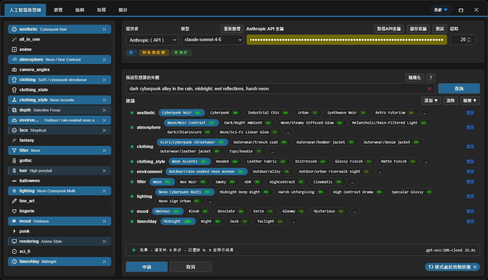

<h4 align="center">
  <a href="./README.md">English</a> | <a href="./README.de.md">Deutsch</a> | <a href="./README.es.md">Español</a> | <a href="./README.fr.md">Français</a> | <a href="./README.pt.md">Português</a> | <a href="./README.ru.md">Русский</a> | <a href="./README.ja.md">日本語</a> | <a href="./README.ko.md">한국어</a> | <a href="./README.zh.md">中文</a> | 繁體中文
</h4>

<p align="center">
  
  
  
</p>
<br />

# ComfyUI Styler Pipeline ✨

> 面向 ComfyUI 可重現工作流的聚焦 styler-pipeline nodes：透過確定性的 Styler nodes 與安全的 conditioning 合併來套用風格。

---

## <a id="table-of-contents"></a>目錄

- ✨ [特色](#features)
- 📦 [安裝](#installation)
- 🔧 [Nodes](#nodes)
- 🤖 [LLM 設定](#llm-setup)
- ✍️ [AI 提示詞](#ai-prompts)
- 📝 [JSON 進階](#advanced-json)
- 💖 [支援](#support)
- 🖼️ [展示](#gallery)
- 🤝 [貢獻](#contributing)
- 📄 [授權條款](#license)

---

## <a id="features"></a>特色

- 設計為在多次執行之間維持可重現的確定性 styler-pipeline nodes。
- AI 輔助的風格選擇：按類別查詢 LLM，並回傳附帶 score 的風格候選排名清單。
- 透過具備類別導覽的 Browser workflow 進行手動瀏覽與選擇風格。
- Dynamic Styler，可將風格安全地套用到既有 conditioning。
- 經典的 `Advanced Styler` node：基於 dropdowns，可在圖中按類別逐一控制。
- 相容於 ControlNet workflows，包括 OpenPose 驅動的情境。

---

## <a id="installation"></a>安裝

### 需求
- ComfyUI（較新的 build）
- Python 3.10+

### 步驟

1. 將此 repo clone 到 `ComfyUI/custom_nodes/` 中。
2. 重新啟動 ComfyUI。
3. 確認 nodes 出現在 `Styler Pipeline/` 下。

---

## <a id="nodes"></a>Nodes

### Styler Pipeline

**概覽：**
- 日常 styling 的主 node，具備 **Edit** 面板。
- 由於選擇會寫入內部 JSON，因此是確定且可重現的。


**Inputs:**
- `positive` (`CONDITIONING`, required)
- `negative` (`CONDITIONING`, required)
- `clip` (`CLIP`, required to apply styles)
- `strength` (`FLOAT`, default `1.0`)
- `redundancy` (`INT`, default `1`)
- `selected_styles_json` (`STRING`, internal UI state)

**Outputs:**
- `positive` (`CONDITIONING`)
- `negative` (`CONDITIONING`)

**行為說明：**
- 使用所選風格來編碼額外的風格 conditioning，然後合併到既有 conditioning 中。
- 點擊 **Edit** 在單一面板中管理類別/風格選擇，並寫入內部 JSON。

#### Strength 與 Redundancy 指南

`strength` 控制所選風格對生成的引導強度。不同 checkpoint/model 的可控性不同：有些在較低 `strength` 下就會強烈套用風格，有些則更「抗」。

如果 model 很抗，提高 `strength` 可能有幫助。但超過某個點後通常會降低品質；在 `~1.3+` 附近，降質往往會變得明顯，因為這實際上相當於在對 `KSampler`「喊話」。

`redundancy` 會把所選風格字面重複多次以增加權重。這可以提升風格貼合度，但 redundancy 過高可能會傷害構圖。

- 安全起點：`strength = 1.0`, `redundancy = 1`。
- 常見調法：先以小步幅逐步提高 `strength`。
- 多數情況下將 `redundancy` 維持在 `2` 或更低。

**AI Styler module:**
描述你想要的 look，**AI Styler** 會請 LLM 依類別自動建議最匹配的風格。
支援主要 API providers（OpenAI, Anthropic, Groq, Gemini, Hugging Face），也支援 **Ollama (Local)**，方便在離線/無網路環境執行。
下圖展示了從 **Edit** 開啟的 **AI Styler** 分頁，在此會基於 prompt 生成並套用建議。



**Browser module:**
如果你不想使用 AI Styler，**Browse** 分頁可讓你手動選擇風格並保有更多控制權。
下圖展示的是同一面板中的 **Browser** 分頁，用於手動選擇類別與風格。


**Editor module:**
Editor 可讓你查看按類別從 JSON 檔案（`data/*.json`）載入的風格。
編輯工具目前仍在開發中，稍後會提供（目前 AI token 預算有限）。

> [!NOTE]
> 由於所選風格會儲存在 node 的資料中，即使你在風格 JSON 檔案中新增/移除類別與風格，只要保留你最初選擇的風格，同一個 workflow 仍然可重現。

### Styler Pipeline (Single)

手動選擇 `category` 與 `style`，一次套用一個風格。


**Inputs:**
- `positive` (`CONDITIONING`, required)
- `negative` (`CONDITIONING`, required)
- `category` (`STRING`/dropdown, required)
- `style` (`STRING`/dropdown, required)
- `clip` (`CLIP`, required to apply styles)
- `strength` (`FLOAT`, default `1.0`)
- `redundancy` (`INT`, default `1`)

**Outputs:**
- `positive` (`CONDITIONING`)
- `negative` (`CONDITIONING`)
- `style` (`STRING`)

### Styler Pipeline (By Index) + Index Iterator

使用這對 nodes 進行確定性的風格掃掠，避免手動選擇風格：透過遞增 index 逐一套用所選類別中的風格。
`Styler Pipeline (By Index)` 透過 `style_index` 從所選類別中套用一個風格，而 `Index Iterator` 在每次執行時提供遞增的 index。


**Inputs:**
- `Styler Pipeline (By Index)`: `positive`, `negative`, `category`, `style_index`, `clip`, `strength`, `redundancy`, `prepend_timestamp`.
- `Index Iterator`: `reset`, `start`.

**Outputs:**
- `Styler Pipeline (By Index)`: `positive`, `negative`, `style`.
- `Index Iterator`: `index` (`INT`).

**Usage:** 連接你的 `positive` 與 `negative` conditioning，並正確連接 `clip`。接著在 `Styler Pipeline (By Index)` 選擇一個 `category`，並將 `Index Iterator` 的輸出 `index` 連到它的 `style_index`。每次執行 workflow 時，`Index Iterator` 會從設定的 `start` 值開始遞增，因此該類別的下一個風格會被自動套用。這可在將結果 conditioning 送到 `KSampler` 等 downstream nodes 之前，快速測試大量風格，而無需每次手動切換選擇。

---

### Advanced Styler Pipeline

經典的 menu-based Styler，為每個 JSON 類別提供直接 dropdown。

**概覽：**
- 當你希望在圖中透過 dropdown 按類別控制時很有用。
- 明確地將風格 conditioning 加到你目前的 `positive`/`negative` 路徑中。
- 當你已經知道各類別要選什麼時，比開啟面板更快瀏覽。


**Inputs:**
- `positive` (`CONDITIONING`, required)
- `negative` (`CONDITIONING`, required)
- `clip` (`CLIP`, optional input, required to apply style encoding)
- `strength` (`FLOAT`, default `1.0`)
- `redundancy` (`INT`, default `1`)
- Style dropdowns loaded from `data/*.json`

**Outputs:**
- `positive` (`CONDITIONING`)
- `negative` (`CONDITIONING`)

**Usage:** 將輸入的 `positive` 與 `negative` conditioning 連到此 node，連接 `clip`，並在每個類別中選擇你想要的風格 dropdown，以便逐層「疊加」 look。此 node 會增強既有 conditioning 而不是替換，因此請依需求調整 `strength` 與 `redundancy` 以取得平衡。最後，將輸出 `positive` 與 `negative` 連到 `KSampler` 等 downstream nodes 進行生成。

---

## <a id="llm-setup"></a>LLM 設定

AI Styler 使用你在 UI 中選擇的 Provider 與 Model。開啟 **Edit**，在 **AI Styler** 分頁中先選擇 `Provider`，再選擇該 provider 的 `Model`。

### Cloud API Providers

Cloud API providers（OpenAI, Anthropic, Google Gemini, Hugging Face, Groq 等）透過其 API 呼叫。在 AI Styler 分頁中選擇 provider 與 model，然後在執行 suggestions 前把 API key 或 token 貼到 token 欄位中。
在使用 cloud provider 前，點擊 **Refresh** 取得最新的 model 清單。

**Provider notes（受 provider 政策影響，可能會變更）：**
- **Hugging Face** — 依 model 與 provider 提供 free-tier 存取。
- **Groq** — 通常提供 free tier；請確認目前政策。
- **OpenAI, Google Gemini, Anthropic** — 通常需要啟用 billing 才能使用 API。

> [!WARNING]
> 由於無法使用預付卡啟用 billing，因此未能測試 OpenAI API。若你在使用 OpenAI 時遇到錯誤，請在 GitHub 開 issue 並附上詳細錯誤資訊，以便盡快修復。

API key 或 token 僅用於本次執行，外掛 **不會保存**；但你可以使用提供的 **Save token** 按鈕，把它存到瀏覽器的 Password Manager。

### Ollama Models (Local + Cloud)

[Ollama](https://ollama.com/download) 是一款免費的桌面應用程式，讓你能在自己的硬體上完全離線執行 LLMs。登入免費的 Ollama account 後，你也可以使用 **Ollama Cloud** models，而無需本地下載。

> [!TIP]
> Ollama 從不需要 API key —— 不論是本地 models 還是 cloud models。Cloud models 只需要在 Ollama 應用內登入免費的 Ollama account。

**如何讓 Ollama models 顯示出來：**

安裝 Ollama 後，AI Styler 可能會顯示 **zero models**，直到你在 Ollama 應用中啟用一個 model：

1. 開啟 Ollama 桌面應用並保持執行（最小化即可；不要關閉）。
2. 在 Ollama 應用中選擇你要使用的 model：
   - **Local model:** 選擇要下載到本機的 model。`gemma3:4b` 是很好的起點 —— 比大多數更輕更快。
   - **Cloud model:** 在應用內登入你的免費 Ollama account，然後選擇 cloud model。
3. 在 Ollama 應用中送出任意短訊息（例如 "test"）以啟用所選 model。
4. 回到 AI Styler 並點擊 **Refresh**；此時 model 應該會出現在 models dropdown 中。

> [!WARNING]
> 強烈建議 **不要在 ComfyUI workflow 執行期間查詢本地 Ollama models**。這可能會嚴重佔用共享的 GPU/CPU 資源，使系統變得非常緩慢且不穩定。盡可能優先使用 **cloud provider**，通常更快且更有效率。若你仍要使用 Ollama local，請先從 **gemma3:4b** 這類小 model 開始，再嘗試更大的 models。

**Troubleshooting（Ollama local）：**

- 本地 models 不顯示：
  - 在 Ollama 應用中對任意本地 model 傳送一則訊息以初始化。
  - 確認 Ollama 正在執行且可透過 `http://127.0.0.1:11434` 存取。
- 狀態顯示 "Not connected"：
  - 重新啟動 Ollama，然後重新開啟 AI Styler。
  - 檢查本機 firewall/安全軟體是否阻擋了 localhost 連接埠 `11434`。
- Ollama 未執行：
  - 啟動應用（Windows/macOS）或執行 `ollama serve`（Linux）。

---

## <a id="ai-prompts"></a>AI 提示詞

保持 prompt 簡短且具體。描述視覺方向，而不是完整故事。

### 建議包含

- Genre/style: sci-fi, noir, anime, fantasy, etc.
- Mood: tense, cozy, melancholic, energetic.
- Lighting: soft, practical, cinematic rim light, harsh noon sun.
- Time of day: dawn, golden hour, night, overcast afternoon.
- Environment: alley, spaceship interior, forest, classroom, rooftop.

### 建議避免

- 過長的 prompt，包含太多彼此競爭的想法。
- 同一句中給出互相矛盾的指示（例如："dark night scene with bright midday sun"）。

### 如何使用回傳的 suggestions

- 先保留 1–2 個與目標最匹配的強類別開始。
- 生成/測試後，再用少量額外類別進行 refine。
- 避免同時堆疊衝突類別；以增量方式逐步加入變更。

---

## <a id="advanced-json"></a>JSON 進階

> 僅適用於 **advanced users**。目前透過 JSON 編輯是修改風格的唯一方式；未來版本計畫提供 Editor 的視覺化 UI。包含的 prompt 經 AI 打磨，但未做全面測試 —— 有些可能需要少量手動調整。

advanced users 可以自由自訂風格：

- **新增或移除完整的 `data/*.json` 檔案。** 任何放在 `data/` 下的 JSON 檔案都會自動成為新的風格類別，並出現在類別清單中。
- **在任意 JSON 檔案中新增/移除/重新命名單個風格條目**，並視需要編輯 prompt。

**可重現性說明：** 只要引用的風格條目不被重新命名或刪除，既有 workflows 仍可重現。如果舊 workflow 使用的風格被重新命名或刪除，該 workflow 將找不到風格定義，也就無法重現相同結果。

保持 `data/*.json` 風格檔案的一致性，以便 styler nodes 仍可預測。

### JSON shape

```json
[
  {
    "name": "style name",
    "prompt": "style description, {prompt}, token1, token2, token3",
    "negative_prompt": ""
  }
]
```

Required keys per item:
- `name` (string)
- `prompt` (string)
- `negative_prompt` (string, can be empty)

### 實用指南

- 優先使用具體的視覺語言，而不是抽象的品質標籤。
- 保持 prompt 簡潔且具有視覺描述性。
- 名稱保持 user-friendly，便於瀏覽。
- 保持 JSON 嚴格有效（無註解、無尾隨逗號）。
- **避免使用 model 容易解讀成物理物件的詞。** 一些名詞會觸發對物件的字面渲染，即使你的意圖是顏色或髮型。例如，**amber-toned** 可能讓 model 畫出琥珀石而非溫暖金色調；**crown braids** 可能生成字面意義上的王冠。最安全的作法是完全移除觸發詞，並用其他詞彙描述意圖 —— 例如用 "warm golden hue" 取代 "amber-toned"，用 "intricate braided updo" 取代 "crown braids"。

> [!TIP]
> 若某個風格 prompt 在 outputs 中生成了意外物件，通常是因為存在字面 trigger word。常見例子：**amber-toned**（渲染琥珀石）與 **crown braids**（渲染字面王冠）。

---

## <a id="support"></a>支援

### 為何你的支持很重要

此外掛由獨立開發與維護，並定期使用 **paid AI agents** 來加速 debugging、testing 與提升易用性。若你覺得有用，資金支持可幫助開發持續推進。

你的貢獻將幫助：

* 資助 AI tooling，以更快修復並新增新 features
* 覆蓋持續維護與跨 ComfyUI 更新的相容工作
* 避免在達到使用限制時開發停滯

> [!TIP]
> 不打算捐助？在 GitHub 上點個 ⭐ 也能提供很大幫助 —— 提升可見度，讓更多使用者發現它

### 💙 Support this project

<table style="width: 100%; table-layout: fixed;">
  <tr>
    <td align="center" style="width: 33.33%; padding: 20px;">
      <div>
        <h4 style="margin: 8px 0;">Ko-fi</h4>
        <a href="https://ko-fi.com/D1D716OLPM" target="_blank" rel="noopener noreferrer">
          
        </a>
        <p style="margin: 8px 0; font-size: 12px;"><a href="https://ko-fi.com/D1D716OLPM" target="_blank" rel="noopener noreferrer">Buy a Coffee</a></p>
      </div>
    </td>
    <td align="center" style="width: 33.33%; padding: 20px;">
      <div>
        <h4 style="margin: 8px 0;">PayPal</h4>
        <a href="https://www.paypal.com/ncp/payment/GEEM324PDD9NC" target="_blank" rel="noopener noreferrer">
          
        </a>
        <p style="margin: 8px 0; font-size: 12px;"><a href="https://www.paypal.com/ncp/payment/GEEM324PDD9NC" target="_blank" rel="noopener noreferrer">Open PayPal</a></p>
      </div>
    </td>
    <td align="center" style="width: 33.33%; padding: 20px;">
      <div>
        <h4 style="margin: 8px 0;">USDC (Arbitrum only ⚠️)</h4>
        <a href="https://arbiscan.io/address/0xe36a336fC6cc9Daae657b4A380dA492AB9601e73" target="_blank" rel="noopener noreferrer">
          
        </a>
        <p style="margin: 8px 0; font-size: 12px;"><a href="#usdc-address">Show address</a></p>
      </div>
    </td>
  </tr>
</table>

<details>
  <summary>更喜歡掃碼？顯示 QR code</summary>
  <br />
  <table style="width: 100%; table-layout: fixed;">
    <tr>
      <td align="center" style="width: 33.33%; padding: 12px;">
        <strong>Ko-fi</strong><br />
        <a href="https://ko-fi.com/D1D716OLPM" target="_blank" rel="noopener noreferrer">
          
        </a>
      </td>
      <td align="center" style="width: 33.33%; padding: 12px;">
        <strong>PayPal</strong><br />
        <a href="https://www.paypal.com/ncp/payment/GEEM324PDD9NC" target="_blank" rel="noopener noreferrer">
          
        </a>
      </td>
      <td align="center" style="width: 33.33%; padding: 12px;">
        <strong>USDC (Arbitrum) ⚠️</strong><br />
        <a href="https://arbiscan.io/address/0xe36a336fC6cc9Daae657b4A380dA492AB9601e73" target="_blank" rel="noopener noreferrer">
          
        </a>
      </td>
    </tr>
  </table>
</details>

<a id="usdc-address"></a>
<details>
  <summary>顯示 USDC 地址</summary>

```text
0xe36a336fC6cc9Daae657b4A380dA492AB9601e73
```

> [!WARNING]
> 僅透過 Arbitrum One 發送 USDC。透過任何其他網路發送的轉帳將無法到帳，且可能永久遺失。
</details>

## <a id="gallery"></a>展示

### 範例 Workflow
點擊下圖開啟完整的 workflow 範例：
你也可以將這張 workflow 圖片拖曳到 ComfyUI 來開啟/匯入。
此範例 workflow 透過 [OpenPose Studio](https://github.com/andreszs/ComfyUI-OpenPose-Studio) 的 node 使用 ControlNet 進行 OpenPose。

<a href="../workflows/sample_workflow.png" target="_blank" rel="noopener noreferrer">
  
</a>

### 範例圖片

> [!NOTE]
> 下方所有 demo 圖片使用相同的 model、相同的 LoRA、相同的 base prompt，以及相同的 seed。唯一差別是 **Styler Pipeline** node 套用的風格。

| 圖片 | Styles used |
|---|---|
| <a href="../workflows/sample_bypass.png" target="_blank" rel="noopener noreferrer"></a> | - Baseline: Styler not applied<br>- Generation settings (shared):<br>&nbsp;&nbsp;- Resolution: `1024×1344`<br>&nbsp;&nbsp;- Seed: `717891937617865`<br>&nbsp;&nbsp;- Steps: `25`<br>&nbsp;&nbsp;- CFG: `4`<br>&nbsp;&nbsp;- Sampler: `dpmpp_2m_sde`<br>&nbsp;&nbsp;- Scheduler: `karras`<br>&nbsp;&nbsp;- Denoise: `1.0`<br>&nbsp;&nbsp;- Checkpoint: `yiffInHell_yihXXXTended.safetensors`<br>&nbsp;&nbsp;- LoRA: `inuyasha_ilxl.safetensors`<br>&nbsp;&nbsp;- ControlNet: `illustriousXL_v10.safetensors` |
| <a href="../workflows/sample_4.png" target="_blank" rel="noopener noreferrer"></a> | - aesthetic: `Enchanted Forest`<br>- atmosphere: `Neon/Bioluminescent Glow`<br>- environment: `Nature/bamboo forest`<br>- filter: `BlueHour`<br>- lighting: `Bioluminescent Organic`<br>- mood: `Enchanted`<br>- timeofday: `Twilight`<br>- face: `Raised Eyebrow`<br>- hair: `Color combo silver and cyan`<br>- clothing_style: `Iridescent`<br>- depth: `Soft Focus`<br>- clothing: `Specialty/fantasy outfit` |
| <a href="../workflows/sample_3.png" target="_blank" rel="noopener noreferrer"></a> | - aesthetic: `Rustic`<br>- atmosphere: `Melancholic/Cold Overcast`<br>- environment: `Historical/medieval village`<br>- filter: `BlueHour`<br>- lighting: `Overcast Diffusion`<br>- mood: `Bleak`<br>- timeofday: `Midday`<br>- face: `Serious`<br>- hair: `Silver white hair`<br>- clothing_style: `Denim Fabric`<br>- depth: `Deep Focus`<br>- clothing: `Historical/viking raider` |
| <a href="../workflows/sample_2.png" target="_blank" rel="noopener noreferrer"></a> | - aesthetic: `Dark Fantasy`<br>- atmosphere: `Dark/Night Ambient`<br>- environment: `Outdoor/temple hill overlook`<br>- filter: `Soft`<br>- lighting: `Soft General`<br>- mood: `Meditative`<br>- timeofday: `Midnight`<br>- face: `Worried`<br>- hair: `Long wavy hair`<br>- depth: `Ultra Sharp`<br>- rendering: `Semi-Realistic`<br>- clothing: `Medieval/monk robe` |
| <a href="../workflows/sample_1.png" target="_blank" rel="noopener noreferrer"></a> | - aesthetic: `Cyberpunk`<br>- atmosphere: `Dark/Night Ambient`<br>- environment: `Asian/japanese neon alley`<br>- filter: `Neon`<br>- lighting: `Multi-Source Complex`<br>- mood: `Gloomy`<br>- timeofday: `Midnight`<br>- face: `Skeptical`<br>- hair: `High ponytail`<br>- clothing_style: `Neon Accents`<br>- depth: `Selective Focus`<br>- rendering: `Anime Style`<br>- clothing: `SciFi/cyberpunk streetwear` |

獲得可靠結果的最佳實務：
- Styler 的影響因 model 而異；有些 model 更容易被引導。如果某個 model 不配合風格，可略微提高 `strength` 或 `redundancy` 來增加 Styler 影響。
- 你的正向 prompt（`CONDITIONING`）通常比 Styler node 權重更高。prompt 不應與期望風格相矛盾，否則 Styler 效果會被削弱。
- 對於 SDXL、Pony 與 Illustrious，ControlNet OpenPose 通常是「指引」而非嚴格規則，且可能被 prompt 覆蓋。如果 prompt 與套用的 pose 相矛盾，ControlNet 可能被忽略或導致構圖不一致。在 prompt 中加強 pose 通常是個好主意。
- 謹慎使用 `camera_angles`，避免與 prompt 或 ControlNet 衝突。這是最敏感的類別，誤用時經常會被忽略，因為它驅動構圖強於風格。

### Styler Iterator workflow

<a href="../workflows/sample_styler_iterator.png" target="_blank" rel="noopener noreferrer">
  
</a>

- **Extensions required:** [comfyui-openpose-studio](https://github.com/andreszs/ComfyUI-OpenPose-Studio)

你可以將這張圖片載入 ComfyUI 以擷取/開啟 workflow。
此 workflow 在每次執行時會依序遍歷某個類別內的風格，因此你可以在不手動改值的情況下測試不同風格。
由於技術限制，生成的圖片無法在其自身 workflow 內包含正在遍歷的風格名；請將 `Styler Pipeline (By Index)` node 的 `style` 輸出作為檔名的一部分，否則很難識別套用了哪個風格。
iterator workflow 無法將使用過的 index 或套用的風格名回寫並持久化到 workflow 中。

### Conditioning Areas workflow (Experimental)

Styler Pipeline node 不僅相容於 ControlNet workflows，也與 [comfyui-lora-pipeline](https://github.com/andreszs/comfyui-lora-pipeline) 的 `Conditioning Pipeline Area` nodes **100% 相容**。
此 setup 支援按區域進行 styling：在該 pipeline 內連接 Styler nodes，即可對圖像不同區域套用不同風格。
這些 nodes 也支援多 LoRA 且不混合其風格，因為它們封裝了 ComfyUI 原生 `Cond Pair Set Props` 邏輯，不暴露 hooks，並使用區域而非 mask。

<a href="../workflows/sample_conditioning_areas.png" target="_blank" rel="noopener noreferrer">
  
</a>

- **Extensions required:** [comfyui-openpose-studio](https://github.com/andreszs/ComfyUI-OpenPose-Studio), [comfyui-lora-pipeline](https://github.com/andreszs/comfyui-lora-pipeline)
- **Experimental:** 使用 ControlNet 對此 multi-LoRA multi-area workflow 進行 fine-tuning 更複雜，且執行速度明顯慢於一般 workflows。

區域風格與一致的 pose 可能相對 straightforward，但最終圖像品質取決於很多因素，這裡不做展開。更多細節請閱讀 [comfyui-lora-pipeline](https://github.com/andreszs/comfyui-lora-pipeline) 的 README。

查看[這篇文章](https://www.andreszsogon.com/building-a-multi-character-comfyui-workflow-with-area-conditioning-openpose-control-and-style-layering/)，了解同時使用多個 conditioning area、OpenPose、ControlNet 和 Styler 的完整 workflow。

## <a id="contributing"></a>貢獻

### 核心原則

- 保持 pull requests 聚焦且最小化。
- 除非事先討論，否則避免大範圍 refactors。
- 保留現有架構及其 rationale。

### AI 輔助修改

如果你使用 AI 輔助編碼工具，請讓它在改動前先閱讀並遵守 [AGENTS.md](../AGENTS.md)。

### 接受標準

- 每個 PR 只解決一個清楚的問題或改進點。
- 局部、可審閱的 diffs。
- 清楚說明為何需要該改動。

---

## <a id="license"></a>授權條款

MIT License - 完整文本見 [LICENSE](../LICENSE)。

---

**Last update:** 2026-02-13  
**Maintained by:** andreszs  
**Status:** Active development
