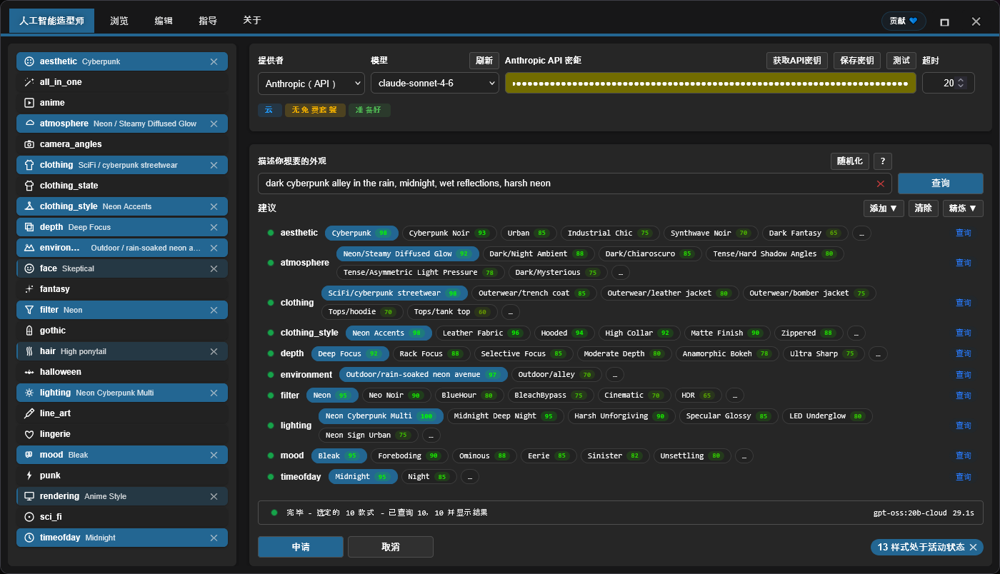

<h4 align="center">
  <a href="./README.md">English</a> | <a href="./README.de.md">Deutsch</a> | <a href="./README.es.md">Español</a> | <a href="./README.fr.md">Français</a> | <a href="./README.pt.md">Português</a> | <a href="./README.ru.md">Русский</a> | <a href="./README.ja.md">日本語</a> | <a href="./README.ko.md">한국어</a> | 中文 | <a href="./README.zh-TW.md">繁體中文</a>
</h4>

<p align="center">
  
  
  
</p>
<br />

# ComfyUI Styler Pipeline ✨

> 面向 ComfyUI 可复现工作流的聚焦 styler-pipeline nodes：通过确定性的 Styler nodes 与安全的 conditioning 合并来应用风格。

---

## <a id="table-of-contents"></a>目录

- ✨ [特性](#features)
- 📦 [安装](#installation)
- 🔧 [Nodes](#nodes)
- 🤖 [LLM 配置](#llm-setup)
- ✍️ [AI 提示词](#ai-prompts)
- 📝 [JSON 进阶](#advanced-json)
- 💖 [支持](#support)
- 🖼️ [展示](#gallery)
- 🤝 [贡献](#contributing)
- 📄 [许可证](#license)

---

## <a id="features"></a>特性

- 设计为在多次运行之间保持可复现的确定性 styler-pipeline nodes。
- AI 辅助的风格选择：按类别查询 LLM，并返回带 score 的风格候选排名列表。
- 通过带类别导航的 Browser workflow 手动浏览并选择风格。
- Dynamic Styler，可将风格安全地应用到现有 conditioning。
- 经典的 `Advanced Styler` node：基于 dropdowns，在图中按类别逐个控制。
- 兼容 ControlNet workflows，包括 OpenPose 驱动的场景。

---

## <a id="installation"></a>安装

### 要求
- ComfyUI（较新的 build）
- Python 3.10+

### 步骤

1. 将此 repo clone 到 `ComfyUI/custom_nodes/` 中。
2. 重启 ComfyUI。
3. 确认 nodes 出现在 `Styler Pipeline/` 下。

---

## <a id="nodes"></a>Nodes

### Styler Pipeline

**概览：**
- 日常 styling 的主 node，带 **Edit** 面板。
- 由于选择会写入内部 JSON，因此是确定且可复现的。


**Inputs:**
- `positive` (`CONDITIONING`, required)
- `negative` (`CONDITIONING`, required)
- `clip` (`CLIP`, required to apply styles)
- `strength` (`FLOAT`, default `1.0`)
- `redundancy` (`INT`, default `1`)
- `selected_styles_json` (`STRING`, internal UI state)

**Outputs:**
- `positive` (`CONDITIONING`)
- `negative` (`CONDITIONING`)

**行为说明：**
- 使用所选风格来编码额外的风格 conditioning，然后合并到现有 conditioning 中。
- 点击 **Edit** 在一个面板中管理类别/风格选择，并写入内部 JSON。

#### Strength 与 Redundancy 指南

`strength` 控制所选风格对生成的引导强度。不同 checkpoint/model 的可控性不同：有些在较低 `strength` 下就会强烈应用风格，而有些更“抗”。

如果 model 很抗，增加 `strength` 可能有帮助。但超过某个点后通常会降低质量；在 `~1.3+` 附近，降质往往会变得明显，因为这实际上相当于在对 `KSampler` “喊话”。

`redundancy` 会把所选风格字面重复多次以增加权重。这可以提升风格贴合度，但 redundancy 过高可能会伤害构图。

- 安全起点：`strength = 1.0`, `redundancy = 1`。
- 常见调法：先以小步幅逐步提高 `strength`。
- 大多数情况下将 `redundancy` 保持在 `2` 或更低。

**AI Styler module:**
描述你想要的 look，**AI Styler** 会请求 LLM 按类别自动建议最匹配的风格。
支持主要 API providers（OpenAI, Anthropic, Groq, Gemini, Hugging Face），也支持 **Ollama (Local)**，便于在离线/无网络环境运行。
下图展示了从 **Edit** 打开的 **AI Styler** 选项卡，在这里会基于 prompt 生成并应用建议。



**Browser module:**
如果你不想用 AI Styler，**Browse** 选项卡允许你手动选择风格并保持更多控制权。
下图展示的是同一面板中的 **Browser** 选项卡，用于手动选择类别与风格。


**Editor module:**
Editor 允许你查看按类别从 JSON 文件（`data/*.json`）加载的风格。
编辑工具目前仍在开发中，稍后会提供（目前 AI token 预算有限）。

> [!NOTE]
> 由于所选风格会存储在 node 的数据中，即使你在风格 JSON 文件中添加/移除类别与风格，只要保留你最初选择的风格，同一个 workflow 仍然可复现。

### Styler Pipeline (Single)

手动选择 `category` 与 `style`，一次应用一个风格。


**Inputs:**
- `positive` (`CONDITIONING`, required)
- `negative` (`CONDITIONING`, required)
- `category` (`STRING`/dropdown, required)
- `style` (`STRING`/dropdown, required)
- `clip` (`CLIP`, required to apply styles)
- `strength` (`FLOAT`, default `1.0`)
- `redundancy` (`INT`, default `1`)

**Outputs:**
- `positive` (`CONDITIONING`)
- `negative` (`CONDITIONING`)
- `style` (`STRING`)

### Styler Pipeline (By Index) + Index Iterator

使用这对节点进行确定性的风格扫掠，避免手动选择风格：通过递增的 index 逐个应用所选类别中的风格。
`Styler Pipeline (By Index)` 通过 `style_index` 从所选类别中应用一个风格，而 `Index Iterator` 在每次运行时提供递增的 index。


**Inputs:**
- `Styler Pipeline (By Index)`: `positive`, `negative`, `category`, `style_index`, `clip`, `strength`, `redundancy`, `prepend_timestamp`.
- `Index Iterator`: `reset`, `start`.

**Outputs:**
- `Styler Pipeline (By Index)`: `positive`, `negative`, `style`.
- `Index Iterator`: `index` (`INT`).

**Usage:** 连接你的 `positive` 和 `negative` conditioning，并正确连接 `clip`。然后在 `Styler Pipeline (By Index)` 中选择一个 `category`，并将 `Index Iterator` 的输出 `index` 连接到它的 `style_index`。每次运行 workflow 时，`Index Iterator` 都会从配置的 `start` 值开始递增，因此该类别的下一个风格会被自动应用。这样可以在把生成的 conditioning 送到 `KSampler` 等 downstream nodes 之前，快速测试大量风格，而无需每次手动切换选择。

---

### Advanced Styler Pipeline

经典的 menu-based Styler，为每个 JSON 类别提供直接的 dropdown。

**概览：**
- 当你希望在图中通过 dropdown 按类别控制时很有用。
- 明确地将风格 conditioning 添加到你当前的 `positive`/`negative` 路径中。
- 当你已经知道各类别要选什么时，比打开面板更快浏览。


**Inputs:**
- `positive` (`CONDITIONING`, required)
- `negative` (`CONDITIONING`, required)
- `clip` (`CLIP`, optional input, required to apply style encoding)
- `strength` (`FLOAT`, default `1.0`)
- `redundancy` (`INT`, default `1`)
- Style dropdowns loaded from `data/*.json`

**Outputs:**
- `positive` (`CONDITIONING`)
- `negative` (`CONDITIONING`)

**Usage:** 将输入的 `positive` 与 `negative` conditioning 连接到该 node，连接 `clip`，并在每个类别中选择你想要的风格 dropdown，以便逐层“叠加” look。该 node 会增强现有 conditioning 而不是替换它，因此请按需要调整 `strength` 与 `redundancy` 以取得平衡。最后，将输出 `positive` 与 `negative` 连接到 `KSampler` 等 downstream nodes 进行生成。

---

## <a id="llm-setup"></a>LLM 配置

AI Styler 使用你在 UI 中选择的 Provider 与 Model。打开 **Edit**，在 **AI Styler** 选项卡中先选择一个 `Provider`，再选择该 provider 的 `Model`。

### Cloud API Providers

Cloud API providers（OpenAI, Anthropic, Google Gemini, Hugging Face, Groq 等）通过其 API 调用。在 AI Styler 选项卡中选择 provider 与 model，然后在运行 suggestions 之前将 API key 或 token 粘贴到 token 字段中。
在使用 cloud provider 之前，点击 **Refresh** 获取最新的 model 列表。

**Provider notes（受 provider 政策影响，可能会变化）：**
- **Hugging Face** — 依据 model 与 provider 提供 free-tier 访问。
- **Groq** — 通常提供 free tier；请核对当前政策。
- **OpenAI, Google Gemini, Anthropic** — 通常需要启用 billing 才能使用 API。

> [!WARNING]
> 由于无法使用预付卡启用 billing，因此未能测试 OpenAI API。如果你在使用 OpenAI 时遇到错误，请在 GitHub 打开 issue 并附上详细错误信息，以便尽快修复。

API key 或 token 仅用于本次运行，插件 **不会保存**；但你可以使用提供的 **Save token** 按钮，将其保存到浏览器的 Password Manager 中。

### Ollama Models (Local + Cloud)

[Ollama](https://ollama.com/download) 是一款免费的桌面应用，可让你在自己的硬件上完全离线运行 LLMs。登录免费的 Ollama account 后，你也可以使用 **Ollama Cloud** models，而无需本地下载。

> [!TIP]
> Ollama 从不需要 API key —— 无论是本地 models 还是 cloud models。Cloud models 仅需要在 Ollama 应用内登录免费的 Ollama account。

**如何让 Ollama models 显示出来：**

安装 Ollama 后，AI Styler 可能会显示 **zero models**，直到你在 Ollama 应用中激活一个 model：

1. 打开 Ollama 桌面应用并保持运行（最小化即可；不要关闭）。
2. 在 Ollama 应用中选择你要使用的 model：
   - **Local model:** 选择一个要下载到本机的 model。`gemma3:4b` 是不错的起点 —— 比大多数更轻更快。
   - **Cloud model:** 在应用内登录免费的 Ollama account，然后选择一个 cloud model。
3. 在 Ollama 应用中发送任意短消息（例如 "test"）以激活所选 model。
4. 返回 AI Styler 并点击 **Refresh**；此时 model 应该会出现在 models dropdown 中。

> [!WARNING]
> 强烈建议 **不要在 ComfyUI workflow 运行时查询本地 Ollama models**。这可能会严重占用共享的 GPU/CPU 资源，使系统变得非常缓慢且不稳定。尽可能优先使用 **cloud provider**，通常更快更高效。如果你仍想使用 Ollama local，请先从 **gemma3:4b** 这类小 model 开始，再尝试更大的 models。

**Troubleshooting（Ollama local）：**

- 本地 models 不显示：
  - 在 Ollama 应用中向任意本地 model 发送一条消息以初始化它。
  - 确认 Ollama 正在运行并可通过 `http://127.0.0.1:11434` 访问。
- 状态显示 "Not connected"：
  - 重启 Ollama，然后重新打开 AI Styler。
  - 检查本地 firewall/安全软件是否阻止了 localhost 端口 `11434`。
- Ollama 未运行：
  - 启动应用（Windows/macOS）或运行 `ollama serve`（Linux）。

---

## <a id="ai-prompts"></a>AI 提示词

保持 prompt 简短且具体。描述视觉方向，而不是完整故事。

### 建议包含

- Genre/style: sci-fi, noir, anime, fantasy, etc.
- Mood: tense, cozy, melancholic, energetic.
- Lighting: soft, practical, cinematic rim light, harsh noon sun.
- Time of day: dawn, golden hour, night, overcast afternoon.
- Environment: alley, spaceship interior, forest, classroom, rooftop.

### 建议避免

- 过长的 prompt，包含太多相互竞争的想法。
- 同一句中给出相互矛盾的指示（例如："dark night scene with bright midday sun"）。

### 如何使用返回的 suggestions

- 先保留 1–2 个与目标最匹配的强类别开始。
- 生成/测试后，再用少量额外类别进行 refine。
- 避免同时堆叠冲突类别；以增量方式逐步添加变化。

---

## <a id="advanced-json"></a>JSON 进阶

> 仅适用于 **advanced users**。目前通过 JSON 编辑是修改风格的唯一方式；未来版本计划提供 Editor 的可视化 UI。包含的 prompt 经过 AI 打磨，但未做全面测试 —— 一些可能需要少量手动调整。

advanced users 可以自由自定义风格：

- **添加或移除完整的 `data/*.json` 文件。** 任何放在 `data/` 下的 JSON 文件都会自动成为新的风格类别，并出现在类别列表中。
- **在任意 JSON 文件中添加/移除/重命名单个风格条目**，并按需编辑 prompt。

**可复现性说明：** 只要引用的风格条目不被重命名或删除，已有 workflows 仍可复现。如果老 workflow 使用的风格被重命名或删除，该 workflow 将无法找到风格定义，也就无法复现相同结果。

保持 `data/*.json` 风格文件的一致性，以便 styler nodes 继续可预测。

### JSON shape

```json
[
  {
    "name": "style name",
    "prompt": "style description, {prompt}, token1, token2, token3",
    "negative_prompt": ""
  }
]
```

Required keys per item:
- `name` (string)
- `prompt` (string)
- `negative_prompt` (string, can be empty)

### 实用指南

- 优先使用具体的视觉语言，而不是抽象的质量标签。
- 保持 prompt 简洁且具备视觉描述性。
- 名称保持 user-friendly，便于浏览。
- 保持 JSON 严格有效（无注释、无尾随逗号）。
- **避免使用 model 容易解释为物理对象的词。** 一些名词会触发对物体的字面渲染，即使你的意图是颜色或发型。例如，**amber-toned** 可能让 model 画出琥珀石而非温暖金色调；**crown braids** 可能生成字面意义上的王冠。最安全的做法是完全移除触发词，并用其他词汇描述意图 —— 例如用 "warm golden hue" 替代 "amber-toned"，用 "intricate braided updo" 替代 "crown braids"。

> [!TIP]
> 如果某个风格 prompt 在 outputs 中生成了意外对象，通常是因为存在字面 trigger word。常见例子：**amber-toned**（渲染琥珀石）与 **crown braids**（渲染字面王冠）。

---

## <a id="support"></a>支持

### 为何你的支持很重要

该插件由独立开发与维护，并定期使用 **paid AI agents** 来加速 debugging、testing 与提升易用性。如果你觉得有用，资金支持可以帮助开发持续推进。

你的贡献将帮助：

* 资助 AI tooling，以更快修复并增加新 features
* 覆盖持续维护与跨 ComfyUI 更新的兼容工作
* 避免在达到使用限制时开发停滞

> [!TIP]
> 不打算捐助？在 GitHub 上点个 ⭐ 也能提供很大帮助 —— 提升可见性，让更多用户发现它

### 💙 Support this project

<table style="width: 100%; table-layout: fixed;">
  <tr>
    <td align="center" style="width: 33.33%; padding: 20px;">
      <div>
        <h4 style="margin: 8px 0;">Ko-fi</h4>
        <a href="https://ko-fi.com/D1D716OLPM" target="_blank" rel="noopener noreferrer">
          
        </a>
        <p style="margin: 8px 0; font-size: 12px;"><a href="https://ko-fi.com/D1D716OLPM" target="_blank" rel="noopener noreferrer">Buy a Coffee</a></p>
      </div>
    </td>
    <td align="center" style="width: 33.33%; padding: 20px;">
      <div>
        <h4 style="margin: 8px 0;">PayPal</h4>
        <a href="https://www.paypal.com/ncp/payment/GEEM324PDD9NC" target="_blank" rel="noopener noreferrer">
          
        </a>
        <p style="margin: 8px 0; font-size: 12px;"><a href="https://www.paypal.com/ncp/payment/GEEM324PDD9NC" target="_blank" rel="noopener noreferrer">Open PayPal</a></p>
      </div>
    </td>
    <td align="center" style="width: 33.33%; padding: 20px;">
      <div>
        <h4 style="margin: 8px 0;">USDC (Arbitrum only ⚠️)</h4>
        <a href="https://arbiscan.io/address/0xe36a336fC6cc9Daae657b4A380dA492AB9601e73" target="_blank" rel="noopener noreferrer">
          
        </a>
        <p style="margin: 8px 0; font-size: 12px;"><a href="#usdc-address">Show address</a></p>
      </div>
    </td>
  </tr>
</table>

<details>
  <summary>更喜欢扫码？显示二维码</summary>
  <br />
  <table style="width: 100%; table-layout: fixed;">
    <tr>
      <td align="center" style="width: 33.33%; padding: 12px;">
        <strong>Ko-fi</strong><br />
        <a href="https://ko-fi.com/D1D716OLPM" target="_blank" rel="noopener noreferrer">
          
        </a>
      </td>
      <td align="center" style="width: 33.33%; padding: 12px;">
        <strong>PayPal</strong><br />
        <a href="https://www.paypal.com/ncp/payment/GEEM324PDD9NC" target="_blank" rel="noopener noreferrer">
          
        </a>
      </td>
      <td align="center" style="width: 33.33%; padding: 12px;">
        <strong>USDC (Arbitrum) ⚠️</strong><br />
        <a href="https://arbiscan.io/address/0xe36a336fC6cc9Daae657b4A380dA492AB9601e73" target="_blank" rel="noopener noreferrer">
          
        </a>
      </td>
    </tr>
  </table>
</details>

<a id="usdc-address"></a>
<details>
  <summary>显示 USDC 地址</summary>

```text
0xe36a336fC6cc9Daae657b4A380dA492AB9601e73
```

> [!WARNING]
> 仅通过 Arbitrum One 发送 USDC。通过任何其他网络发送的转账将无法到账，并可能永久丢失。
</details>

## <a id="gallery"></a>展示

### 示例 Workflow
点击下图打开完整的 workflow 示例：
你也可以将这张 workflow 图片拖拽到 ComfyUI 来打开/导入。
该示例 workflow 通过 [OpenPose Studio](https://github.com/andreszs/ComfyUI-OpenPose-Studio) 的 node 使用 ControlNet 进行 OpenPose。

<a href="../workflows/sample_workflow.png" target="_blank" rel="noopener noreferrer">
  
</a>

### 示例图片

> [!NOTE]
> 下方所有 demo 图片使用相同的 model、相同的 LoRA、相同的 base prompt、以及相同的 seed。唯一差别是 **Styler Pipeline** node 应用的风格。

| 图片 | Styles used |
|---|---|
| <a href="../workflows/sample_bypass.png" target="_blank" rel="noopener noreferrer"></a> | - Baseline: Styler not applied<br>- Generation settings (shared):<br>&nbsp;&nbsp;- Resolution: `1024×1344`<br>&nbsp;&nbsp;- Seed: `717891937617865`<br>&nbsp;&nbsp;- Steps: `25`<br>&nbsp;&nbsp;- CFG: `4`<br>&nbsp;&nbsp;- Sampler: `dpmpp_2m_sde`<br>&nbsp;&nbsp;- Scheduler: `karras`<br>&nbsp;&nbsp;- Denoise: `1.0`<br>&nbsp;&nbsp;- Checkpoint: `yiffInHell_yihXXXTended.safetensors`<br>&nbsp;&nbsp;- LoRA: `inuyasha_ilxl.safetensors`<br>&nbsp;&nbsp;- ControlNet: `illustriousXL_v10.safetensors` |
| <a href="../workflows/sample_4.png" target="_blank" rel="noopener noreferrer"></a> | - aesthetic: `Enchanted Forest`<br>- atmosphere: `Neon/Bioluminescent Glow`<br>- environment: `Nature/bamboo forest`<br>- filter: `BlueHour`<br>- lighting: `Bioluminescent Organic`<br>- mood: `Enchanted`<br>- timeofday: `Twilight`<br>- face: `Raised Eyebrow`<br>- hair: `Color combo silver and cyan`<br>- clothing_style: `Iridescent`<br>- depth: `Soft Focus`<br>- clothing: `Specialty/fantasy outfit` |
| <a href="../workflows/sample_3.png" target="_blank" rel="noopener noreferrer"></a> | - aesthetic: `Rustic`<br>- atmosphere: `Melancholic/Cold Overcast`<br>- environment: `Historical/medieval village`<br>- filter: `BlueHour`<br>- lighting: `Overcast Diffusion`<br>- mood: `Bleak`<br>- timeofday: `Midday`<br>- face: `Serious`<br>- hair: `Silver white hair`<br>- clothing_style: `Denim Fabric`<br>- depth: `Deep Focus`<br>- clothing: `Historical/viking raider` |
| <a href="../workflows/sample_2.png" target="_blank" rel="noopener noreferrer"></a> | - aesthetic: `Dark Fantasy`<br>- atmosphere: `Dark/Night Ambient`<br>- environment: `Outdoor/temple hill overlook`<br>- filter: `Soft`<br>- lighting: `Soft General`<br>- mood: `Meditative`<br>- timeofday: `Midnight`<br>- face: `Worried`<br>- hair: `Long wavy hair`<br>- depth: `Ultra Sharp`<br>- rendering: `Semi-Realistic`<br>- clothing: `Medieval/monk robe` |
| <a href="../workflows/sample_1.png" target="_blank" rel="noopener noreferrer"></a> | - aesthetic: `Cyberpunk`<br>- atmosphere: `Dark/Night Ambient`<br>- environment: `Asian/japanese neon alley`<br>- filter: `Neon`<br>- lighting: `Multi-Source Complex`<br>- mood: `Gloomy`<br>- timeofday: `Midnight`<br>- face: `Skeptical`<br>- hair: `High ponytail`<br>- clothing_style: `Neon Accents`<br>- depth: `Selective Focus`<br>- rendering: `Anime Style`<br>- clothing: `SciFi/cyberpunk streetwear` |

获得可靠结果的最佳实践：
- Styler 的影响因 model 而异；有些 model 更容易被引导。如果某个 model 不配合风格，可略微提高 `strength` 或 `redundancy` 来增加 Styler 影响。
- 你的正向 prompt（`CONDITIONING`）通常比 Styler node 权重更高。prompt 不应与期望风格相矛盾，否则 Styler 效果会被削弱。
- 对于 SDXL、Pony 和 Illustrious，ControlNet OpenPose 通常是“指导”而不是严格规则，且可能被 prompt 覆盖。如果 prompt 与应用的 pose 相矛盾，ControlNet 可能被忽略或导致构图不一致。在 prompt 中加强 pose 通常是个好主意。
- 谨慎使用 `camera_angles`，避免与 prompt 或 ControlNet 冲突。这是最敏感的类别，误用时经常会被忽略，因为它驱动构图强于风格。

### Styler Iterator workflow

<a href="../workflows/sample_styler_iterator.png" target="_blank" rel="noopener noreferrer">
  
</a>

- **Extensions required:** [comfyui-openpose-studio](https://github.com/andreszs/ComfyUI-OpenPose-Studio)

你可以将这张图片加载到 ComfyUI，以提取/打开 workflow。
该 workflow 在每次运行时按顺序遍历某个类别内的风格，因此你可以在不手动改值的情况下测试不同风格。
由于技术限制，生成的图片无法在其自身 workflow 内包含正在遍历的风格名；请将 `Styler Pipeline (By Index)` node 的 `style` 输出作为文件名的一部分，否则很难识别应用了哪个风格。
iterator workflow 无法将使用过的 index 或应用的风格名回写并持久化到 workflow 中。

### Conditioning Areas workflow (Experimental)

Styler Pipeline node 不仅与 ControlNet workflows 兼容，也与 [comfyui-lora-pipeline](https://github.com/andreszs/comfyui-lora-pipeline) 的 `Conditioning Pipeline Area` nodes **100% 兼容**。
该 setup 支持按区域进行 styling：在该 pipeline 内连接 Styler nodes，即可对图像不同区域应用不同风格。
这些 nodes 也支持多 LoRA 且不混合其风格，因为它们封装了 ComfyUI 原生 `Cond Pair Set Props` 逻辑，不暴露 hooks，并使用区域而非 mask。

<a href="../workflows/sample_conditioning_areas.png" target="_blank" rel="noopener noreferrer">
  
</a>

- **Extensions required:** [comfyui-openpose-studio](https://github.com/andreszs/ComfyUI-OpenPose-Studio), [comfyui-lora-pipeline](https://github.com/andreszs/comfyui-lora-pipeline)
- **Experimental:** 使用 ControlNet 对该 multi-LoRA multi-area workflow 进行 fine-tuning 更复杂，且执行速度明显慢于普通 workflows。

区域风格与一致的 pose 可能相对 straightforward，但最终图像质量取决于很多因素，这里不做展开。更多细节请阅读 [comfyui-lora-pipeline](https://github.com/andreszs/comfyui-lora-pipeline) 的 README。

查看[这篇文章](https://www.andreszsogon.com/building-a-multi-character-comfyui-workflow-with-area-conditioning-openpose-control-and-style-layering/)，了解同时使用多个 conditioning area、OpenPose、ControlNet 和 Styler 的完整 workflow。

## <a id="contributing"></a>贡献

### 核心原则

- 保持 pull requests 聚焦且最小化。
- 除非事先讨论，否则避免大范围 refactors。
- 保留现有架构及其 rationale。

### AI 辅助修改

如果你使用 AI 辅助编码工具，请让它在改动前先阅读并遵守 [AGENTS.md](../AGENTS.md)。

### 接受标准

- 每个 PR 只解决一个清晰的问题或改进点。
- 局部、可审阅的 diffs。
- 清晰说明为何需要该改动。

---

## <a id="license"></a>许可证

MIT License - 完整文本见 [LICENSE](../LICENSE)。

---

**Last update:** 2026-02-13  
**Maintained by:** andreszs  
**Status:** Active development
